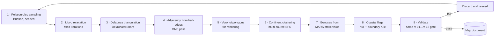
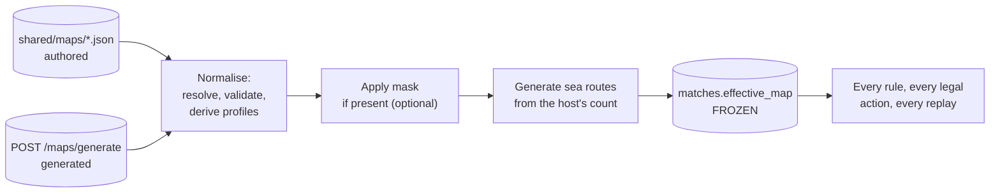

# Appendix C — Map Specification

> **Deliverable N.** The map file format, the validation gate, the sea-route edge type, the procedural
> generation contract, and the retained submersion-mask design.
>
> This appendix is the format-level expansion of [§5.7 Map System](../docs/05-system-design.md),
> [§7.11 Maps](../docs/07-game-design.md) and [§8.10](../docs/08-implementation-plan.md). The authored
> instance is [`shared/maps/world_classic.json`](../shared/maps/world_classic.json); this file specifies
> what any map — authored or generated — must satisfy to be loadable.

---

## C.1 The two edge types

The single most important distinction in this appendix, because conflating them breaks a locked rule.

| | **Land adjacency** | **Sea route** |
|---|---|---|
| Field | `territories[].neighbours` | Not in the map file at all |
| Where it lives | The authored/generated map | `matches.effective_map`, generated per match |
| Chosen by | The map author or generator | The **system**, from a count the host picks (FR-15, FR-16) |
| Count on the classic board | 83 | 2–10, default 4 (SEA-1) |
| Used by normal attack | Yes | No |
| Used by Naval attack | No | **Yes** |
| Used by fortification | Yes | Yes, with Naval capability |
| **Used by Air Force range** | **Yes** | **No — excluded entirely** (C-08) |
| Symmetric | Yes, validated (V-01) | Yes, by construction |
| Frozen per match | Inherited from the map | Frozen at creation (FR-10) |

There is a third, *non*-edge concept that is easy to mistake for a sea route:

| | **`crossesWater`** |
|---|---|
| Field | Top-level `crossesWater` array |
| Meaning | **Render hint only.** Draw this land edge dashed, or with a bridge glyph |
| Mechanical effect | **None whatsoever** |
| Relationship to adjacency | A strict subset of the adjacency edges (V-12) |
| Count on the classic board | 10 |

`crossesWater` is the renamed `seaLanes` field from the source material (D-04). The rename is deliberate:
the term *sea route* is reserved for the generated Naval edge type, and one name for two different things
is how "Air Force uses sea routes for range" gets implemented by accident.

**Alaska–Kamchatka is a land adjacency that happens to cross water.** An attack across it is an ordinary
attack, it counts as one edge of Air Force range, and it requires no Naval capability.

---

## C.2 File format

`formatVersion: 2`. Version 1 was the source report's shape; version 2 adds `coastal`, `cardSymbol`,
`capabilities` and the `seaLanes` → `crossesWater` rename.

### Top level

```jsonc
{
  "key":           "world_classic",      // unique identifier; matches the filename stem
  "name":          "Classic World",      // display name
  "formatVersion": 2,
  "source":        { "kind": "authored" },              // or { "kind": "generated", "seed": 20260927 }
  "canvas":        { "width": 1600, "height": 900 },    // label coordinate space
  "continents":    [ /* ... */ ],
  "territories":   [ /* ... */ ],
  "crossesWater":  [ ["alaska", "kamchatka"] /* ... */ ]
}
```

| Field | Type | Required | Notes |
|---|---|---|---|
| `key` | string | Yes | `snake_case`. For a generated map, `generated:<seed>` |
| `name` | string | Yes | Display only |
| `formatVersion` | int | Yes | `2`. A loader rejects an unknown version rather than guessing |
| `source.kind` | `"authored"` \| `"generated"` | Yes | |
| `source.seed` | int | If generated | The seed that reproduces this map byte-for-byte |
| `canvas` | `{width, height}` | Yes | The coordinate space `label` is expressed in |
| `continents` | array | Yes | ≥ 1 |
| `territories` | array | Yes | ≥ `2 × maxPlayers` (V-08) |
| `crossesWater` | array of pairs | No | Render hints; defaults to empty |
| `_comment` | array of strings | No | Ignored by the loader. The authored file uses it to carry the asserted totals |

### `continents[]`

```jsonc
{ "key": "NA", "name": "North America", "bonus": 5, "colour": "#d4a05a" }
```

| Field | Type | Notes |
|---|---|---|
| `key` | string | Unique; referenced by `territories[].continent` (V-05) |
| `name` | string | Display |
| `bonus` | int ≥ 1 | Armies awarded for holding every territory in the continent (DR-09) |
| `colour` | hex string | Render hint |

### `territories[]`

```jsonc
{
  "key":          "alaska",
  "name":         "Alaska",
  "continent":    "NA",
  "label":        [110, 130],
  "coastal":      true,
  "cardSymbol":   "Cavalry",
  "capabilities": ["Infantry", "Cavalry", "NavalForce"],
  "neighbours":   ["northwest_territory", "alberta", "kamchatka"]
}
```

| Field | Type | Required | Notes |
|---|---|---|---|
| `key` | string | Yes | Unique, `snake_case`. The identifier used by the API, the database and the card deck |
| `name` | string | Yes | Display |
| `continent` | string | Yes | Must exist in `continents` (V-05) |
| `label` | `[x, y]` | Yes | Anchor for the name and the army badge, in `canvas` space |
| `coastal` | bool | Yes | **Authored input to CAP-1.** Not derived from geometry in an authored map |
| `cardSymbol` | enum | Yes | `Infantry` \| `Cavalry` \| `Artillery` \| `AirForce` \| `NavalForce` |
| `capabilities` | string array | Yes | The CAP-1 profile. **Redundant and asserted** (V-10) |
| `neighbours` | string array | Yes | Land adjacency. Symmetric, no self-loops, no duplicates (V-01…V-04) |
| `shape` | SVG path | **No** | Deliberately absent in v1 — see below |

#### Why `shape` is absent

Adjacency ships first; artwork is Phase 12. Phases 3–11 run on a debug renderer that draws each territory
as a labelled circle at `label` and each edge as a line. The engine, the agents and the entire test suite
are correct before a single polygon exists, which is what keeps artwork off the critical path (O-01).

A generated map *does* carry Voronoi polygons, because generating them is free once the triangulation
exists (§C.5 step 5).

#### Why `capabilities` is stored *and* derived

It is written explicitly so a client can render it and a map author can read it, and it is re-derived on
load by CAP-1 and asserted equal (V-10, TC-MAP-05) so the two can never drift after a hand edit. See
[Appendix D](D-capability-mapping-decision-table.md#d1-the-two-rules) for the full argument.

---

## C.3 The validation gate

Every map — authored, generated, or hand-edited — passes the **same** twelve rules before a match can use
it (FR-08). The validator lives in `Engine/Validation/MapValidator`, so the API, the simulator and the
offline clients cannot each apply a different standard.

| Rule | Check | Rejection is |
|---|---|---|
| **V-01** | Adjacency is symmetric — `b ∈ neighbours(a)` ⟺ `a ∈ neighbours(b)` | An asymmetric board where an attack is possible one way only |
| **V-02** | No self-loops | A territory adjacent to itself |
| **V-03** | No duplicate edges | A double-counted border |
| **V-04** | Every neighbour key exists | A dangling reference |
| **V-05** | Every `continent` key exists | An orphan territory |
| **V-06** | Continents partition the territories exactly — every territory in exactly one | A territory in two continents, or none |
| **V-07** | The land graph is connected | An unreachable island group, which makes domination impossible |
| **V-08** | `territories ≥ 2 × maxPlayers` | A board too small to deal |
| **V-09** | Every continent has ≥ 1 border territory | A continent that cannot be entered or left |
| **V-10** | Every stored `capabilities` array equals its CAP-1 derivation | Data drifted from the rule |
| **V-11** | No `NavalForce` card symbol on a landlocked territory | A naval card in a place with no coast (DR-17) |
| **V-12** | `crossesWater` pairs are a subset of the adjacency edges | A render hint for an edge that does not exist |

### A failing map is rejected, never repaired

A repaired map is a map nobody specified. The validator names the failed rule and the offending keys, and
the map does not load. For **generated** maps the response is different but equally strict: discard the
result and reseed (§C.5 step 9). Neither path patches a bad graph.

### Negative testing

The gate is only real if it has been shown to reject something. `tests/fixtures/invalid_*.json` holds
**one deliberately broken map per rule V-01…V-12**, and TC-MAP-01…05 plus that fixture set are what
verify it (§9.1 *Test data*). A validator with no negative tests is a validator that has never rejected
anything.

### Verified state of the authored board

The following are computed from `world_classic.json`, not asserted by hand:

| Property | Value |
|---|---|
| Territories | 42 |
| Continents | 6 — NA 9 / SA 4 / EU 7 / AF 6 / AS 12 / AU 4 |
| Continent bonuses | 5 / 2 / 5 / 3 / 7 / 2 |
| Undirected land edges | **83** |
| Asymmetric references | 0 |
| Self-loops | 0 |
| Dangling neighbour keys | 0 |
| Land graph connected | Yes |
| Coastal / landlocked | 36 / 6 |
| CAP-1 violations | 0 of 42 |
| `crossesWater` entries that are not land edges | 0 of 10 |
| Land-graph diameter | **10** |
| Territories missing a `label` | 0 |

---

## C.4 Sea routes

A sea route is a **per-match** edge type. It does not appear in any map file.

### What the host chooses, and what it does not

| The host chooses | The system chooses |
|---|---|
| **How many** routes the match has | **Where every one of them goes** |

There is no interface anywhere in the system — no API field, no client screen, no configuration key — for
naming a route's two endpoints. Adding one is an explicit §40 prohibition ("no arbitrary user-created sea
routes"), and [Appendix A](A-api-contract.md#6--post-apimatches--201) is where its absence is visible in
the contract.

### Bounds (SEA-1)

| Key | Value |
|---|---|
| `seaRoutes.min` | 2 |
| `seaRoutes.max` | 10 |
| `seaRoutes.default` | 4 |
| `seaRoutes.maxGenerationAttempts` | 500 |

All four are data in [`shared/rules.json`](../shared/rules.json), so a different band is a configuration
edit. A count of **0** is legal only when `navalForce.enabled = false`, which is how a purely classic
match is configured (D-13).

### Generation constraints

| Constraint | Key | Hard? |
|---|---|---|
| Both endpoints coastal | `endpointsMustBeCoastal` | **Hard** — a landlocked territory is never an endpoint (DR-17, FR-51) |
| Not already land-adjacent | `forbidExistingLandAdjacency` | **Hard** — a route duplicating a land edge adds nothing |
| Not a duplicate route | `forbidDuplicate` | **Hard** |
| Endpoints in different continents | `preferDifferentContinents` | **Soft preference** |
| Bounded attempts | `maxGenerationAttempts` | 500, then a specific failure |

### Failure is specific and total

If the requested count cannot be placed within the attempt bound, match creation returns `422` stating
**how many were placeable**, and **no match row exists** (UC-04 alternative path 9a). A match with three
of four requested routes would be a match the host did not configure.

### Frozen at creation

Routes are generated **once**, from the match seed, and written into `matches.effective_map`. They are
never regenerated, so a resumed match has exactly the routes it started with (FR-10, TC-PER-06). Their
representation inside the effective map:

```jsonc
"seaRoutes": [
  { "id": 0, "a": "brazil",  "b": "west_africa" },
  { "id": 1, "a": "iceland", "b": "greenland"   }
]
```

`id` is stable for the life of the match and is what `NavalAttack` carries on the wire.

### What a sea route is not

- **Not a territory.** It cannot be owned, captured, garrisoned, or counted toward reinforcement (DR-16).
- **Not a cost.** Crossing consumes no units (NAV-1, `unitsRequiredPerRoute: 0`).
- **Not automatic.** A landlocked territory is never an endpoint; a coastal one gains nothing without a
  route actually touching it.
- **Not part of Air Force range.** Excluded entirely (C-08). Enforced *by construction*: the range BFS is
  handed the land adjacency graph, and sea routes live in a separate structure that is never added to it
  (§5.4). That is a stronger guarantee than a conditional, which could be edited away.

---

## C.5 Procedural generation

Seeded and deterministic: the same seed and parameters produce a byte-identical map (NFR-02, TC-MAP-06).



| Step | Implementation | Note |
|---|---|---|
| 1 | Poisson-disc (Bridson), seeded | Even spacing without a grid |
| 2 | Lloyd relaxation, fixed iteration count | Regularises cell sizes |
| 3 | DelaunatorSharp | |
| 4 | **One pass over half-edges** | See below |
| 5 | Voronoi cells from the triangulation | The renderer's polygons, free at this point |
| 6 | Multi-source BFS from spread seeds | Produces contiguous continents |
| 7 | `bonus = clamp(round(target × size × borders), 1, 10)` | `target` is the classic board's static-value band (§2.3) |
| 8 | Cells touching the hull, plus the continent-boundary rule | Authors `coastal`, the CAP-1 input |
| 9 | The same V-01…V-12 gate | **Failure discards and reseeds** |

### Step 4 matters more than it looks

Adjacency from a proximity threshold produces *almost* the right graph — and an almost-right adjacency
graph is an unplayable board with a plausible-looking picture. The triangulation already knows exactly
which cells share an edge, so the half-edge pass is both cheaper and exactly correct.

### Step 9's discard-and-reseed

Bounded by an attempt count. This is what lets steps 1–8 stay simple: generation is allowed to fail, and
the cheapest correct response is another seed rather than a repair pass on a bad graph.

### Parameters

```jsonc
{ "seed": 20260927,
  "params": { "territories": 42, "continents": 6,
              "minContinentSize": 4, "maxContinentSize": 12 } }
```

Symbols are dealt across the generated territory count in the authored board's 12/10/8/7/5 proportion
(Appendix D §D.6), then CAP-1 applies unchanged and **V-10 asserts it on generated maps exactly as on the
authored one**. There is no separate capability path for generated maps — which is what keeps a
procedural board compatible with the same engine (§42).

### Generated maps play through the same engine

| Consequence | Verified by |
|---|---|
| Same validation gate | TC-MAP-06…10 |
| Same engine, API and clients | TC-SYS-04 — a full match on a generated map |
| Variable territory count handled | The GNN state encoder (§C.7) and `territory_state` row count, never 42 by assumption (TC-PER-02) |

---

## C.6 Effective map

What a match actually plays on. Built once at creation, stored as `matches.effective_map` (jsonb), and
**never re-read from disk** (FR-10).



| Contains | Why |
|---|---|
| Normalised continents and territories | The playable board |
| Land adjacency | Attack, fortify, Air Force range |
| Capability profiles | CAP-1 results, already validated |
| **Generated sea routes** | Naval actions; per-match, so they must live here |
| Applied mask result, if any | The board after submersion |

Editing `shared/maps/world_classic.json` mid-match cannot alter a match in progress. The alternative — a
foreign key to a map table — would let an in-flight match change under the players.

`territory_state` rows are inserted once from this document: 42 for the classic board, fewer if a mask
submerged territories, whatever the generator produced. **Never 42 by assumption** (TC-PER-02).

---

## C.7 Submersion masks — design retained, not a v1 requirement

D-05: the mask feature is **out of v1 scope**. It has no FR, no phase and no v1 test case. What is
retained costs nothing and is recorded here so the option stays open:

| Retained | Where |
|---|---|
| The nullable `mask` column | `matches.mask` (Appendix B) |
| The normalisation step | §C.6 pipeline, a no-op when `mask` is null |
| This design section | Below |
| The GNN state encoder | **Retained independently** — procedural maps alone already produce variable territory counts |

### The design

A mask names territories that are submerged for a match. `MaskResolver` applies it during normalisation:

1. Remove the named territories.
2. Remove every adjacency edge touching them; remaining edges are unchanged.
3. **Remove the corresponding cards** — a card naming a drowned territory would make the +2 territory
   bonus unclaimable (FR-37).
4. Recompute `coastal` for territories that now border removed cells.
5. Re-derive capability profiles by CAP-1.
6. Re-run the **full** V-01…V-12 gate. A mask that disconnects the graph fails V-07 and is rejected.

### Why it needs no rules changes

A submerged territory simply **has no row** in `territory_state` and no card in `cards`. Nothing in the
engine counts to 42. Continent bonuses are recomputed from the surviving members, and a continent that
lost every territory is dropped along with its bonus.

Mid-match sinking would be a new action type (`SubmergeTerritory`) rather than a schema change, because
`moves.action` is stored verbatim as jsonb (Appendix B). That is the reason this feature can be deferred
without cost — and the reason deferring it is the right call: it is a *presentation-led* feature competing
with Phase 11's locked extensions.

---

## C.8 Traceability

| Item | Location |
|---|---|
| Authored instance | [`shared/maps/world_classic.json`](../shared/maps/world_classic.json) |
| Fast test board | `tests/fixtures/tiny_12.json` — 12 territories, curriculum stage 1 |
| Negative fixtures | `tests/fixtures/invalid_*.json`, one per V-01…V-12 |
| Requirements | FR-05…FR-10 (maps), FR-15, FR-16 (sea routes), FR-11, FR-39…41 (capability) |
| Decisions | D-04 (`crossesWater` rename), D-05 (mask out of scope), D-13 (SEA-1 bounds), D-14 (distribution) |
| Design | §5.7, §7.10, §7.11, §8.10 |
| Implementation | `Engine/Models/`, `Engine/Validation/MapValidator`, `Engine/Generation/` |
| Configuration | [`shared/rules.json`](../shared/rules.json) → `seaRoutes.*` |
| Tests | TC-MAP-01…10, TC-SEA-01…06, TC-PER-02, TC-PER-06, TC-SYS-04, TC-SYS-05 |

---

**Appendix index:** [A](A-api-contract.md) · [B](B-database-schema.sql) · C ·
[D](D-capability-mapping-decision-table.md) · [E](E-pseudocode.md) · [F](F-test-cases.md) ·
[G](G-configuration-tables.md) · [H](H-additional-diagrams-and-screenshots.md)
