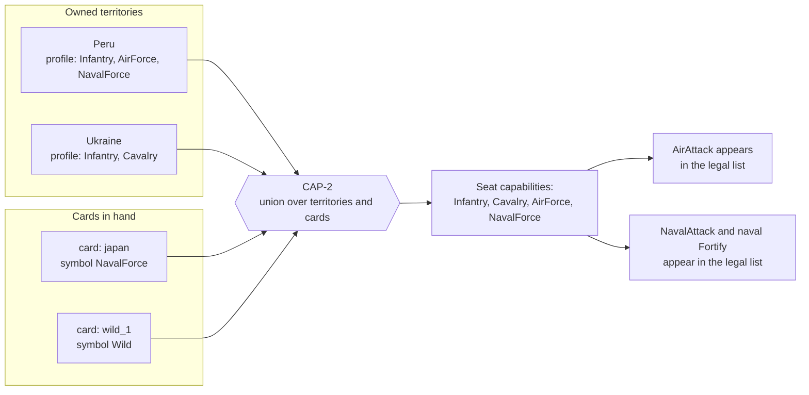

# Appendix D — Capability Mapping Decision Table

> **Deliverable O (part).** The complete 42-row capability mapping for the Classic World board, with the
> rule that produced each row and a review column.
>
> This appendix expands [§7.7 Capability System](../docs/07-game-design.md#77-capability-system) and is the
> evidence for decisions **D-08**, **D-09**, **D-10** and **D-14** in
> [`00-decisions-and-assumptions.md`](../docs/00-decisions-and-assumptions.md).

> **This table records a game-design decision. It is not a factual, historical or military claim about
> any real territory, nation or armed force.** The symbols are set-matching tokens inherited from classic
> RISK; two of them additionally gate an action. A card symbol on a territory carries no assertion about
> that place. The review column exists so a supervisor can audit the distribution as a *game-balance*
> choice, which is the only kind of choice being made here.

---

## D.1 The two rules

### CAP-1 — territory profile

```
profile(t) = {Infantry}
           ∪ ({NavalForce}  if t.coastal)
           ∪ {t.cardSymbol}
```

Every territory's profile is **derived** from exactly two authored fields — `coastal` (boolean) and
`cardSymbol` (one of five) — and nothing else. The profile is *also* written explicitly into
`world_classic.json` as the `capabilities` array, re-derived on load, and asserted equal to the stored
value by validation rule **V-10** and test **TC-MAP-05**.

Storing a derivable value and then asserting the derivation looks redundant. It is not: the explicit array
is what a client renders and what a map author reads, and the assertion is what stops the two from
drifting after a hand edit. Either alone would be worse — a derived-only field is invisible in the data,
and a stored-only field is a second source of truth.

### CAP-2 — seat capability

> A seat holds capability **X** if and only if it owns at least one territory whose profile contains X,
> **or** holds at least one card whose profile contains X.

Capability is **derived on demand and never stored** (FR-41, D-10). There is no capability column in the
schema, no counter and no timer, so it cannot desynchronise from ownership. Losing the last coastal
territory removes Naval capability at the instant the territory changes hands — and **TC-CAP-04** and
**TC-CAP-05** assert the *loss*, not just the gain, because a cache added later for performance would
break exactly that and nothing else.

### Only two capabilities unlock anything (D-09)

| Capability | Unlocks | Why |
|---|---|---|
| Infantry | Nothing | A set-matching symbol in classic RISK, and it stays one |
| Cavalry | Nothing | As above |
| Artillery | Nothing | As above |
| **Air Force** | The Air Force attack (§7.8) | The locked extension |
| **Naval Force** | Naval attack and naval fortification (§7.9) | The locked extension |

In classic RISK, Infantry, Cavalry and Artillery have **no** mechanical difference whatever — they exist
only to be matched into sets. Giving them one would be inventing unit types, which §40 of the master
specification explicitly forbids. So the capability system has exactly two mechanical members, and the
other three are carried forward unchanged.

**Five symbol categories do not imply five-card sets.** A set is exactly **three** cards (DR-12, C-05).
This is called out here because the five-category table below is precisely the thing that might tempt a
reader toward a five-card set, and that is a named §40 prohibition.

---

## D.2 The authored inputs

Two fields per territory, 84 values in total, from which all 42 profiles follow.

| Input | Domain | Source |
|---|---|---|
| `coastal` | `true` / `false` | Authored. 36 coastal, 6 landlocked (D-14) |
| `cardSymbol` | `Infantry` \| `Cavalry` \| `Artillery` \| `AirForce` \| `NavalForce` | Authored. Distribution below |

### Symbol distribution (D-14)

| Symbol | Count | Unlocks | Deck cards |
|---|---|---|---|
| Infantry | 12 | — | 12 |
| Cavalry | 10 | — | 10 |
| Artillery | 8 | — | 8 |
| AirForce | 7 | Air Force attack | 7 |
| NavalForce | 5 | Naval actions | 5 |
| Wild | — | — | 2 |
| **Total** | **42** | | **44** |

The classic 14 / 14 / 14 split is not preserved, because two of the five symbols now gate an action and an
equal split would make the gating symbols too common. The counts descend — 12, 10, 8, 7, 5 — so that the
two action symbols are the two scarcest. Air is 7 (one per continent, two in Asia) and Naval is 5, which
is the smallest count that still puts a Naval *card* route into four of six continents.

The 44-card deck is 42 territory cards plus 2 wilds, unchanged from classic RISK.

---

## D.3 The complete mapping

Column meanings:

- **Card symbol** — the authored `cardSymbol`.
- **Capability profile** — the CAP-1 result, and the `capabilities` array in the map file.
- **Rule applied** — which clause of CAP-1 contributed. `I` = the unconditional Infantry;
  `N(coastal)` = the coastal Naval clause; `S=` = the card-symbol clause.
- **Review** — what a reviewer should check on this row.

| # | Territory | Continent | Coastal | Card symbol | Capability profile (CAP-1) | Rule applied | Review |
|---|---|---|---|---|---|---|---|
| 1 | Alaska | North America | Yes | Cavalry | Infantry + Cavalry + NavalForce | I ∪ N(coastal) ∪ S=Cav | Naval by coast only |
| 2 | Alberta | North America | No | Infantry | Infantry | I ∪ S=Inf | No naval — landlocked (DR-17) |
| 3 | Central America | North America | Yes | NavalForce | Infantry + NavalForce | I ∪ N(coastal) ∪ S=Nav | Naval by symbol *and* coast |
| 4 | Eastern United States | North America | Yes | Infantry | Infantry + NavalForce | I ∪ N(coastal) ∪ S=Inf | Naval by coast only |
| 5 | Greenland | North America | Yes | Artillery | Infantry + Artillery + NavalForce | I ∪ N(coastal) ∪ S=Art | Naval by coast only |
| 6 | Northwest Territory | North America | Yes | Infantry | Infantry + NavalForce | I ∪ N(coastal) ∪ S=Inf | Naval by coast only |
| 7 | Ontario | North America | No | Cavalry | Infantry + Cavalry | I ∪ S=Cav | No naval — landlocked (DR-17) |
| 8 | Quebec | North America | Yes | Artillery | Infantry + Artillery + NavalForce | I ∪ N(coastal) ∪ S=Art | Naval by coast only |
| 9 | Western United States | North America | Yes | AirForce | Infantry + AirForce + NavalForce | I ∪ N(coastal) ∪ S=Air | **Air unlock** |
| 10 | Argentina | South America | Yes | Cavalry | Infantry + Cavalry + NavalForce | I ∪ N(coastal) ∪ S=Cav | Naval by coast only |
| 11 | Brazil | South America | Yes | NavalForce | Infantry + NavalForce | I ∪ N(coastal) ∪ S=Nav | Naval by symbol *and* coast |
| 12 | Peru | South America | Yes | AirForce | Infantry + AirForce + NavalForce | I ∪ N(coastal) ∪ S=Air | **Air unlock** |
| 13 | Venezuela | South America | Yes | Infantry | Infantry + NavalForce | I ∪ N(coastal) ∪ S=Inf | Naval by coast only |
| 14 | Great Britain | Europe | Yes | NavalForce | Infantry + NavalForce | I ∪ N(coastal) ∪ S=Nav | Naval by symbol *and* coast |
| 15 | Iceland | Europe | Yes | Infantry | Infantry + NavalForce | I ∪ N(coastal) ∪ S=Inf | Naval by coast only |
| 16 | Northern Europe | Europe | No | Artillery | Infantry + Artillery | I ∪ S=Art | No naval — landlocked (DR-17) |
| 17 | Scandinavia | Europe | Yes | Cavalry | Infantry + Cavalry + NavalForce | I ∪ N(coastal) ∪ S=Cav | Naval by coast only |
| 18 | Southern Europe | Europe | Yes | AirForce | Infantry + AirForce + NavalForce | I ∪ N(coastal) ∪ S=Air | **Air unlock** |
| 19 | Ukraine | Europe | No | Cavalry | Infantry + Cavalry | I ∪ S=Cav | No naval — landlocked (DR-17) |
| 20 | Western Europe | Europe | Yes | Infantry | Infantry + NavalForce | I ∪ N(coastal) ∪ S=Inf | Naval by coast only |
| 21 | Congo | Africa | Yes | Cavalry | Infantry + Cavalry + NavalForce | I ∪ N(coastal) ∪ S=Cav | Naval by coast only |
| 22 | East Africa | Africa | Yes | NavalForce | Infantry + NavalForce | I ∪ N(coastal) ∪ S=Nav | Naval by symbol *and* coast |
| 23 | Egypt | Africa | Yes | Infantry | Infantry + NavalForce | I ∪ N(coastal) ∪ S=Inf | Naval by coast only |
| 24 | Madagascar | Africa | Yes | Infantry | Infantry + NavalForce | I ∪ N(coastal) ∪ S=Inf | Naval by coast only |
| 25 | North Africa | Africa | Yes | AirForce | Infantry + AirForce + NavalForce | I ∪ N(coastal) ∪ S=Air | **Air unlock** |
| 26 | South Africa | Africa | Yes | Artillery | Infantry + Artillery + NavalForce | I ∪ N(coastal) ∪ S=Art | Naval by coast only |
| 27 | Afghanistan | Asia | No | Cavalry | Infantry + Cavalry | I ∪ S=Cav | No naval — landlocked (DR-17) |
| 28 | China | Asia | Yes | AirForce | Infantry + AirForce + NavalForce | I ∪ N(coastal) ∪ S=Air | **Air unlock** |
| 29 | India | Asia | Yes | Infantry | Infantry + NavalForce | I ∪ N(coastal) ∪ S=Inf | Naval by coast only |
| 30 | Irkutsk | Asia | No | Infantry | Infantry | I ∪ S=Inf | No naval — landlocked (DR-17) |
| 31 | Japan | Asia | Yes | NavalForce | Infantry + NavalForce | I ∪ N(coastal) ∪ S=Nav | Naval by symbol *and* coast |
| 32 | Kamchatka | Asia | Yes | Cavalry | Infantry + Cavalry + NavalForce | I ∪ N(coastal) ∪ S=Cav | Naval by coast only |
| 33 | Middle East | Asia | Yes | AirForce | Infantry + AirForce + NavalForce | I ∪ N(coastal) ∪ S=Air | **Air unlock** |
| 34 | Mongolia | Asia | Yes | Artillery | Infantry + Artillery + NavalForce | I ∪ N(coastal) ∪ S=Art | Naval by coast only |
| 35 | Siam | Asia | Yes | Artillery | Infantry + Artillery + NavalForce | I ∪ N(coastal) ∪ S=Art | Naval by coast only |
| 36 | Siberia | Asia | Yes | Infantry | Infantry + NavalForce | I ∪ N(coastal) ∪ S=Inf | Naval by coast only |
| 37 | Ural | Asia | Yes | Cavalry | Infantry + Cavalry + NavalForce | I ∪ N(coastal) ∪ S=Cav | Naval by coast only |
| 38 | Yakutsk | Asia | Yes | Artillery | Infantry + Artillery + NavalForce | I ∪ N(coastal) ∪ S=Art | Naval by coast only |
| 39 | Eastern Australia | Australia | Yes | AirForce | Infantry + AirForce + NavalForce | I ∪ N(coastal) ∪ S=Air | **Air unlock** |
| 40 | Indonesia | Australia | Yes | Cavalry | Infantry + Cavalry + NavalForce | I ∪ N(coastal) ∪ S=Cav | Naval by coast only |
| 41 | New Guinea | Australia | Yes | Infantry | Infantry + NavalForce | I ∪ N(coastal) ∪ S=Inf | Naval by coast only |
| 42 | Western Australia | Australia | Yes | Artillery | Infantry + Artillery + NavalForce | I ∪ N(coastal) ∪ S=Art | Naval by coast only |

---

## D.4 Distribution audit

### By continent

| Continent | Territories | Coastal | Landlocked | Inf | Cav | Art | Air | Nav | Bonus |
|---|---|---|---|---|---|---|---|---|---|
| North America | 9 | 7 | 2 | 3 | 2 | 2 | 1 | 1 | 5 |
| South America | 4 | 4 | 0 | 1 | 1 | 0 | 1 | 1 | 2 |
| Europe | 7 | 5 | 2 | 2 | 2 | 1 | 1 | 1 | 5 |
| Africa | 6 | 6 | 0 | 2 | 1 | 1 | 1 | 1 | 3 |
| Asia | 12 | 10 | 2 | 3 | 3 | 3 | 2 | 1 | 7 |
| Australia | 4 | 4 | 0 | 1 | 1 | 1 | 1 | 0 | 2 |
| **Total** | **42** | **36** | **6** | **12** | **10** | **8** | **7** | **5** | |

### Profile-size distribution

| Profile size | Count | Shape |
|---|---|---|
| 1 capability | 2 | Landlocked with an Infantry symbol — Alberta, Irkutsk |
| 2 capabilities | 19 | Landlocked with a non-Infantry symbol (4), or coastal with Infantry or NavalForce symbol (15) |
| 3 capabilities | 21 | Coastal with a Cavalry, Artillery or AirForce symbol |

A profile of size 3 is the common case, and **capability profiles containing multiple capabilities are
therefore normal, not exceptional** — which is one of the §42 audit points.

### Review checks a supervisor can verify directly

| Check | Expected | Verified by |
|---|---|---|
| Rows in this table | 42 | Count above |
| Coastal / landlocked split | 36 / 6 | D-14 |
| No landlocked territory carries a NavalForce **symbol** | 0 violations | V-11, TC-MAP-04 |
| No landlocked territory has NavalForce in its **profile** | 0 violations | CAP-1 by construction |
| Every profile equals its CAP-1 derivation | 42 / 42 | **V-10, TC-MAP-05** |
| Air-capable territories | 7 | §7.7 |
| Air symbols per continent | 1 each, 2 in Asia | Table above |
| Naval symbols | 5, all coastal | Table above |
| Symbol counts sum to 42 | 12+10+8+7+5 | Table above |
| Deck size | 44 (42 + 2 wild) | D-14, TC-CRD-01 |

The six landlocked territories are **Alberta, Ontario, Northern Europe, Ukraine, Irkutsk and
Afghanistan** — the same six as in classic RISK, chosen by the board's geography rather than by this
design.

---

## D.5 How capability reaches a player

Two independent routes, both from CAP-2. This is the part most worth understanding, because it is what
stops the extensions from being either unreachable or ever-present.



### The card route matters

A seat that holds no Air-symbol territory can still gain Air Force capability by **drawing the card** for
one — and loses it again when the card is traded away. That makes the capability something a player can
pursue in two ways, and it makes a card hand worth reading for more than its set value.

It also means capability can change *without any territory changing hands*, which is precisely why it is
derived on every query rather than cached (D-10).

### Worked examples

| Situation | Air Force? | Naval Force? | Why |
|---|---|---|---|
| Owns Ukraine and Afghanistan only | No | **No** | Both landlocked; no Air symbol |
| Owns Ukraine; holds the `peru` card | **Yes** | **Yes** | The card's profile is `{Infantry, AirForce, NavalForce}` — a card carries the *whole* profile of its territory |
| Owns Iceland only | No | **Yes** | Coastal ⇒ Naval |
| Owns China; trades away the `china` card | **Yes** | **Yes** | Capability came from the *territory*, which it still owns |
| Owns Peru, then loses Peru | No | No | Derived, so it is gone the instant ownership changes (TC-CAP-04) |
| Owns 20 coastal territories, no sea route touches any of them | No | Yes — **but no naval action is legal** | Capability is necessary, not sufficient: a route must also connect an owned territory to an unowned one |
| Holds only `wild_1` and `wild_2` | No | No | A wild has no territory and therefore no profile |
| Match created with `navalForce.enabled = false` | Unchanged | Capability held, **no actions offered** | Feature flag, not a capability change (D-13) |

The last three rows are the ones that catch implementations. Capability is a *gate*, and every gated
action has its own further legality conditions — which is why the legal-action list, not the capability
set, is what a client renders (FR-21).

### A wild card has no profile

`wild_1` and `wild_2` name no territory, so `profile(wild)` is the empty set. A wild contributes to
**set matching** — `2 + Wild` is a valid set — and to nothing else. It never grants a capability.

---

## D.6 Traceability

| Item | Location |
|---|---|
| CAP-1 rule statement | §7.7, `shared/rules.json → capability._rule_text` |
| CAP-2 rule statement | §7.7, `shared/rules.json → capability._note` |
| Decisions | D-08 (CAP-1), D-09 (two action symbols), D-10 (CAP-2, derived), D-14 (distribution) |
| Requirements | FR-11, FR-39, FR-40, FR-41 |
| Design | §5.4 `CapabilityRules`, §7.7 |
| Implementation | `Engine/Rules/CapabilityRules`, `Engine/Validation/MapValidator` (V-10, V-11) |
| Data | [`shared/maps/world_classic.json`](../shared/maps/world_classic.json) — the `coastal`, `cardSymbol` and `capabilities` fields |
| Tests | TC-CAP-01…06, TC-MAP-04, TC-MAP-05 |

### Procedural maps

A generated map assigns `coastal` from whether the Voronoi cell touches the outer hull or a water cell,
and `cardSymbol` by dealing the 12/10/8/7/5 distribution proportionally across the generated territory
count. CAP-1 then applies unchanged, and **V-10 asserts it on generated maps exactly as on the authored
one** (§8.10). No separate capability path exists for generated maps, which is what keeps a procedural
board compatible with the same engine (§42).

---

**Appendix index:** [A](A-api-contract.md) · [B](B-database-schema.sql) · [C](C-map-specification.md) ·
D · [E](E-pseudocode.md) · [F](F-test-cases.md) · [G](G-configuration-tables.md) ·
[H](H-additional-diagrams-and-screenshots.md)
