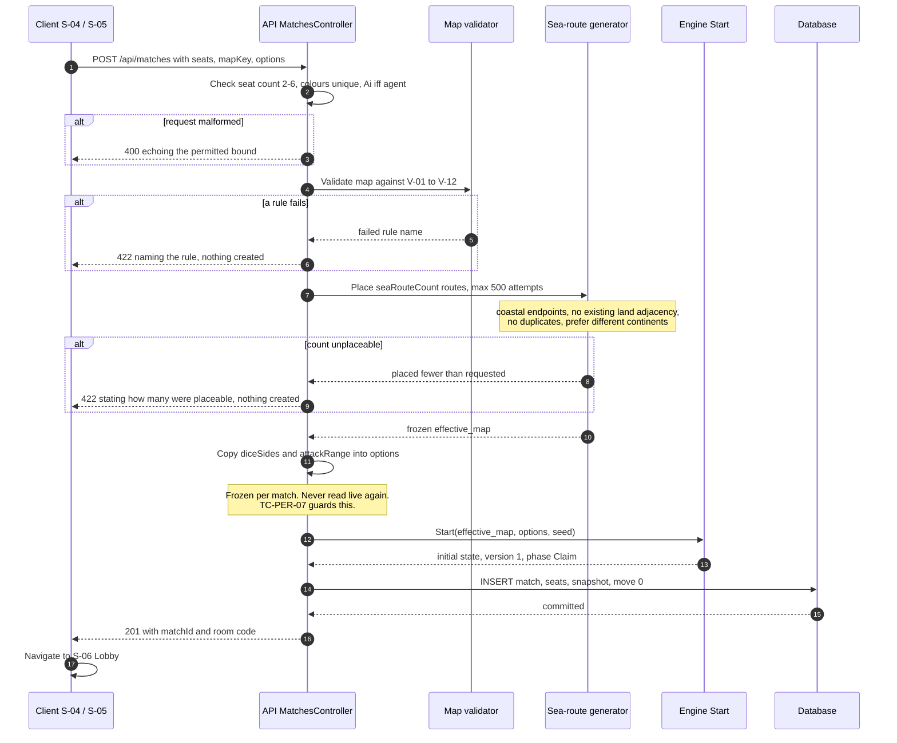
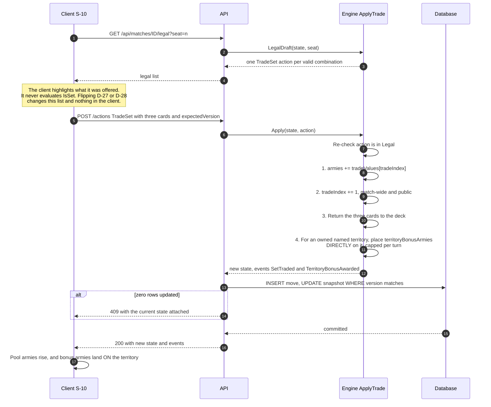
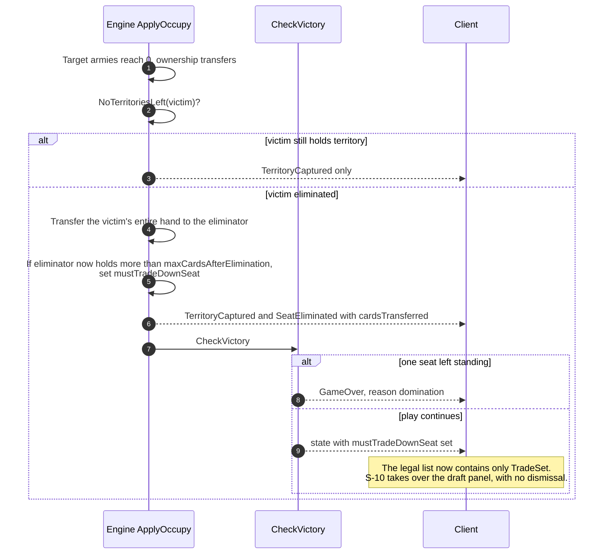
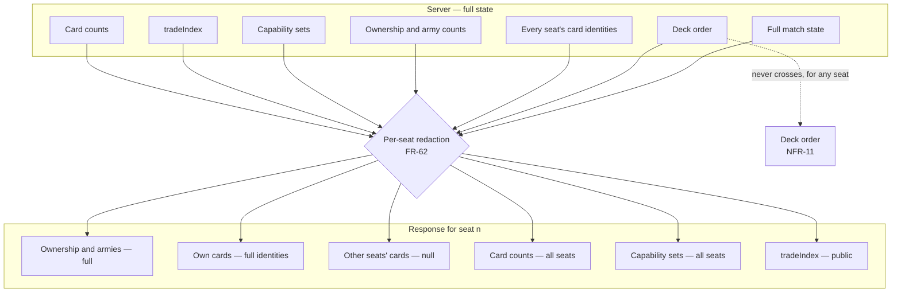

# Appendix H — Additional Diagrams and Screenshots

> **Deliverable U.** The diagrams the main chapters reference but do not contain, and the register
> of screenshots to be captured in Phase 14.
>
> §10.5 of [`10-results-template.md`](../docs/10-results-template.md) lists the required screenshot
> set so that nothing is missed while a build is available. This appendix is where those images
> land, and it carries the placeholders until they do.

---

## H.1 What is here, and what deliberately is not

The package already contains **29 diagrams**. Before adding any, each candidate was checked against
them:

| Candidate | Verdict |
|---|---|
| System context | **Already present** — [`04-system-analysis.md`](../docs/04-system-analysis.md) §4.6 is the Level-0 DFD, which *is* the context diagram, and §5.1's deployment view covers the process boundary. Duplicating it would create two drawings to keep in step |
| Combat resolution | **Already present** — §4.9.1 covers the human action path end to end |
| AI turn, hand-over, resume, concurrency | **Already present** — §4.9.2 – §4.9.4, §5.6 |
| **Create and start a match** | **Missing** — added as §H.2 |
| **Card trade** | **Missing** — added as §H.3 |
| **Seat elimination and card transfer** | **Missing** — added as §H.4 |
| **The redaction boundary** | **Missing** — added as §H.5 |

Four diagrams, bringing the package to **33**. Each is here because a specified behaviour had no
drawing, not to fill a section.

---

## H.2 Creating and starting a match

The most complex write path in the system, and the only one that can fail in four distinct ways
before anything is persisted. Referenced by UC-04, FR-12…FR-19, and route 6.

Three things this diagram exists to make unmissable:

- **`422` creates nothing.** Both failure points abort before the first `INSERT`. There is no
  partially-created match to clean up, which is why the route needs no compensating delete.
- **The freeze happens here and only here.** Step 11 is the single moment `diceSides` and
  `attackRange` move from configuration into match state. Everything afterwards reads
  `matches.options`.
- **Validation precedes generation.** Sea routes are placed onto an already-valid map, so the
  generator never has to cope with a malformed graph.

---

## H.3 Trading a card set

Referenced by UC-11, FR-34…FR-37. The flow is short but has four distinct effects, two of which are
easy to implement in the wrong order.

| Effect | Detail |
|---|---|
| Set value | goes to `armiesToPlace` — the player places it freely |
| **Territory bonus** | **placed directly on that territory**, *not* added to the pool (§E.8). A player cannot redirect it |
| Escalation | `tradeIndex` is **match-wide**, monotonic and **public** (DR-13) — any seat's trade raises the price for everyone |
| **Capability** | returning the cards can **remove** a capability, because a held card grants one (`seatHoldsCapabilityFromCards: true`). Nothing in the engine warns; [05 §5.5](../design/05-card-ui-ux.md) requires the client to |

The ordering matters: the bonus is evaluated against ownership **after** the cards leave the hand,
and the escalation increments once per trade regardless of how many bonuses were granted.

---

## H.4 Eliminating a seat

Referenced by UC-12, FR-36, FR-38. This is the subtlest flow in the engine because it can force a
second action out of the eliminating seat immediately.

Three properties worth stating next to the drawing:

- **The threshold after an elimination is 6, not 5.** `maxCardsAfterElimination: 6` and
  `maxCardsBeforeForcedTrade: 5` are separate keys because the forced trade-down happens
  *immediately*, mid-turn, rather than at the start of the next Draft.
- **Elimination is discovered in `Occupy`, not in `Attack`.** Ownership transfers in `ApplyOccupy`
  (§E.13), so the victim is only territory-less once the occupying armies have moved.
- **Victory is checked after every action**, not only after an elimination — `Apply` calls
  `CheckVictory` unconditionally (§E.5).

---

## H.5 The redaction boundary

No diagram in the package shows what the per-seat filter actually stops. NFR-11 and **TC-SEC-02**
assert it, so it is worth drawing once.

| Field | Own seat | Other seats | Why |
|---|---|---|---|
| Ownership, armies | full | full | Visible on the board anyway |
| Card **identities** | full | **`null`** | FR-62. The core secret |
| Card **counts** | full | **full** | Public information in RISK; hiding it would break play (§05.6) |
| Capability set | full | **full** | Derivable from visible ownership, so hiding it would be theatre |
| `tradeIndex` | full | full | Match-wide and public (DR-13) |
| **Deck order** | **never** | **never** | NFR-11. Not shown to anyone, at any point, including the replay viewer |

The deck order is the one item with no audience. It is excluded from the state DTO, from the event
log, from `GET /replay` and from S-18's final reveal — **TC-SEC-02** asserts that no response
contains it.

`CardAwarded` is the event-stream counterpart: the drawing seat receives `cardKey` and `symbol`,
every other seat receives `{ "seat": n }`. The count moves for everyone; the identity moves for one.

---

## H.6 Screenshot register

Twenty-five images, mirroring §10.5 of [`10-results-template.md`](../docs/10-results-template.md).
Each is captured from **every client that implements the screen**.

> **Status: not captured.** Phase 14 output. Each row below is a placeholder; replace the status
> cell with the image when it exists. A row is not complete until the **Must show** column is
> actually visible in the image.

| # | Screen | ID | Must show | Status |
|---|---|---|---|---|
| 1 | Sign in / Register / Guest | S-02 | The guest path, which needs no account | ☐ |
| 2 | Main menu | S-03 | The in-progress list with a resumable match | ☐ |
| 3 | Match setup | S-04 | An AI seat; the dice-faces and attack-range steppers at defaults | ☐ |
| 4 | Map selection | S-04 | Classic and at least one generated map | ☐ |
| 5 | Sea-route configuration | **S-05** | The count selector with its min/max bounds visible | ☐ |
| 6 | Lobby — seat list | S-06 | A 2-player match showing the third `Neutral` seat | ☐ |
| 7 | Claim phase | S-07 | Unclaimed territories selectable, everything else inert | ☐ |
| 8 | Board — classic | S-08 | Ownership colours, army counts, sea routes distinct from land edges | ☐ |
| 9 | Board — generated map | S-08 | A different territory count | ☐ |
| 10 | Reinforcement | S-09 | The computed army count and its breakdown | ☐ |
| 11 | Card hand and trade | S-10 | A valid three-card set and the escalation value offered | ☐ |
| 12 | Attack — target selection | S-11 | Only legal targets highlighted (FR-66) | ☐ |
| 13 | Dice resolution | S-11 | Faces from the `DiceRolled` event; a tie resolved to the defender | ☐ |
| 14 | **Dice at `diceSides = 7`** | S-11 | **Numeral faces including a 7** — the only evidence for D-29 | ☐ |
| 15 | Air Force targeting | **S-12** | The range-5 reachable set, with an unreachable territory for contrast | ☐ |
| 16 | Naval Force action | **S-13** | A target reachable only across a sea route | ☐ |
| 17 | Occupy | S-14 | The minimum-armies bound equal to the dice rolled | ☐ |
| 18 | Fortification | S-15 | A naval fortification, labelled as crossing a sea route | ☐ |
| 19 | Capability panel | **S-16** | A seat holding Air Force but not Naval, or the reverse | ☐ |
| 20 | Hand-over | S-17 | The blocking screen, outgoing hand already cleared | ☐ |
| 21 | Game over | S-18 | Both a domination result and a round-cap ranking | ☐ |
| 22 | Replay viewer | S-19 | A logged attack replayed with its original dice faces | ☐ |
| 23 | Settings — this match | S-20 | Dice faces and attack range shown **read-only** | ☐ |
| 24 | Three clients, one match | — | The same board state in Unity, Godot and Flutter side by side | ☐ |
| 25 | Debug renderer | — | The Phase 3 board, evidencing playable rules before artwork | ☐ |

S-01 (Splash) is deliberately omitted — it carries branding and a connectivity check and evidences
nothing. Every other screen in the §5.3 inventory appears above.

### The four that carry the argument

| # | What it proves |
|---|---|
| **14** | The dice face count is genuinely configurable — the supervisory question, answered with an image rather than a claim |
| **15, 16** | The locked extensions behave as specified; the only visual evidence for Air Force and Naval Force |
| **24** | The three-client architecture claim. The single most persuasive image this project can produce |

### Capture protocol

Comparability is the whole point of capturing the same scene three times, so the conditions are
fixed:

| | |
|---|---|
| Match | One **seeded** match, replayed to the required state in each client |
| Seed | Recorded in the caption. A screenshot without its seed is not reproducible |
| Theme | Light for 1 – 23; **24 in both themes** |
| Viewport | Desktop 1600 × 900; the mobile variant additionally at 390 × 844 for 8, 11, 12, 20 |
| Redaction | Captured from a seat that **does not** hold the information being redacted, so #11 evidences FR-62 |
| Naming | `H-<nn>-<screen-id>-<client>.png`, e.g. `H-14-S-11-unity.png` |

Capturing #11 from the hand's owner would show full identities and evidence nothing about
redaction. It must be captured from the owning seat for the *hand* and from another seat for the
*opponent rows* — two images under one number if necessary.

---

## H.7 Diagram inventory

All 33 diagrams in the package, for the report's list of figures.

| Location | Count | Kinds |
|---|---|---|
| [`01-introduction.md`](../docs/01-introduction.md) | 1 | delivery-order flowchart |
| [`04-system-analysis.md`](../docs/04-system-analysis.md) | 12 | use case, system flowchart, game flowchart, DFD 0/1/2, 4 sequences, 2 state machines |
| [`05-system-design.md`](../docs/05-system-design.md) | 10 | architecture, deployment, components, clients, maps, concurrency sequence, agents, capability, generation, persistence |
| [`06-database-design.md`](../docs/06-database-design.md) | 1 | **ER diagram** |
| [`08-implementation-plan.md`](../docs/08-implementation-plan.md) | 1 | phase dependencies |
| [`C-map-specification.md`](C-map-specification.md) | 2 | generation, effective map |
| [`D-capability-mapping-decision-table.md`](D-capability-mapping-decision-table.md) | 1 | capability routing |
| [`02-screen-inventory-and-flows.md`](../design/02-screen-inventory-and-flows.md) | 1 | screen navigation graph |
| **This appendix** | **4** | create-match, card-trade, elimination sequences; redaction boundary |
| **Total** | **33** | |

> **Every diagram in this package has been validated by rendering**, not merely by eye: each is
> parsed with `mermaid.parse()` and rendered with `mermaid.render()` in headless Chrome against
> Mermaid 11.17.2, then checked for an error graphic, for double-escaped entities, and for a
> non-zero node **and edge** count. A diagram that parses but renders empty would otherwise pass
> unnoticed.

> **All of them are browsable and zoomable in [`../diagrams.html`](../diagrams.html)** — a
> self-contained page with the library inlined, so it needs no network. Click any diagram to open it,
> scroll to zoom, drag to pan. A Markdown renderer strips JavaScript, so this is the only place a
> click-to-zoom lightbox can live.

---

**Appendix index:** [A](A-api-contract.md) · [B](B-database-schema.sql) · [C](C-map-specification.md) ·
[D](D-capability-mapping-decision-table.md) · [E](E-pseudocode.md) · [F](F-test-cases.md) ·
[G](G-configuration-tables.md) · H
