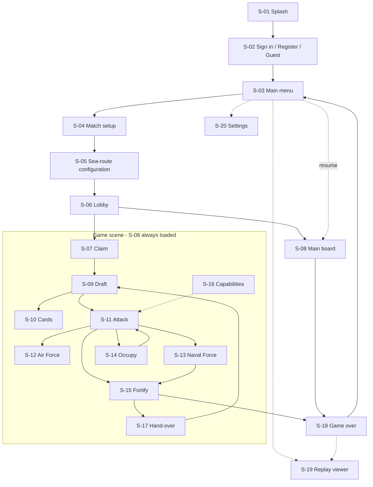

# 02 · Screen Inventory and Flows

Twenty screens, thirteen endpoints, nine action types, fourteen log events, six push events. This
document is the wiring diagram between them: for each screen, **what it reads, what it writes, what
it listens to, and what it becomes on a phone**.

The screen list itself is not this pack's invention — it is `../docs/05-system-design.md` §5.3,
copied without renumbering. What is added here is the binding of each screen to the API surface,
because that is the part a screen designer needs and the part the engine documents do not state
screen-by-screen.

---

## 2.1 Twenty screens, six scenes

A "screen" is a named UI state, not a scene file. Clients load **six** scenes
(`../docs/05-system-design.md` §5.3) and most screens are panels inside one of them.

| Scene | Screens | Why they share a scene |
|---|---|---|
| `Splash` | S-01 | Branding and the liveness check; nothing else is loaded yet |
| `Menu` | S-02, S-03, S-19, S-20 | All four are outside a match and need no board |
| `MatchSetup` | S-04, S-05 | S-05 is a step of setup, not a destination |
| `Lobby` | S-06 | Waiting room; the only scene that can be left by someone else's action |
| `Game` | S-07 … S-17 | **Eleven screens, one scene.** The board (S-08) is never unloaded |
| `Result` | S-18 | Final standings; the board is released |

> **S-08 is not a screen you navigate to — it is the floor every in-match screen stands on.**
> S-09 through S-17 are panels, sheets, overlays and modals *over* a live board. A client that
> implements them as separate scenes will reload the board eleven times a turn and lose the
> `StateChanged` subscription each time.

That single structural decision is why the Game scene holds eleven of the twenty screens, and it is
the main thing this document exists to say before anyone opens Unity.

---

## 2.2 Navigation graph

Solid edges are phase-driven and therefore **not the player's choice** — the server's phase moves
and the UI follows. Dotted edges are the only genuinely optional navigations in the product:
settings, replay, the capability panel, and resuming a match.

### The one cycle that matters

`S-11 → S-14 → S-11` is the attack loop, and S-14 is the only screen in the product that **cannot be
dismissed**. During `Occupy` the legal list contains occupation actions and **no `EndPhase`**
(`../appendices/E-pseudocode.md` §E.4), so there is no legal way out except choosing an army count.
§06 treats it as a blocking modal for exactly that reason.

---

## 2.3 The screen table

`Reads` and `Writes` name routes from `../appendices/A-api-contract.md` §A.3. Every route is given
by its number there, so the table is checkable against the contract line by line.

| # | Screen | Reads | Writes | Listens | Mobile form |
|---|---|---|---|---|---|
| S-01 | Splash | **3** `GET /maps` as the liveness check | — | — | full screen |
| S-02 | Sign in / Register / Guest | — | **1** `register`, **2** `login` | — | full screen |
| S-03 | Main menu | **13** `GET /players/{id}/matches` | — | — | full screen |
| S-04 | Match setup | **3** `GET /maps`, **4** `GET /maps/{key}` | **5** `POST /maps/generate` | — | full screen, stepped |
| S-05 | Sea-route configuration | **4** (`seaRoutes` min/max/default) | — contributes to **6**'s body | — | step of S-04 |
| S-06 | Lobby | **8** `GET /state` | **6** `POST /matches`, **7** `POST /join` | `StateChanged` | full screen |
| S-07 | Claim | **8**, **9** | **10** `POST /actions` | `StateChanged`, `TurnChanged`, `HandOverDevice` | board + right drawer |
| S-08 | Main board | **8**, **9** | **10** (`EndPhase`), **11** `ai-step` | all six | the scene itself |
| S-09 | Draft | **8**, **9** | **10** | `StateChanged` | right drawer |
| S-10 | Cards | **8**, **9** | **10** | `StateChanged` | right drawer, wide |
| S-11 | Attack | **8**, **9** | **10** | `StateChanged`, **`DiceRolled`** | right drawer |
| S-12 | Air Force targeting | **8**, **9** | **10** | `StateChanged`, **`DiceRolled`** | right drawer, wide |
| S-13 | Naval Force | **8**, **9** | **10** | `StateChanged`, **`DiceRolled`** | right drawer |
| S-14 | Occupy | **9** | **10** | `StateChanged` | **blocking modal** |
| S-15 | Fortify | **8**, **9** | **10** | `StateChanged` | right drawer |
| S-16 | Capability panel | **8** | — **read-only** | `StateChanged` | right drawer, wide |
| S-17 | Hand-over | **nothing until dismissed** | — | `HandOverDevice` | **blocking full screen** |
| S-18 | Game over | **8** | — | `GameOver` | full screen |
| S-19 | Replay viewer | **12** `GET /replay` | — | — | full screen |
| S-20 | Settings | — local only | — | — | full screen |

Four rows are worth reading twice:

- **S-01 uses route 3 because there is no health endpoint.** The thirteen routes contain no
  `/health` and none is being added — the splash screen's "connectivity check" is a `GET /maps`,
  which is unauthenticated, cacheable, and proves the API *and* its map data are present. Failure
  lands in §06's offline state.
- **S-16 and S-20 write nothing at all.** The capability panel is pure derived display (CAP-2,
  D-10) and settings are local to the device. Neither can desynchronise a match, which is why
  neither needs a version check.
- **S-17 reads nothing while it is up.** The incoming seat's state is requested **after** the
  blocking screen is dismissed, never before (§05.6, TC-UI-03). A prefetch here is the one
  optimisation that is a security bug.
- **S-08 is the only screen that calls route 11.** Driving an AI turn is the board's job because
  the board is what animates it — `ai-step` plays exactly one action per call and increments
  `version` by one, so the board calls it in a loop until `currentSeat` changes rather than letting
  the state teleport.

---

## 2.4 Endpoint coverage

All thirteen routes have at least one calling screen, and no screen invents a fourteenth.

| # | Route | Called from |
|---|---|---|
| 1 | `POST /api/auth/register` | S-02 |
| 2 | `POST /api/auth/login` | S-02 |
| 3 | `GET /api/maps` | S-01, S-04 |
| 4 | `GET /api/maps/{key}` | S-04, S-05 |
| 5 | `POST /api/maps/generate` | S-04 |
| 6 | `POST /api/matches` | S-06 (submitted from S-04/S-05's accumulated choices) |
| 7 | `POST /api/matches/{id}/join` | S-06 |
| 8 | `GET /api/matches/{id}/state?seat=n` | S-06 … S-18 |
| 9 | `GET /api/matches/{id}/legal?seat=n` | S-07 … S-15 |
| 10 | `POST /api/matches/{id}/actions` | S-07, S-08, S-09, S-10, S-11, S-12, S-13, S-14, S-15 |
| 11 | `POST /api/matches/{id}/ai-step` | S-08 |
| 12 | `GET /api/matches/{id}/replay` | S-19 |
| 13 | `GET /api/players/{id}/matches` | S-03 |

### Guest play calls neither route 1 nor route 2

FR-01…03 allow *continue as guest*. A guest session holds `LocalHuman` seats on one device and is
authorised as "the match's creating session" (`../appendices/A-api-contract.md` §A.4), so S-02's
third button leads straight to S-03 with no auth round trip. Route 13 is then unavailable — a guest
has no `player_id` — so **S-03's "resume" list is empty for guests**, and §06.7 gives it an
`EmptyState` rather than a spinner that never resolves.

---

## 2.5 Action types and the screens that submit them

Nine action types, from the `Apply` dispatch in `../appendices/E-pseudocode.md` §E.5. Every one
arrives through route 10.

| Action | Shape | Submitted by | Phase |
|---|---|---|---|
| `ClaimTerritory` | `(territory)` | S-07 | Claim |
| `PlaceArmies` | `(territory, n)` | **S-07** with `n = 1`, **S-09** with `n` chosen | Claim, Draft |
| `TradeSet` | `(cards[3])` | S-10 | Draft |
| `Attack` | `(from, to, dice)` | S-11 | Attack |
| `AirAttack` | `(from, to, dice)` | S-12 | Attack |
| `NavalAttack` | `(from, to, seaRouteId, dice)` | S-13 | Attack |
| `Occupy` | `(armies)` | S-14 | Occupy |
| `Fortify` | `(from, to, n)` | **S-15** by land, **S-13** by sea | Fortify |
| `EndPhase` | `()` | S-08 action bar | Attack, Fortify, EndTurn, Draft |

Three consequences a designer should know before drawing anything:

- **`PlaceArmies` is one action serving two screens.** In Claim, `LegalClaim` offers it only as
  `PlaceArmies(t, 1)` — the count is fixed, so S-07 has no stepper. In Draft it carries a chosen
  `n`, so S-09 does. Same action, two very different controls.
- **A naval fortification is a plain `Fortify`.** There is no `NavalFortify` action. S-13's
  "fortify across this route" and S-15's "fortify to this neighbour" submit the identical shape;
  the engine re-derives reach from the map. A client labels the move by sea from the **map** before
  the fact, or from the resulting `ArmiesFortified` event's `viaSeaRoute` flag after it — never
  from the action.
- **`EndPhase` is the only action with no parameters, and the only one offered in four phases.**
  It is the action bar's right-hand button in all of them, in the same position, always
  (§06.2). `Legal` is total precisely because `EndPhase` is nearly always available — the two
  exceptions are `Occupy` and a satisfiable forced trade.

---

## 2.6 Events: the log is larger than the push feed

Two vocabularies, and conflating them produces a replay viewer that cannot show what the live board
showed, or a live board that animates nothing.

| Event | In the action response's `events[]` | Pushed over `/hubs/match` |
|---|---|---|
| `ArmiesPlaced` | ✓ | |
| `TerritoryClaimed` | ✓ | |
| `SetTraded` | ✓ | |
| `TerritoryBonusAwarded` | ✓ | |
| `DiceRolled` | ✓ | **✓** |
| `TerritoryCaptured` | ✓ | |
| `TerritoryHeld` | ✓ | |
| `ArmiesOccupied` | ✓ | |
| `ArmiesFortified` | ✓ | |
| `CardAwarded` | ✓ — redacted to `{ "seat": n }` for other seats | |
| `SeatEliminated` | ✓ | **✓** |
| `PhaseChanged` | ✓ | |
| `TurnChanged` | ✓ | **✓** |
| `GameOver` | ✓ | **✓** |
| `StateChanged` | — | **✓** transport only |
| `HandOverDevice` | — | **✓** transport only |

**Fourteen log events, six push events, four in both.**

| Audience | What it gets | What it can animate |
|---|---|---|
| The **acting** client | Route 10's response, with the full `events[]` | Everything |
| An **observing** seat | `StateChanged`, then re-reads route 8 | The new state — plus dice, because `DiceRolled` is pushed separately |
| **S-19 replay** | Route 12, the whole log | Everything, step by step |

That is why `DiceRolled` is in the push set at all despite already being in the log: without it an
observer's board would simply show two army counts change, and FR-69's animation would be visible
only to the attacker. The other ten log events need no push because `StateChanged` plus a re-read
reproduces their effect — a card award changes a count, a phase change changes the phase bar.

`CardAwarded`'s redaction is the event-stream half of UX-12: the acting seat learns which card,
every other seat learns only that a card was drawn. The count moves for everyone; the identity
moves for one.

---

## 2.7 Per-phase screen map

Which screens can be open in which phase, and what the action bar offers.

| Phase | Primary | Also available | Action bar | `EndPhase`? |
|---|---|---|---|---|
| `Claim` | S-07 | S-16 | — | no |
| `Draft` | S-09 | S-10, S-16 | Trade · End phase | yes, unless `mustTrade` |
| `Attack` | S-11 | S-12, S-13, S-16 | Attack · Air · Naval · End phase | yes |
| `Occupy` | **S-14, blocking** | — | — | **no** |
| `Fortify` | S-15 | S-13, S-16 | Fortify · End phase | yes |
| `EndTurn` | S-08 only | — | End turn | **only** `EndPhase` |
| `GameOver` | S-18 | S-19 | — | — |

Two phases have no player choice beyond one thing, and both are easy to get wrong:

- **`Occupy`** offers only `Occupy(n)` and never `EndPhase`. §E.4.5 proves the offered range is
  never empty, so a blocking modal can always be satisfied — the UI is not gambling on that.
- **`EndTurn`** offers only `EndPhase`. It exists as a distinct phase so that end-of-turn effects
  (the card award, §E.8.4) have somewhere to happen. A client should show it as a brief confirm
  state on S-08, not as a screen; a full screen for a single button reads as a bug.

`S-16` is available in every in-match phase because it is read-only and derived. It is the one panel
that can never be wrong.

---

## 2.8 Conditional screens

Four screens are not reachable in every match, and all four must degrade to something, not to
nothing.

| Screen | Needs | When unavailable |
|---|---|---|
| S-12 Air Force | the `AirForce` capability **and** `airAttackUsed = false` | Affordance absent from the action bar — not greyed. §06.3 |
| S-13 Naval Force | the `NavalForce` capability **and** a sea route touching an owned territory | Same. Appendix D §D.5 records the capability-held-but-no-route case; TC-NAV-03 asserts it |
| S-17 Hand-over | two or more `LocalHuman` seats | Never shown in a single-human match |
| S-19 Replay | a finished or in-progress match with a log | S-03's entry point is hidden for guests (§2.4) |

The distinction between **absent** and **disabled** is a rule, not a preference, and §06.3 states
it: an action the server has not offered does not appear. A greyed *Air Force* button invites a tap
that FR-66 guarantees will do nothing.

S-16 is the exception that makes this workable: capabilities are always visible there, with their
source, so a player who wonders *why can't I attack by air* has one place to look and it is never
empty.

---

## 2.9 One write path, and what it buys the interface

Every rule change flows through route 10, or route 11 which calls the same service for an agent
(`../appendices/A-api-contract.md` §A.3). The interface consequences are concrete:

| Because | The UI gets |
|---|---|
| One route carries every action | One submit function, one error path, one place for the 409 conflict (§06.5) |
| Route 10 returns the new state **and** `events[]` | No read-after-write round trip; the acting screen renders from the response |
| `version` increments by exactly one per applied action | A reliable staleness check, and `expectedVersion` to send back |
| `Apply` re-checks `Legal` server-side | A client bug can produce a `409`/`422`, never a corrupt match |
| The log is append-only (`REVOKE UPDATE, DELETE ON moves`) | S-19 can be built as a pure function of the log |

The last row is what makes S-19 cheap: a replay viewer is the same renderer as S-08, driven from
route 12 instead of route 8. It is not a second board implementation, and if it ever becomes one,
TC-UI-04's "all three clients render the same state" has quietly become two renderers per client.

---

## 2.10 Design acceptance checks

Verified by inspection in Phase 8. Not additions to the 119-case catalogue — **TC-UI-01** already
requires all twenty screens present and reachable, and **TC-API-01…08** pin the routes.

| # | Check | Rule |
|---|---|---|
| DA-36 | All 20 screens exist and are reachable; the Game scene loads the board exactly once per match | §2.1, TC-UI-01 |
| DA-37 | No in-match screen is implemented as a scene load | §2.1 |
| DA-38 | Every one of the 13 routes has a calling screen, and no client calls a route not in §2.4 | §2.4 |
| DA-39 | S-16 and S-20 issue no write of any kind | §2.3 |
| DA-40 | S-17 requests no incoming state until dismissed, verified by request log | §2.3, TC-UI-03 |
| DA-41 | S-14 has no dismissal affordance by any route | §2.7, §E.4.5 |
| DA-42 | Unavailable capability actions are **absent**, never disabled | §2.8, FR-66 |
| DA-43 | S-19 reuses S-08's renderer, driven from route 12 | §2.9, TC-UI-04 |
| DA-44 | The guest path reaches S-03 with zero auth calls and an `EmptyState` resume list | §2.4 |
| DA-45 | Observing seats animate dice; verified with a second client attached | §2.6, FR-69 |

---

[← 01 Design system](01-design-system.md) · [03 Map UI/UX →](03-map-ui-ux.md)
