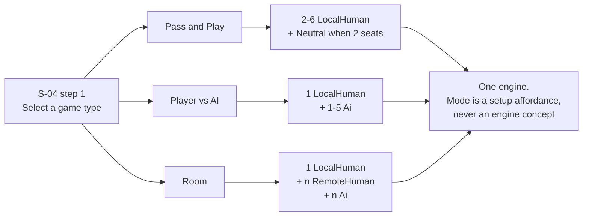

# 09 · Art Direction — sampled from reference

**Every value in this document was measured from a reference frame, not chosen.** The source files
are in [`References/`](References/); each row names the frame and, where it matters, the pixel region
it came from. Nothing here is recalled or estimated, and anything derived rather than sampled is
labelled **DERIVED**.

This document supersedes the palette and surface treatment in
[`01-design-system.md`](01-design-system.md) §1.2–§1.4 for everything the player sees in a match.
The token *names* and the structural rules in 01 stand; the *values* come from here.

---

## 9.1 What the reference actually is

A survey of 168 extracted frames plus 5 screenshots. The headline correction first, because the
earlier draft of this pack had it backwards:

| Assumed earlier | Actually measured |
|---|---|
| Dark "war-room" chrome | **Bright cyan ocean** `#1897C8` with dark slate landmasses |
| Flat, token-driven surfaces | **Glossy, bevelled, casual-game** surfaces — gradients, inner highlights, outlined type |
| Persistent side panels | **No side panels during play at all.** The board is 100 % full-bleed; every control is a small floating corner or edge element |
| Academic neutrals | Saturated ownership fills, near-black territory outlines, bright badge discs |

The reference also settles two open questions by showing them directly:

- **Landscape.** Every frame is 1280 × 576 and every screenshot 1600 × 720 — 2.22 aspect, landscape,
  no portrait layout anywhere in the capture. This is independent confirmation of UX-05.
- **Zoom and pan are core.** Frame 110's own tutorial copy reads *"To zoom, pinch-out or double tap
  the map"* — which is UX-13's two-state model, as shipped by the genre.

---

## 9.2 Board palette — sampled

| Token | Value | Sampled from | Modal share |
|---|---|---|---|
| `board-ocean` | **`#1897C8`** | `frame_103.png` @ (150,150) | 26 % |
| `board-ocean-hi` | `#53B7E5` | `frame_103.png` — wave highlight | — |
| `board-ocean-deep` | `#2D5E74` | `frame_103.png` — coastal shadow | 6 % |
| `board-land-unowned` | **`#383E48`** | `frame_103.png` @ (700,470) | **100 %** |
| `board-outline` | **`#120400`** | edge scan, see §9.4 | — |
| `banner-panel` | `#D3E9F3` | `frame_103.png` top instruction banner | 19 % |
| `banner-ink` | `#000000` | same banner, text | — |
| `card-face` | `#F0EEED` | `frame_103.png` card-stack icon | — |

Ocean readings across four frames were `#1897C8`, `#1A96C8`, `#1A97C6`, `#1F95C6` — stable within
JPEG/scaling noise. Unowned land read `#383E48`/`#384047`/`#393F49`/`#3B3F49` across the same frames,
with a **100 % modal share** in a clean patch, so it is a flat fill and not a gradient.

### Chrome and menus — sampled

| Token | Value | Sampled from |
|---|---|---|
| `chrome-navy-deep` | `#081A24` | `frame_023.png` (main menu) |
| `chrome-navy` | `#0A2433` | `frame_023.png` |
| `chrome-navy-mid` | `#123A50` | `frame_023.png`, 9.6 % |
| `chrome-navy-lift` | `#20658A` | `frame_023.png`, 8.9 % |
| `chrome-steel` | `#3091C5` | `frame_023.png` |
| `chrome-panel-teal` | `#0C3D4F` | `frame_124.png` (settings), 14.6 % |
| `brand-red` | `#842627` | `frame_023.png` — character art / RISK mark |

Menus are a **deep teal-navy gradient** with a faint repeating watermark (an "R" in the reference;
ours becomes the Order & Conquest mark), gold accent type, and glossy pill buttons.

---

## 9.3 Seat colours — two tiers, which is the key discovery

The reference uses **two values per seat**: a **muted fill** for the territory body and a **bright
accent** for the army badge, the seat ring and anything in the UI. They are not the same colour and
not a simple multiply of one another.

| | Fill, sampled | Accent, sampled |
|---|---|---|
| Red | `#FF0103` | `#FF0103` |
| Gold | `#96843C` | `#FBBA2D` |
| Blue | `#35677E` | `#45A4EE` |

Gold fill → accent moves (150,132,60) → (251,186,45); blue moves (53,103,126) → (69,164,238).
Neither is a uniform scale, so this is a deliberate two-tier palette, not shading.

> **Why it works:** muted fills let 42 territories sit together without vibrating, while the bright
> badge is the thing the eye actually needs to find. The number pops; the geography recedes.

### The full six seats

Three are sampled. Three are **DERIVED** to extend the same language, chosen for maximum separation
and validated in §9.7.

| Seat | Fill | Accent | Source |
|---|---|---|---|
| `seat-0` Red | `#FF0103` | `#FF2E30` | **sampled** (accent lifted for badge legibility) |
| `seat-1` Gold | `#96843C` | `#FBBA2D` | **sampled** |
| `seat-2` Blue | `#2F6E92` | `#45A4EE` | **sampled** (fill nudged +chroma, §9.7) |
| `seat-3` Green | `#6D9423` | `#8FD13A` | **DERIVED** |
| `seat-4` Violet | `#8A3FA8` | `#B97BE8` | **DERIVED** |
| `seat-5` Orange | `#B4532A` | `#F2863A` | **DERIVED** |
| `seat-neutral` | `#4E5765` | `#8A94A2` | **DERIVED** — desaturated, never reads as a competitor (D-07) |

---

## 9.4 Territory edge treatment — measured

A horizontal pixel scan across the red/gold boundary in `frame_103.png` at y = 300 gives the exact
construction:

```
x=700…727   #FF0103        territory fill
x=728…731   #FF7975        LIGHT INNER RIM   ~4 px, a lightened fill
x=732…734   #120400        DARK OUTLINE      ~3 px, near-black
x=735…      #96843C        the neighbouring territory's fill
```

So every territory is drawn as **three concentric layers**:

| Layer | Width | Value |
|---|---|---|
| Fill | — | the seat fill, or `board-land-unowned` |
| **Inner rim** | **4 px** @ reference scale | the fill lightened — `#FF0103` → `#FF7975` |
| **Outline** | **3 px** @ reference scale | `#120400`, essentially black with a trace of the fill hue |

This is what gives the board its weight, and it is why [07 §7.3](07-responsive-and-accessibility.md)'s
requirement for a `border-strong` stroke on every territory is satisfied automatically: the reference
already carries a 3 px near-black outline, far exceeding the 3 : 1 boundary contrast we required.

At our 1600 × 900 canvas the widths scale 1 : 1. Under the zoom model (UX-13) both rims are drawn in
**screen space, not canvas space**, so the outline stays 3 px at every scale and the board never
turns into a smear at Overview.

---

## 9.5 Board HUD anatomy — observed layout

The single most important structural fact: **no side panels.** Measured against the 1280 × 576 frame:

```
┌──────────────────────────────────────────────────────────────────────┐
│ (⚙)(?)(🎲)          ┌─ instruction banner ─┐                   seat │ ← 3 circular
│  top-left, Ø36      │ "Tap any of your…"   │                   rail │   icon buttons
│                     └──────────────────────┘                    (◉) │
│                                                                 (◉) │ ← right edge,
│                     B O A R D   ·  100 % full-bleed             (◉) │   circular seat
│                                                                      │   avatars + rings
│                                                                      │
│  ╭──╮                    ┌────────────────────────┐                  │
│  │0 │ card stack         │ (avatar) DRAFT   (troop│                  │
│  ╰──╯ bottom-left        │  ▰▰▱▱▱ segmented bar  │ 10)              │
│                          │  [   Next Phase   ]    │                  │
│                          └────────────────────────┘                  │
└──────────────────────────────────────────────────────────────────────┘
                            bottom-CENTRE HUD, ~100 px of 576 = 17 %
```

| Element | Observed treatment |
|---|---|
| Corner icon buttons | Circular, ~36 px, thin white ring, transparent centre. Gear / help / dice |
| Instruction banner | Top-centre, rounded, `banner-panel` fill, **black** text, bold phrase + regular tail |
| Card stack | Bottom-left, an **angled card silhouette** in `card-face` with a count numeral on it |
| Phase HUD | Bottom-**centre**, not full-width. Circular seat avatar, outlined caps phase label, a **segmented** progress bar, and a `Next Phase` pill |
| Troop button | Circular, seat-red, troop glyph, with a **count badge** pinned to its lower edge |
| Seat rail | **Right edge**, vertical stack of circular avatars, each with its seat-accent ring, a small territory/army count, and a `YOU` tag on the local seat |
| Sea route | A **white dotted line with round dots**, drawn over the ocean between coastal territories |

### Army badge — observed

| Property | Treatment |
|---|---|
| Shape | Circular disc |
| Fill | the seat **accent** (not the fill) |
| Ring | a darker ring of the same hue beneath, offset down — reads as a physical token |
| Numeral | **bold white with a dark outline**, optically centred |
| Territory name | small **white, bold, dark-outlined** text directly **below** the badge |

The dark text outline is the genre's load-bearing typographic device: it is what lets white type sit
legibly on both a bright ocean and a dark landmass without a plate behind it.

---

## 9.6 Mode selection — the reference has this screen

`frame_030.png` is a **"Select a game type"** screen: a horizontal row of cards, each an icon over a
title with a short descriptor, one of them *Pass & Play*. Our product has exactly three modes, so
S-04 opens with three cards rather than an abstract seat-kind table.



| Mode | Seat composition | Hand-over? | Room code? |
|---|---|---|---|
| **Pass & Play** | 2–6 `LocalHuman`; a 2-seat match adds `Neutral` (D-07) | **Yes** — S-17 blocking | no |
| **Player vs AI** | 1 `LocalHuman` + 1–5 `Ai` | no — the next seat is never local | no |
| **Room** | 1 `LocalHuman` + `RemoteHuman` + `Ai`, mixed freely | only if 2+ local seats | **yes**, S-06 |

> **"Game mode" stays out of the engine.** `../docs/05-system-design.md` §5.1 is explicit that mode
> is not a concept and that a seat is `LocalHuman | RemoteHuman | Ai | Neutral`. That holds: the three
> cards are a **setup-screen affordance** that resolve to seat compositions. One engine, one rule set,
> three doors. The modes need no new FR, no new action type and no new test — which is why the seat-kind
> model was the right call.

---

## 9.7 Accessibility — where we deliberately diverge from the reference

Running the measured palette through a colour-vision validator produced a finding worth stating
plainly:

| Check | Accents | Fills |
|---|---|---|
| Normal-vision separation | **PASS** — worst pair ΔE 25.2 | **PASS** — worst pair ΔE 19.8 |
| CVD separation | **PASS** — ΔE 17.7 deutan; tritan 7.3 | **FAIL** — see below |
| Contrast vs surface | PASS | 1 pair needs relief |

> **The reference's own red and gold territory fills are ΔE 5.1 apart under deuteranopia** —
> `#FF0103` against `#96843C`. They are, for a deuteranopic player, the same colour. This is a real
> accessibility defect in the commercial game, measured rather than asserted.

We keep the fills, because fidelity to the art direction is the point, and we fix the defect the way
**UX-03** already required: **ownership is encoded twice**, by colour *and* by a per-seat pattern at
18 % over the fill. With that second channel the validator's own rule applies — separation in the
6–8 band is legal *with* secondary encoding — and below-band pairs are still resolvable, because the
board additionally carries the bright accent badge and the territory name on every territory.

Two further notes:

- The muted fills sit **below the validator's chroma floor** (`#96843C` 0.095, `#2F6E92` 0.086). That
  is inherent to the reference's approach and is not treated as a defect: a territory's identity is
  carried by its **accent badge, its name and its pattern**, not by fill chroma alone. The floor is a
  rule for chart series, where a fill is the only channel available.
- The accents sit **above** the validator's lightness band (0.68–0.83 against 0.43–0.77). That is
  correct for a badge carrying white outlined numerals, and is a genre difference rather than an
  error.

**This is a defensible contribution rather than a compromise:** the pack reproduces a shipped
commercial art direction *and* repairs a measurable accessibility flaw in it.

---

## 9.8 What must be adapted, not copied

The reference is a different product. Four things ours has that it does not, and they need art that
belongs to the same family:

| Ours | Treatment |
|---|---|
| **Sea routes** (generated, 2–10, capability-gated) | The reference's white dotted line is the right form. Ours adds an `⚓` endpoint badge so a sea route is never confused with the 10 `crossesWater` dashed land borders (UX-08) |
| **Capability profiles** | No equivalent in the reference. S-16 uses the chrome panel language of `frame_124.png`, with the icon family from [01 §1.7](01-design-system.md). **No Wild row** (D-20) |
| **Configurable dice faces** (2–20, D-29) | The reference shows a physical white/red die. Ours keeps that token at `diceSides ≤ 6` and switches to numerals above it (UX-06) — the die *object* stays, only the face changes |
| **Six card symbols** incl. AirForce / NavalForce | The reference's card stack silhouette and count carry over; the card *faces* need two symbols the reference has no art for |

### What we deliberately do not copy

The RISK wordmark, the character portraits, the specific map artwork and any store or monetisation
surface. Those are Hasbro/SMG assets. What this document takes is the **art direction** — palette,
surface construction, HUD anatomy, badge system — which is the part a design specification is
allowed to learn from.

---

## 9.9 Design acceptance checks

| # | Check | Rule |
|---|---|---|
| DA-76 | Every colour in the built UI traces to a token in §9.2–§9.3, and every sampled token matches its reference frame | §9.2 |
| DA-77 | Every territory draws fill + 4 px lightened inner rim + 3 px `#120400` outline, in **screen space** at every zoom | §9.4 |
| DA-78 | Army badges use the seat **accent**, territory fills the seat **fill** — never interchanged | §9.3 |
| DA-79 | No side panel is persistent on touch; the board is 100 % full-bleed with floating controls | §9.5, UX-14 |
| DA-80 | White board type always carries a dark outline, on ocean and land alike | §9.5 |
| DA-81 | S-04 opens with the three mode cards, and each resolves to the seat composition in §9.6 | §9.6 |
| DA-82 | Ownership is encoded by colour **and** pattern on every territory | §9.7, UX-03 |
| DA-83 | No Hasbro/SMG wordmark, portrait or map asset appears in any deliverable | §9.8 |

---

[← 08 Wireframes](08-wireframes.md) · [00 Index](00-index.md) · Reference frames: [`References/`](References/)
