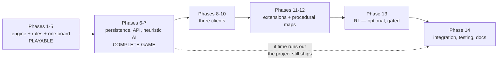

# 1 — Introduction

## 1.1 Background

Territory-conquest board games occupy a well-defined niche in strategy gaming: a shared map divided into
regions, armies placed on those regions, and conquest resolved by chance rather than by positional
calculation. RISK, first published in 1957, is the canonical example and remains the reference point for
the genre. Its rules are compact — reinforce, attack, fortify — yet the resulting decision space is
enormous, because the value of a territory depends on the whole board rather than on the territory
itself.

That combination makes the genre unusually well suited to a final-year software project. The rules are
small enough to specify exactly and test exhaustively, while the strategic depth is large enough that
building a competent computer opponent is a genuine engineering problem rather than a lookup table.

This project, **Order & Conquest**, is a digital territory-conquest game built on classic RISK rules
with three controlled extensions: an **Air Force** capability that attacks beyond adjacency, a **Naval
Force** capability that operates over **sea routes**, and a per-territory **capability profile** system
that governs which of those a player can use. It is delivered as a single authoritative server holding
one rules engine, three thin clients built on different engines (Unity, Godot, Flutter + Flame), a
heuristic AI opponent, and an optional reinforcement-learning agent.

A prior student project, *Risk Conquest* (2022), addressed a similar problem at the same institution. It
is used in this document as a historical reference — for its requirement structure, its three AI
personalities, and several design faults worth correcting — and not as a specification. Where this
project departs from it, §2.4 and `00-decisions-and-assumptions.md` say so explicitly.

## 1.2 Problem Statement

Existing digital RISK implementations tend to fall into one of two groups. Commercial products are
closed, so their rules engines and AI cannot be studied or extended. Open student and hobby projects
typically implement the rules **inside the user interface**, which produces three specific failures:

1. **Rule logic is duplicated per platform.** Combat tie-handling, the escalating card-trade table, and
   the "one more army than dice rolled" constraint are exactly the rules that get subtly wrong. Three
   implementations mean three different subtle bugs — and matches that disagree with each other.
2. **The game cannot be replayed or resumed reliably.** When dice are rolled in the UI and outcomes are
   not recorded, a match cannot be reconstructed. That rules out save/resume, rules out replay, and
   rules out using the game as a training environment.
3. **The AI is tied to one client.** An agent written against a Unity scene cannot be reused, evaluated
   against other agents, or run headlessly for the millions of matches that learning requires.

There is a further, narrower problem. Extending RISK is easy to do badly. Adding air and naval forces
usually means adding unit types, movement costs, fuel, transport capacity and separate combat systems —
at which point the game is no longer RISK and the project is no longer finishable. The problem is
therefore not only *how to build* a digital RISK, but **how to extend it without the extension consuming
the project.**

## 1.3 Proposed Solution

Order & Conquest addresses both problems with one structural decision and one design discipline.

**The structural decision: one authoritative rules engine, on the server, with three thin clients.**

`OrderAndConquest.Engine` is a pure C# library with no I/O, no database and no framework dependency. Its
entire public surface is three methods:

```csharp
public interface IGameEngine
{
    GameState Start(MapData map, MatchOptions options, IRandomSource rng);
    IReadOnlyList<GameAction> Legal(GameState state);
    ApplyResult Apply(GameState state, GameAction action);   // -> new state + events
}
```

Randomness is injected and seeded; every random outcome is returned as an event rather than hidden; and
state transitions are pure functions. From those constraints, save/resume, full replay, deterministic
tests, reinforcement-learning trajectories and the option of compiling the engine into a client all
follow without further work.

The clients contain **no rules at all**. `GET /legal` returns the list of actions currently available,
so a client renders highlights for what the server says is possible and nothing else. This is what makes
three clients cost three times the *drawing* rather than three times the *game*.

**The design discipline: the extensions reuse existing mechanics rather than adding new ones.**

- **Air Force** changes only the adjacency test for an attack — from "is adjacent" to "is within 5 land
  edges". Combat resolution, occupation and card award are untouched.
- **Naval Force** adds one new edge type to the map graph. A sea route behaves exactly like a land edge
  for a player holding Naval capability. There is no naval unit, no transport and no naval combat
  system.
- **Capability profiles** are derived from two authored fields per territory. Infantry, Cavalry and
  Artillery remain card symbols with no mechanical effect, exactly as in classic RISK; Air Force and
  Naval Force are the only two capabilities that unlock an action.

The result is that the entire extension set adds **two actions** and **one edge type**, and no second
combat system.

## 1.4 Objectives

| # | Objective | How completion is judged |
|---|---|---|
| **O1** | Implement complete classic RISK rules in one deterministic, I/O-free engine | The unit-test suite in §9.2 passes, including exact dice-probability verification |
| **O2** | Guarantee determinism: identical seed and action sequence reproduce identical state | TC-DET-01…04; replay of a completed match reproduces its final state byte-for-byte |
| **O3** | Add Air Force, Naval Force, sea routes and capability profiles without a second combat system | One code path resolves all combat (TC-AIR-03, TC-NAV-03 assert identical resolution) |
| **O4** | Deliver three functional clients containing zero rule logic | §9.3; a source-level check confirms no client references combat, draft or card rules |
| **O5** | Persist matches so any match can be resumed or replayed | TC-PER-01…05; a resumed match yields an identical legal-action set |
| **O6** | Provide a competent heuristic AI opponent | MarsBot defeats a uniform-random agent in ≥ 90% of 1000 seeded matches |
| **O7** | Generate balanced procedural maps | Generated maps pass the same validation gate as the authored map; derived continent bonuses land in the classic static-value band |
| **O8** | *(Optional)* Train a reinforcement-learning agent that beats the heuristic AI | Head-to-head win rate > 50% over ≥ 1000 seeded matches. **If not met, the heuristic AI ships and the result is reported as negative.** |

O1–O7 constitute a complete, playable, documented system. **O8 is explicitly optional** and no other
objective depends on it.

## 1.5 Scope

### In scope

| Area | Contents |
|---|---|
| Core rules | 42-territory classic board · 6 continents · 2–6 players · claim or random territory allocation · reinforcement · dice combat · occupation · fortification · territory cards · escalating set trading · elimination · world-domination victory · 100-round cap |
| Extensions | Air Force (range 5, land adjacency only) · Naval Force (sea routes) · per-territory capability profiles · 6 card types · seat-chosen sea-route count |
| Architecture | One pure rules engine · ASP.NET Core REST + SignalR · PostgreSQL six-table persistence · per-seat state redaction · optimistic concurrency |
| Clients | Unity · Godot · Flutter + Flame — all thin, all driven by `GET /legal` |
| Modes | **Three, and only three: Pass & Play · Player vs AI · Room (remote players and AI together)** — each a seat composition over one rule set, never an engine concept (§5.1) |
| AI | PassiveBot · ChaoticBot · AggressiveBot · MarsBot (evaluation function) |
| Maps | Authored classic board · procedural generation (Poisson-disc → Lloyd → Delaunay → clustering) · shared validation gate |
| Optional | Reinforcement-learning agent (PPO, self-play, ONNX export) |

### Out of scope

Everything in Part E of `00-decisions-and-assumptions.md`. The load-bearing exclusions:

- No diplomacy, alliances-as-a-rule, player trading, fog of war, commanders, heroes, resources, economy,
  tech trees or mission cards.
- No new unit types, hit points, fuel, airfields, bombing or transport capacity.
- No separate air or naval combat system — one resolution path only.
- No microservices, no required cloud infrastructure, no container orchestration.
- No rule logic in any client.
- Submersion masks are **optional** and not a v1 requirement (decision D-05).
- Free-text chat is not built (D-25); preset messages are an optional client feature.

### Scope discipline

The governing rule for this project, stated so it can be checked: **a feature is not required because it
appears in the 2022 report, or because it is common practice.** Where a detail is unspecified, the
simplest implementation that works is chosen and recorded as an assumption. That register is
`00-decisions-and-assumptions.md`, and every assumption in it carries an ID.

## 1.6 Target Users

| User | What they need | How the system serves it |
|---|---|---|
| **Casual player** | To play a familiar game without reading a manual | `GET /legal` drives the UI, so only legal moves are interactive — the rules are discoverable by trying |
| **Experienced RISK player** | Rules that are correct, including the edge cases | Exact dice probabilities verified statistically; escalating trade table and forced-trade conditions implemented and tested |
| **Group at one device** | Pass-and-play | A blocking hand-over screen with per-seat state redaction, so no player sees another's cards |
| **Solo player** | A competent opponent at a chosen difficulty | Four agents behind one interface; difficulty is a `W_p` value, not a separate code path |
| **Developer / researcher** | A deterministic, headless environment | The shipping engine *is* the simulation environment; `OrderAndConquest.Sim` runs it with no UI |
| **FYP evaluator** | Traceable requirements and honest reporting | Numbered FRs/NFRs, a traceability matrix (§13), and results sections that state what is measured versus planned |

## 1.7 Limitations

Stated plainly, because an honest limitations section is worth more than an optimistic one.

| Limitation | Detail | Mitigation |
|---|---|---|
| A server process is required | The authoritative engine runs on the server, so even single-player needs the local API and PostgreSQL running | Documented setup; the engine is pure C# so it *can* later be compiled into Unity or Godot for true offline play |
| Flutter cannot run the stack on a handset | PostgreSQL and Kestrel do not run on a phone | Open decision O-02: remote server, or an FFI bridge |
| Reinforcement learning may not succeed | Risk has ≈ 3.3 × 10²⁴ opening positions. Published attempts have largely failed; the one clear success used a network as an evaluator inside a search, not as a direct policy | O8 is optional and gated. Stages 1–2 ship the complete game |
| Territory artwork is not part of the systems work | 42 hand-traced polygons are an art task | Adjacency ships first; the engine, AI and tests run against a debug board view (O-01) |
| No performance claims are made before measurement | §10.4 is a **template**. It contains no numbers | NFR targets in §3.3 are stated as targets, and §9.6 records results only once measured |
| **Room mode requires the networked path to be delivered, not merely prepared** | Room is one of the three shipped modes, so `RemoteHuman` seats, room codes, join authorisation and the realtime push must all work — not just exist as fields | Phase 6 becomes **mandatory**, not optional. The seat model still means going online changes configuration rather than rules, which is why this is a phase to complete rather than a design to revisit |
| Single-instance deployment only | One API process, one database | NFR-23. Turn-based play has one writer at a time, so this is sufficient, not a compromise |

## 1.8 Development Methodology

### Incremental delivery, ordered by dependency

The project uses fourteen phases (§8 and `docs/08-implementation-plan.md`). The ordering principle is
stated once and applied throughout:

> **Make the core playable before advanced features can block progress.**

Concretely: rules and a playable board come before any client polish; one client is finished before the
second is started; and both procedural map generation and reinforcement learning are placed **after** the
game is already complete and shippable. Neither can therefore delay delivery.



### Test-first where determinism is the requirement

The engine's correctness properties are the kind that pass a manual playtest and still be wrong. Dice
tie-handling shifts every combat probability by a few percent, is invisible in play, and silently
poisons every agent trained against it. So the rules layer is developed against tests that assert exact
probability fractions and exact reproducibility rather than against observed gameplay. §9.2 lists them.

### Why not a heavier process

A single small team, a fixed specification and a fixed deadline. Sprints and ceremony would add
overhead without reducing risk; the real risk here is scope, and the countermeasure for scope is the
decision register and the anti-scope-creep checklist (`docs/14-implementation-safety-checklist.md`), not
a process framework.

### Tooling

| Purpose | Tool |
|---|---|
| Engine, API, data, AI, simulation | C# / .NET, ASP.NET Core, EF Core |
| Database | PostgreSQL |
| Clients | Unity (C#), Godot, Flutter + Flame (Dart) |
| RL training | Python, PyTorch; ONNX for interchange; ONNX Runtime for C# inference |
| Contracts | OpenAPI generated from the API, then client SDKs generated from it |
| Diagrams | Mermaid, in source, in these documents |

---

**Next:** [2 — Literature Review and Related Systems](02-literature-review.md)
