# 4 — System Analysis and Modelling

> **Deliverables E, F, G.** Use cases, flowcharts, data-flow diagrams levels 0–2, sequence diagrams and
> the state diagram. All diagrams are Mermaid source, so they are diffable and regenerate on render.
>
> One modelling convention governs this chapter: **the engine is the only process that changes game
> state.** Every diagram below is drawn so that this is visible rather than asserted.

## 4.1 System Overview

Order & Conquest is one authoritative server, one rules engine inside it, and three thin clients that
render what the server reports. Analysis therefore separates cleanly into three concerns:

| Concern | Question it answers | Modelled by |
|---|---|---|
| **Who does what** | Which actor triggers which capability | §4.2, §4.3 |
| **What flows where** | Which data crosses which boundary, and what is stored | §4.6–§4.8 |
| **What happens in what order** | Sequencing, concurrency and the legal phase transitions | §4.4, §4.5, §4.9, §4.10 |

### Actors

| Actor | Type | Description |
|---|---|---|
| **Guest Player** | Primary, human | Plays without an account. Single-player and pass-and-play only (FR-03) |
| **Registered Player** | Primary, human | Guest plus resumable history and remote seats (FR-01, FR-02, FR-04) |
| **Host** | Primary, human | The Registered or Guest Player who created a match; the only seat that configures it |
| **AI Agent** | Secondary, system | Occupies an `Ai` seat and selects an action from the engine's legal list (FR-71) |
| **Game Engine** | Secondary, system | The sole authority on rules. Not a user, but appears in flow and sequence models because every state change passes through it |
| **Trainer** | Secondary, human | A developer running headless simulation, tournaments and optional RL training (FR-79, FR-82) |

**`Neutral` is not an actor.** It is a seat kind with no agency: it owns territories and defends, but
never initiates anything (DR-15). Modelling it as an actor would imply behaviour it does not have.

## 4.2 Use Case Diagram

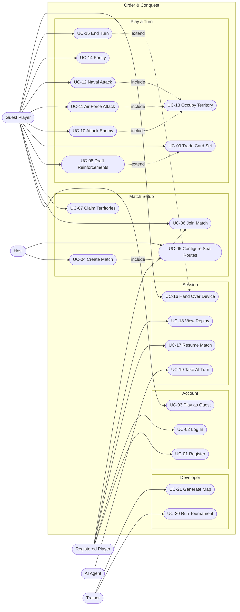

*Inheritance note:* Registered Player is a specialisation of Guest Player — every guest capability is
also available once logged in. Edges are drawn from `Guest` where the capability is shared, to keep the
diagram readable.

### Use case index

| ID | Use case | Primary actor | FRs |
|---|---|---|---|
| UC-01 | Register account | Registered Player | FR-01 |
| UC-02 | Log in | Registered Player | FR-02 |
| UC-03 | Play as guest | Guest Player | FR-03 |
| UC-04 | Create match | Host | FR-12, FR-13, FR-17, FR-18, FR-19 |
| UC-05 | Configure sea routes | Host | FR-15, FR-16 |
| UC-06 | Join match | Guest / Registered | FR-13, FR-63 |
| UC-07 | Claim territories | Player | FR-17, FR-21 |
| UC-08 | Draft reinforcements | Player | FR-23, FR-24, FR-35 |
| UC-09 | Trade card set | Player | FR-33, FR-34, FR-37 |
| UC-10 | Attack an enemy territory | Player | FR-26…FR-31, FR-84, FR-85 |
| UC-11 | Launch an Air Force attack | Player | FR-42…FR-46 |
| UC-12 | Launch a Naval attack | Player | FR-47, FR-48, FR-50 |
| UC-13 | Occupy a captured territory | Player | FR-28, FR-30 |
| UC-14 | Fortify | Player | FR-49, FR-52 |
| UC-15 | End turn | Player | FR-25, FR-32 |
| UC-16 | Hand over device | Player | FR-64, FR-62 |
| UC-17 | Resume match | Registered Player | FR-04, FR-58 |
| UC-18 | View replay | Registered Player | FR-59 |
| UC-19 | Take AI turn | AI Agent | FR-71…FR-76 |
| UC-20 | Run tournament | Trainer | FR-79, FR-82 |
| UC-21 | Generate a map | Trainer | FR-07, FR-08 |

## 4.3 Use Case Specifications

Specifications follow the template used by the 2022 report, for continuity with institutional
expectations (§2.4). **All twenty-one use cases are specified in full**, in numeric order. The ones
where the rules are non-obvious, or where the new capabilities change behaviour — UC-04, UC-05,
UC-08 to UC-13, UC-16 and UC-19 — carry the most detail in their business-rule rows.

---

### UC-01 — Register Account

| Field | Content |
|---|---|
| **Use case name** | Register Account |
| **Actor(s)** | Registered Player (primary) |
| **Summary description** | A visitor creates an account so that matches can be resumed and a match history kept. |
| **Pre-condition** | None. The caller is unauthenticated. |
| **Post-condition** | A player row exists with a password stored as an Argon2id PHC string, and a bearer token is issued. |
| **Basic path** | 1. Visitor opens *Register* on S-02. 2. Visitor supplies a username and password. 3. System checks the username is free. 4. System hashes the password with **Argon2id** and stores the PHC string (NFR-09, D-23). 5. System creates the player row and returns a token. |
| **Alternative path** | 3a. Username already taken → `409`; nothing created. 2a. Malformed body → `400`. 5a. Too many attempts → `429` and back off (NFR-10). |
| **Business rules** | The password is **never** stored, logged or echoed in plaintext or in any other form (NFR-09). The 2022 report stored `p_Password` in plaintext; D-23 records this as a correction, not a continuation. Registration is never required to play — see UC-03. |
| **Non-functional** | NFR-09 — password at rest is an Argon2id PHC string. NFR-10 — the auth routes are the only rate-limited routes. |

---

### UC-02 — Log In

| Field | Content |
|---|---|
| **Use case name** | Log In |
| **Actor(s)** | Registered Player (primary) |
| **Summary description** | A registered player authenticates and receives a bearer token. |
| **Pre-condition** | A player row exists. |
| **Post-condition** | A bearer token is issued and the resumable-match list becomes reachable. |
| **Basic path** | 1. Player supplies credentials on S-02. 2. System verifies the password against the stored PHC string. 3. System returns a token and the player identifier. 4. S-03 loads the in-progress list (UC-17). |
| **Alternative path** | 2a. Unknown username **or** wrong password → `401` with **no distinction between the two cases**. 1a. Too many attempts → `429`. |
| **Business rules** | The single undifferentiated `401` is deliberate: distinguishing the two failures would confirm which usernames exist. The interface carries one error string for both (§08.2). |
| **Non-functional** | NFR-10 — rate limited. |

---

### UC-03 — Play as Guest

| Field | Content |
|---|---|
| **Use case name** | Play as Guest |
| **Actor(s)** | Guest Player (primary) |
| **Summary description** | A visitor plays a full single-player or pass-and-play match without creating an account. |
| **Pre-condition** | None. |
| **Post-condition** | A guest session exists and can create and play matches. |
| **Basic path** | 1. Visitor selects *Continue as guest* on S-02. 2. System establishes a local session with **no network call**. 3. S-03 opens with the resume list empty. |
| **Alternative path** | 3a. The guest opens the resume list → an empty state offering *Sign in*, because route 13 requires a `player_id` (§06.7). |
| **Business rules** | Single-player must not require registration (**D-24**). A guest session holds `LocalHuman` seats on one device and is authorised as the match's creating session (§A.4), which is what makes pass-and-play work without accounts. Accounts exist for resumable history and later online play, not for access. |
| **Non-functional** | NFR-24 — nothing mandatory depends on an account. |

---

### UC-04 — Create Match

| Field | Content |
|---|---|
| **Use case name** | Create Match |
| **Actor(s)** | Host (primary) · Game Engine (secondary) |
| **Summary description** | The host selects a map, configures 2–6 seats and their kinds, chooses a sea-route count, and creates a match. The server normalises the map, generates sea routes, freezes the result, deals starting armies and persists the match at version 1. |
| **Pre-condition** | The host has a session (guest or authenticated). At least one map passes validation. |
| **Post-condition** | A match exists in `Lobby` or `Setup` with a frozen effective map, the configured seats, a deck built from the effective map, and version 1. A room code is issued. |
| **Basic path** | 1. Host opens *Create Match*. 2. System lists validated maps (FR-05). 3. Host selects a map. 4. Host sets seat count 2–6 and each seat's kind; an `Ai` seat also takes an agent name (FR-13). 5. Host sets the sea-route count within `[min, max]` (FR-15). 6. Host sets options: allocation mode, fortify mode, round cap, difficulty. 7. Host confirms. 8. System validates the map against the shared gate (FR-08). 9. System generates exactly the requested number of valid sea routes and freezes them into the effective map (FR-16, FR-10). 10. System builds the deck: one card per territory plus wilds (FR-19). 11. System issues starting armies from the configured table (FR-18). 12. System persists match, seats and territory state in one transaction and returns the match with a room code. |
| **Alternative path** | 4a. Host selects 2 seats → system inserts a third `Neutral` seat automatically and applies the 3-seat army count (FR-14, D-07). 5a. Count outside `[min, max]` → `400` with the permitted range; no match created. 8a. Map fails validation → `422` naming the failed gate rule; no match created. 9a. Generation cannot place the requested number of routes within the attempt bound → `422` stating how many were placeable; **no partial match is created** (D-13). 12a. Transaction fails → nothing persisted; host may retry. |
| **Business rules** | Seats: 2–6 (FR-12). A 2-seat match becomes three seats with one `Neutral`. Sea-route endpoints are chosen by the system, never by the host (C-07). The effective map is frozen at creation; later edits to map files cannot affect this match (FR-10). |
| **Non-functional** | NFR-02 — the same seed and configuration must yield the same effective map. NFR-13 — creation is atomic. |

---

### UC-05 — Configure Sea Routes

| Field | Content |
|---|---|
| **Use case name** | Configure Sea Routes |
| **Actor(s)** | Host (primary) |
| **Summary description** | The host chooses **how many** sea routes the match will contain. The system chooses where they go. |
| **Pre-condition** | Match creation is in progress. `navalForce.enabled` is true. |
| **Post-condition** | A sea-route count within the configured bounds is attached to the pending match options. |
| **Basic path** | 1. System displays the permitted range and the default. 2. Host selects a count. 3. System accepts it into the pending options. |
| **Alternative path** | 2a. Host selects a value outside the range → rejected inline, with the range shown. 1a. `navalForce.enabled` is false → the screen is not shown and the count is 0; the match is classic-only (D-13). |
| **Business rules** | The host chooses a **count only**. No interface exists anywhere in the system for drawing a route between two named territories — this is an explicit non-goal (Part E). Endpoints must be coastal, must not already be land-adjacent, and must not duplicate an existing route (FR-16). |
| **Non-functional** | NFR-21 — an out-of-range count must not be selectable in the interface. |

---

### UC-06 — Join Match

| Field | Content |
|---|---|
| **Use case name** | Join Match |
| **Actor(s)** | Guest / Registered Player (primary) |
| **Summary description** | A player claims an open `RemoteHuman` seat in an existing match using its room code. |
| **Pre-condition** | The match exists, is accepting joins, and has at least one unclaimed `RemoteHuman` seat. |
| **Post-condition** | The caller holds that seat, and every participant sees the updated seat list. |
| **Basic path** | 1. Player enters a room code. 2. System resolves the match. 3. System assigns the first open `RemoteHuman` seat to the caller (FR-13). 4. System broadcasts `StateChanged` so every lobby updates (FR-63). 5. S-06 shows the player in the seat list. |
| **Alternative path** | 2a. Unknown room code → `404`. 3a. The seat is already held → `409`. 2b. The match is not accepting joins → `403`. 3b. The caller already holds a seat in this match → the existing seat is returned rather than a second one being assigned. |
| **Business rules** | A seat is claimed, never created — seat count is fixed at creation (UC-04). `Neutral` and `Ai` seats are never joinable. **Room is one of the three shipped modes, so this route is delivered, not merely prepared**; Phases 1–5 exercise only `LocalHuman`, `Ai` and `Neutral`, and Phase 6 completes the `RemoteHuman` path. The seat model means that completion is a configuration and authorisation job rather than a schema or rules change. |
| **Non-functional** | NFR-23 — one API process and one database; joining needs no orchestration. |

---

### UC-07 — Claim Territories

| Field | Content |
|---|---|
| **Use case name** | Claim Territories |
| **Actor(s)** | Player (primary) · Game Engine (secondary) |
| **Summary description** | In `claim` allocation mode, seats take turns choosing unowned territories until all 42 are owned, then distribute their remaining starting armies. |
| **Pre-condition** | The match has started and `territoryAllocation` is `"claim"`. Phase is `Claim`. |
| **Post-condition** | Every territory has an owner, every starting army is placed, and the phase advances to `Draft`. |
| **Basic path** | 1. System presents the unowned territories as the legal set (FR-21). 2. Player claims one, which receives one army (FR-17). 3. Turn passes to the next seat. 4. Steps 1–3 repeat until no territory is unowned. 5. The legal set becomes `PlaceArmies(t, 1)` on owned territories only. 6. Seats place remaining starting armies one at a time until all pools are empty. 7. Phase advances to `Draft`. |
| **Alternative path** | 1a. `territoryAllocation` is `"random"` → this use case does not run; the engine assigns territories from the seeded source (TC-DET-02) and the match opens in `Draft`. 2a. The player targets an owned territory → not offered, and a direct call is rejected (FR-22). 5a. A `Neutral` seat's territories and armies are allocated by the system; the seat is never offered a turn (D-07). |
| **Business rules** | **Claim offers no `EndPhase`** — the phase ends when the work is done, not when a player says so (§E.4). In stage two the count is fixed at **1** per action, so the interface shows no stepper (§08.8). Starting army totals come from `setup.startingArmies`, keyed by seat count including `Neutral`. |
| **Non-functional** | NFR-04 — the legal set is computed within 100 ms at p95 even at 42 candidates. |

---

### UC-08 — Draft Reinforcements

| Field | Content |
|---|---|
| **Use case name** | Draft Reinforcements |
| **Actor(s)** | Player (primary) · Game Engine (secondary) |
| **Summary description** | At the start of a turn the player receives armies from territory count, continent bonuses and any card trade, then places them on owned territories. |
| **Pre-condition** | It is the player's turn and the phase is `Draft`. The player is not eliminated. |
| **Post-condition** | The player's army pool is zero and the placed armies appear on owned territories. Phase advances to `Attack`. |
| **Basic path** | 1. System computes `max(3, ⌊t/3⌋) + continent bonuses + trade value` (FR-23, FR-24). 2. System presents the total and the legal placement targets. 3. Player places armies on owned territories, one or many at a time. 4. When the pool reaches zero the player confirms and the phase advances. |
| **Alternative path** | 1a. The player holds ≥ 5 cards → the system requires a trade before any placement is legal; the legal-action list contains only trade actions (FR-35). 3a. The player targets a territory they do not own → the action is not legal and is not offered (FR-66); a direct API call is rejected with no state change (FR-22). 1b. The player traded a set naming a territory they own → 2 extra armies are placed directly on that territory, capped at 2 per turn (FR-37). |
| **Business rules** | Minimum 3 armies regardless of territory count (DR-08). A continent bonus requires every territory of that continent (DR-09). Card trade value comes from the next position in the escalation table, which advances once per trade for the whole match and never resets (DR-13). |
| **Non-functional** | NFR-04 — legal-action computation within 100 ms at p95. |

---

### UC-09 — Trade Card Set

| Field | Content |
|---|---|
| **Use case name** | Trade Card Set |
| **Actor(s)** | Player (primary) · Game Engine (secondary) |
| **Summary description** | A player exchanges three cards for armies. The value comes from a match-wide escalation table, and a card naming an owned territory also places armies directly on it. |
| **Pre-condition** | Phase is `Draft`. The player's hand contains at least one valid set. |
| **Post-condition** | The three cards return to the deck, the army pool rises, `tradeIndex` advances by one for the whole match, and any territory bonus is on the board. |
| **Basic path** | 1. System offers **one `TradeSet` action per valid combination** of the hand (FR-33). 2. Player selects a set. 3. Engine adds `tradeValues[tradeIndex]` to the army pool (FR-34). 4. Engine increments `tradeIndex` — match-wide, monotonic, never reset. 5. Engine returns the three cards to the deck. 6. For each card naming a territory the player owns, the engine places `territoryBonusArmies` **directly on that territory**, up to the per-turn cap (FR-37). 7. Engine emits `SetTraded` and, if applicable, `TerritoryBonusAwarded`. |
| **Alternative path** | 1a. The hand holds ≥ 5 cards at the start of `Draft` → the legal set contains **only** `TradeSet`; no placement is legal until a trade happens (FR-35). 1b. The player was handed a hand by eliminating a seat and now holds more than `maxCardsAfterElimination` → an immediate trade-down is required mid-turn (FR-36, UC-15). 2a. The selected combination is not in the legal list → rejected with no state change (FR-22). 6a. The player owns none of the named territories → no bonus; the trade still succeeds. |
| **Business rules** | A set is **exactly three cards** (`setSize: 3`, locked). The escalation table advances once per trade **for the whole match** and never resets (DR-13) — any seat's trade raises the price for everyone, which is why `tradeIndex` is public. The territory bonus is placed **on the territory, not into the pool**, so it cannot be redirected. Returning a card can **remove a capability**, because a held card grants one (`seatHoldsCapabilityFromCards: true`); the engine does not warn, so the client must (§05.5). **D-27** (`distinctSetRule`) and **D-28** (`wildSubstitution`) decide what counts as a set and both await reviewer confirmation before Phase 4; at the configured values a forced trade from five cards is **always** satisfiable, and under `classic_triple` it is not (Appendix G §G.5). |
| **Non-functional** | NFR-11 — the response reveals no other seat's card identities. NFR-04 — enumerating valid sets stays inside the legal-action budget. |

---

### UC-10 — Attack an Enemy Territory

| Field | Content |
|---|---|
| **Use case name** | Attack an Enemy Territory |
| **Actor(s)** | Player (primary) · Game Engine (secondary) |
| **Summary description** | The player attacks an enemy territory within the configured attack range over land edges — **range 1 by default, which is land-adjacency** (FR-85). Dice are rolled by the engine from the match's seeded random source using the match's configured face count (FR-84); losses are applied; if the defender reaches zero the attacker occupies. |
| **Pre-condition** | Phase is `Attack`. The player owns the origin, which holds ≥ 2 armies and at least one more than the dice to be rolled. The target is within `options.attackRange` land edges of the origin and owned by another seat. |
| **Post-condition** | Army counts on both territories are updated. On capture, ownership transfers, the conquest flag is set for the turn, and the phase moves to `Occupy`. |
| **Basic path** | 1. Player selects origin, target and dice count 1–3 (FR-26). 2. Engine draws attacker and defender dice from the injected random source, each face in `1 … options.diceSides` (FR-29, FR-84). 3. Engine compares highest with highest and second with second, **defender winning ties** (FR-27). 4. Engine applies one army loss per comparison to the loser. 5. Engine emits a `DiceRolled` event carrying every die face. 6. If the defender reaches 0 armies → UC-13 Occupy. 7. Otherwise the player may attack again or advance the phase. |
| **Alternative path** | 1a. Origin holds fewer than 2 armies → the attack is not in the legal list. 1b. Dice requested ≥ armies in origin → not legal. 1c. Target is beyond `options.attackRange` land edges → not legal; at the default range of 1 this is every non-adjacent territory. 1d. Target is reachable only across a sea route → not legal at any range; range is measured on the land graph alone (C-08). 3a. All comparisons lost by the attacker → origin loses armies, no capture. 6a. The defender loses its last territory → UC-15 elimination handling; the eliminating seat receives its cards (FR-38). |
| **Business rules** | Defender wins ties at every face count (DR-07, FR-84). At least 1 army always remains in the origin (DR-06). Attack range and face count are read from the **match**, frozen at creation, never from `shared/rules.json` mid-match (FR-84, FR-85, TC-PER-07). Intervening ownership is not consulted: at range > 1 the path may cross enemy territory. Every die comes from the match random source, never from a system clock or an unseeded generator (NFR-02). |
| **Non-functional** | NFR-02 — identical seed and action sequence reproduce identical dice. NFR-05 — round trip within 250 ms at p95. |

---

### UC-11 — Launch an Air Force Attack

| Field | Content |
|---|---|
| **Use case name** | Launch an Air Force Attack |
| **Actor(s)** | Player (primary) · Game Engine (secondary) |
| **Summary description** | A player holding Air Force capability attacks a territory up to 5 land edges away. Combat is resolved by the ordinary rules; only the reachable-target set differs. |
| **Pre-condition** | Phase is `Attack`. The player holds Air Force capability by CAP-2 (FR-39). The player has not already used the turn's Air Force attack (FR-45). Origin and army constraints are as for UC-10. |
| **Post-condition** | As UC-10, plus the turn's Air Force attack is consumed. |
| **Basic path** | 1. System computes the set of targets within `maxRange` by shortest path **over land adjacency edges only** (FR-43). 2. Player selects origin, target and dice count. 3. Combat resolves through the **same** code path as UC-10 (FR-44, FR-31). 4. On capture, occupation follows the ordinary rules (UC-13). |
| **Alternative path** | 1a. The player holds no Air Force capability → no Air Force action appears in the legal list. 1b. The turn's Air Force attack is already used → no Air Force action appears. 1c. The target is reachable only by crossing a sea route → **it is not a legal target**; sea routes are excluded from range entirely (C-08). 4a. The captured territory is not adjacent to any other territory the player owns → this is permitted and expected; the player holds a disconnected pocket (D-11, TC-AIR-04). |
| **Business rules** | Range is 1–5 inclusive (D-17). Range is measured on the land graph only (DR-18). One Air Force attack per seat per turn (AIR-1). No fuel, no airfields, no bombing, no hit points, no air unit — the capability changes which targets are legal and nothing else. Since D-30 made land-attack range configurable, this use case is distinguished from UC-10 by **two** things only: the once-per-turn limit and the capability requirement. The range search itself is the same function at a different argument (§7.8). When `options.attackRange ≥ 5` the Air Force confers no extra reach at all — it then confers only a second attack path that ignores the land-attack budget, which is a legitimate configuration and not a defect. |
| **Non-functional** | NFR-04 — range computation is a bounded breadth-first search from one node and stays inside the legal-action budget. |

---

### UC-12 — Launch a Naval Attack

| Field | Content |
|---|---|
| **Use case name** | Launch a Naval Attack |
| **Actor(s)** | Player (primary) · Game Engine (secondary) |
| **Summary description** | A player holding Naval capability attacks across a sea route. A sea route behaves as an adjacency edge for that player; combat is unchanged. |
| **Pre-condition** | Phase is `Attack`. The player holds Naval capability by CAP-2. A sea route in the frozen effective map connects an origin the player owns to a target they do not own. Origin and army constraints as UC-10. |
| **Post-condition** | As UC-10. |
| **Basic path** | 1. System lists sea routes from territories the player owns to territories they do not (FR-48). 2. Player selects a route and a dice count. 3. Combat resolves through the same code path as UC-10 (FR-50, FR-31). 4. On capture, occupation follows the ordinary rules, moving armies across the sea route. |
| **Alternative path** | 1a. The player holds no Naval capability → no naval action appears. 1b. No sea route touches a territory the player owns → no naval action appears. 1c. The match was created with `navalForce.enabled = false` → the capability system reports no naval actions at all. |
| **Business rules** | A sea route is an **edge**, never a territory, and is never captured or occupied (DR-16). Crossing costs no units (NAV-1). A landlocked territory is never an endpoint (DR-17, FR-51). Sea routes do not extend Air Force range (C-08). |
| **Non-functional** | NFR-02, NFR-05 as UC-10. |

---

### UC-13 — Occupy a Captured Territory

| Field | Content |
|---|---|
| **Use case name** | Occupy a Captured Territory |
| **Actor(s)** | Player (primary) · Game Engine (secondary) |
| **Summary description** | After reducing a defender to zero armies, the attacker moves armies in. Ownership transfers here, not in the attack. |
| **Pre-condition** | Phase is `Occupy` and a pending occupation names an origin and a target. |
| **Post-condition** | The target is owned by the attacker and garrisoned, the origin is reduced by the same number, the conquest flag is set for the turn, and the phase returns to `Attack`. |
| **Basic path** | 1. System offers `Occupy(n)` for every `n` from the dice rolled up to the movable armies (FR-28). 2. Player chooses a count. 3. Engine moves the armies, transfers ownership and sets `conqueredThisTurn` (FR-30). 4. Engine emits `TerritoryCaptured` and `ArmiesOccupied`. 5. Phase returns to `Attack`. |
| **Alternative path** | 3a. The victim now holds no territory → the seat is eliminated and its entire hand transfers to the attacker (UC-15, FR-38). 3b. The elimination leaves one seat standing → `GameOver` with reason `domination`. 2a. The player attempts a count outside the offered range → not legal; rejected with no state change. |
| **Business rules** | At least as many armies as **dice rolled** must move in (DR-06); at least `mustLeaveBehind` must stay (DR-04). Occupation is **identical for land, Air Force and naval captures** (D-18) — no landing rule, no reduced garrison, no beachhead penalty; only the question of which target was legal differs. **`Occupy` offers no `EndPhase`**: a pending occupation must be resolved, and the offered range is provably never empty, because a capture never costs the attacker an army (§E.4.5). Ownership transfers here rather than in `ApplyAttack` so that a territory is never owned with zero armies (§E.13). |
| **Non-functional** | NFR-14 — a resumed match in `Occupy` offers the identical range. |

---

### UC-14 — Fortify

| Field | Content |
|---|---|
| **Use case name** | Fortify |
| **Actor(s)** | Player (primary) · Game Engine (secondary) |
| **Summary description** | Once per turn the player moves armies between two territories they own, by land or — with Naval capability — across a sea route. |
| **Pre-condition** | Phase is `Fortify`. The player has not already fortified this turn. An owned territory holds more than `mustLeaveBehind` armies. |
| **Post-condition** | Armies have moved, the fortification is marked used, and the phase advances to `EndTurn`. |
| **Basic path** | 1. System computes reach under the configured `fortify.mode` (FR-52). 2. System offers `Fortify(from, to, n)` for every reachable owned destination and every legal count. 3. Player chooses one. 4. Engine moves the armies and marks `fortifyUsed`. 5. Engine emits `ArmiesFortified`. |
| **Alternative path** | 1a. The player holds Naval capability and a sea route joins two territories they own → that destination is also offered (FR-49). 1b. The fortification is already used → the legal set contains only `EndPhase`. 3a. The move would leave fewer than `mustLeaveBehind` behind → not offered. |
| **Business rules** | **One fortification per turn, and a naval fortification consumes the same one** (D-19, FR-49) — which is why `fortifyUsed` is checked once, before the reach mode is considered, and not per edge type. `fortify.mode` is `single_pair` by default; published RISK rules disagree with each other here, which is exactly why it is data (Appendix G §G.10). A naval fortification is **not a distinct action type**: it is a `Fortify` whose destination happens to lie across a sea route, so nothing in the action distinguishes it — the resulting `ArmiesFortified` event carries `viaSeaRoute` for that purpose. |
| **Non-functional** | NFR-04 — reach computation stays inside the legal-action budget at every mode, including `connected_path`. |

---

### UC-15 — End Turn

| Field | Content |
|---|---|
| **Use case name** | End Turn |
| **Actor(s)** | Player (primary) · Game Engine (secondary) |
| **Summary description** | The player ends their turn. The engine awards a card if a territory was captured, advances the turn, and hands over the device if the next seat is also local. |
| **Pre-condition** | Phase is `EndTurn`, or the player ends an earlier phase from which `EndPhase` is legal. |
| **Post-condition** | At most one card has been awarded, the turn has advanced to the next non-eliminated, non-`Neutral` seat, and the round counter has incremented if the turn order wrapped. |
| **Basic path** | 1. Player confirms *End turn* (FR-25). 2. If `conqueredThisTurn` is set, the engine awards **exactly one** card regardless of how many territories were taken (FR-32). 3. Engine clears the per-turn flags — conquest, fortification, Air Force use. 4. Engine selects the next eligible seat and emits `TurnChanged`. 5. If the next seat is another `LocalHuman`, `HandOverDevice` is emitted (UC-16). |
| **Alternative path** | 2a. No territory was captured → **no card** (`awardRequiresConquest: true`). 2b. The award pushes the hand past `maxCardsBeforeForcedTrade` → the next `Draft` opens with only `TradeSet` legal (FR-35, UC-09). 4a. The next seat is `Ai` → UC-19 runs instead of a hand-over. 4b. The next seat is `Neutral` → it is skipped entirely; `Neutral` is never offered a turn (D-07). 4c. The round counter reaches `match.roundCap` → the match ends and is ranked by `capTiebreak`. |
| **Business rules** | **One card per turn at most**, and only on conquest (`awardPerTurn: 1`, `awardRequiresConquest: true`) — the award is evaluated here rather than at capture precisely so that several captures still yield one card (§E.8.4). The `Neutral` skip is visible in the turn order and must be presented as normal rather than as a lost turn (§06.10). |
| **Non-functional** | NFR-11 — a `CardAwarded` event is redacted to `{ "seat": n }` for every other seat. |

---

### UC-16 — Hand Over Device

| Field | Content |
|---|---|
| **Use case name** | Hand Over Device |
| **Actor(s)** | Player, outgoing and incoming (primary) |
| **Summary description** | In a pass-and-play match the device must pass between local seats without the outgoing player seeing the incoming player's cards. |
| **Pre-condition** | The match has more than one `LocalHuman` seat. A turn has just ended and the next seat is also `LocalHuman`. |
| **Post-condition** | The incoming seat's redacted state is displayed. The outgoing seat's hand is no longer on screen at any point during the transition. |
| **Basic path** | 1. Outgoing player ends their turn. 2. Server advances the turn and emits `HandOverDevice` naming only the incoming seat (FR-63). 3. Client **immediately** clears all hand information and displays a blocking hand-over screen naming the incoming seat. 4. Incoming player confirms. 5. Client requests state redacted for the incoming seat (FR-62). 6. Play resumes. |
| **Alternative path** | 2a. The next seat is `Ai` or `Neutral` → no hand-over screen; the turn proceeds (UC-19). 3a. The client is backgrounded or restarted during hand-over → it resumes at the blocking screen, never at a revealed hand. |
| **Business rules** | Redaction is performed **server-side** (FR-62). The client is never sent another seat's card identities and therefore cannot leak them through a rendering error. |
| **Non-functional** | NFR-22 — no seat's cards are visible to a previous seat at any point. NFR-11 — the response contains no other seat's card identities. |

---

### UC-17 — Resume Match

| Field | Content |
|---|---|
| **Use case name** | Resume Match |
| **Actor(s)** | Registered Player (primary) |
| **Summary description** | A player reopens an unfinished match. The server restores the snapshot and the random source, producing a state indistinguishable from the one saved. |
| **Pre-condition** | The player holds a seat in a match whose status is not finished. |
| **Post-condition** | The match state and legal-action list are identical to those at the moment of saving. |
| **Basic path** | 1. Player requests their resumable matches (FR-04). 2. Player selects one. 3. Server loads the snapshot — match, seats, territory state, cards — **without replaying the log** (FR-58). 4. Server restores the random source from `rng_seed` and advances it to `rng_position`. 5. Server returns state redacted for that seat, plus the legal-action list and the current version. |
| **Alternative path** | 2a. The player holds no seat in that match → `403`. 3a. The snapshot is missing or inconsistent → the match is reported unrecoverable rather than partially loaded; the action log remains available for replay (FR-59). |
| **Business rules** | Resume reads the snapshot; the log exists for replay and audit, not for reconstruction (FR-57, FR-58). Restoring `rng_position` is what makes the *next* dice roll match what it would have been (NFR-02). |
| **Non-functional** | NFR-14 — the resumed legal-action set is identical to the one before saving (TC-PER-01). |

---

### UC-18 — View Replay

| Field | Content |
|---|---|
| **Use case name** | View Replay |
| **Actor(s)** | Registered Player (primary) |
| **Summary description** | A player steps through a match's recorded action log, seeing the original dice faces rather than re-rolled ones. |
| **Pre-condition** | The player holds, or held, a seat in the match, and the match has at least one logged action. |
| **Post-condition** | No state has changed. Replay is strictly read-only. |
| **Basic path** | 1. Player opens the replay for a match (FR-59). 2. Server returns the append-only action log, redacted for that seat. 3. Client renders the board using **the same renderer as S-08**, driven from the log instead of live state. 4. Player steps forward and backward through the log. 5. Each logged attack animates from **the faces recorded at the time**, so the replay is visually identical rather than merely outcome-identical. |
| **Alternative path** | 1a. The player held no seat in that match → `403`. 2a. The match is still in progress → the log up to the current version is returned; replay and live play do not conflict, because replay writes nothing. |
| **Business rules** | The log is **append-only, enforced at the database** by `REVOKE UPDATE, DELETE ON moves` — so a replay is a pure function of the log and cannot disagree with history. Every die face the engine rolled appears in the log, which is what makes a visually identical replay possible (FR-29) and is the same reason clients animate dice they are *told about*. **The deck order is never shown**, in replay or anywhere else, to any seat (NFR-11, TC-SEC-02). Redaction still applies: a replay does not reveal another seat's historical hand. |
| **Non-functional** | NFR-11 — no response contains another seat's card identities or the deck order. NFR-18 — the replay renderer shares the live DTOs, so it cannot drift from the board (TC-UI-04). |

---

### UC-19 — Take AI Turn

| Field | Content |
|---|---|
| **Use case name** | Take AI Turn |
| **Actor(s)** | AI Agent (primary, system) · Game Engine (secondary) |
| **Summary description** | When the current seat is an `Ai` seat, the server asks the configured agent to choose one action from the engine's legal list, applies it, and streams the resulting events. This repeats until the AI seat's turn ends. |
| **Pre-condition** | The current seat's kind is `Ai` and an agent name is configured (FR-13). |
| **Post-condition** | The AI seat's turn is complete and every resulting event has been broadcast. |
| **Basic path** | 1. Server computes the legal-action list (FR-21). 2. Server passes state and that list to the agent (FR-71). 3. Agent returns exactly one action from the list. 4. Server applies a minimum think-time delay before releasing the result (FR-75). 5. Server applies the action, persists it and broadcasts the events (FR-56, FR-57, FR-63). 6. Repeat from 1 while the current seat remains the same AI seat. |
| **Alternative path** | 3a. MarsBot evaluates candidate attacks by expected value — `winChance × V(won) + (1 − winChance) × V(lost)` — and does **not** roll dice to evaluate, so scoring never advances the match random source (FR-76). 3b. The `Brutal` difficulty's trained policy is unavailable → the server falls back to MarsBot and logs the substitution (FR-78). 6a. The match ends on this action → `GameOver` is broadcast and no further AI action is requested. |
| **Business rules** | An agent selects from the engine's legal list and therefore **cannot** produce an illegal action (FR-74, NFR-20). Think time is applied at the API layer, never inside the agent, so headless simulation and RL training run at full speed (D-22). |
| **Non-functional** | NFR-06 — a heuristic agent chooses within 500 ms. NFR-20 — invalid-action rate exactly zero. |

---

### UC-20 — Run Tournament

| Field | Content |
|---|---|
| **Use case name** | Run Tournament |
| **Actor(s)** | Trainer / Researcher (primary, system) · Game Engine (secondary) |
| **Summary description** | A headless harness plays many seeded matches between configured agents and reports aggregate results, so that an agent change can be measured rather than asserted. |
| **Pre-condition** | `OrderAndConquest.Sim` is built and at least two agents are configured. |
| **Post-condition** | A result set exists giving win rates, match lengths and invalid-action counts per agent, reproducible from the recorded seeds. |
| **Basic path** | 1. Trainer specifies the agent pairing, the match count and a base seed (FR-79). 2. Harness runs each match headlessly through the same `IGameEngine` the API uses. 3. Harness records winner, round count, action count and any invalid-action attempt. 4. Harness aggregates and reports (FR-82). |
| **Alternative path** | 2a. An agent proposes an action outside the legal list → recorded as an invalid action and the run is marked failed; **the expected count is zero** (NFR-20, TC-AI-01). 1a. A trained policy is unavailable → the pairing falls back to MarsBot and the substitution is logged (FR-78). |
| **Business rules** | The harness uses the **same engine** as the API — a tournament result that did not come from the shipping rules would measure nothing (TC-ARC-05). Minimum AI think time is applied at the **API layer only** (D-22), so simulation runs at full speed. Every match is reproducible from its seed (NFR-02). The RL ship gate — *beat MarsBot head-to-head over ≥ 1000 seeded matches* — is evaluated here. |
| **Non-functional** | NFR-02 — identical seeds reproduce identical matches. NFR-24 — this use case is optional; nothing mandatory depends on it. |

---

### UC-21 — Generate a Map

| Field | Content |
|---|---|
| **Use case name** | Generate a Map |
| **Actor(s)** | Trainer / Host (primary) · Map Validator (secondary) |
| **Summary description** | The system procedurally generates a new map and returns it only if it passes the same validation gate every authored map must pass. |
| **Pre-condition** | Generation parameters are within their permitted ranges. |
| **Post-condition** | Either a valid map is returned, or nothing is created and the failed rule is named. |
| **Basic path** | 1. Caller supplies parameters — territory count, continent count, seed (FR-07). 2. Generator produces a candidate map. 3. Candidate is validated against the **V-01…V-12** gate (FR-08). 4. On success the map is returned with its seed. |
| **Alternative path** | 3a. The candidate fails any rule → the generator retries within the attempt bound. 3b. No valid map within the bound → `422` naming the failed rule; **nothing is created** (TC-MAP-07). 2a. Parameters out of range → `400`. |
| **Business rules** | **Generated and authored maps pass the identical gate** — there is one validator, not two (TC-MAP-07 asserts a generated map never escapes it). Generation is **deterministic from its seed** (NFR-02, TC-MAP-06: byte-identical output including territory, adjacency and continent ordering). A generated map is frozen into `matches.effective_map` at match creation, so a later generator change cannot alter a match in progress. Sea routes are **not** generated here — they are placed per match (UC-05). |
| **Non-functional** | NFR-02 — same seed, byte-identical map. NFR-19 — no vendor-specific column types are needed to store it. |

## 4.4 System Flowchart

The lifecycle from launching a client to a finished match.

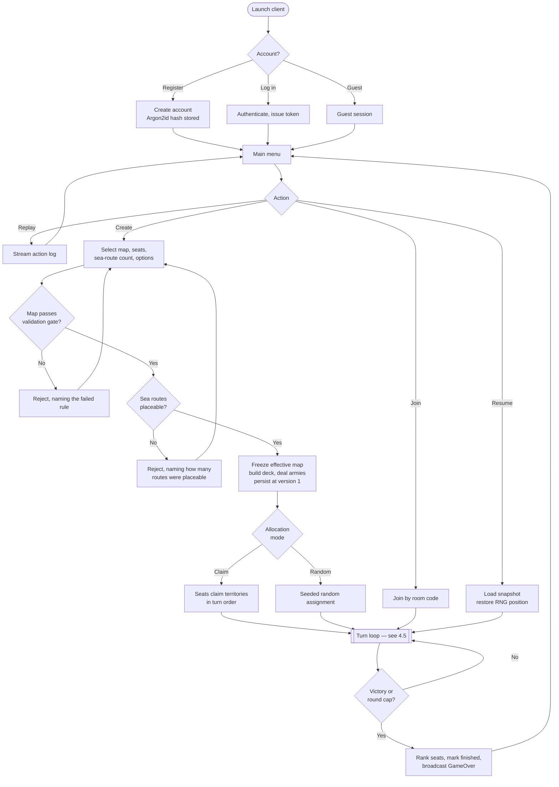

## 4.5 Game Flowchart

One turn, including both new capabilities. Everything in this diagram happens inside the engine.

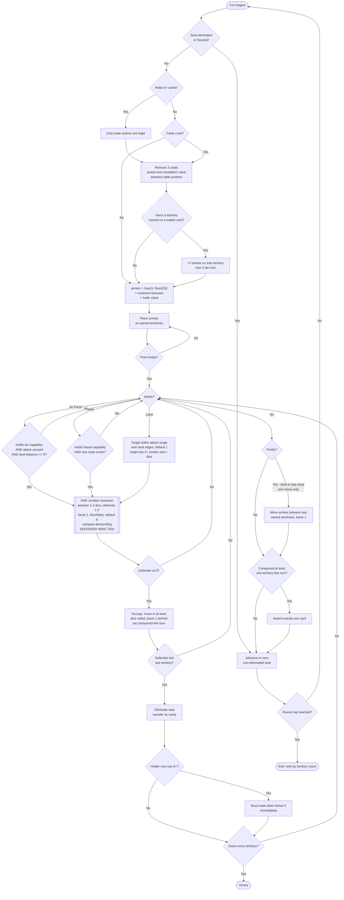

Two things in that diagram are worth naming because they are the extensions in their entirety:

- `CHKA` and `CHKN` are **guards on which targets are legal**. Both funnel into the same `COMBAT` node.
- There is exactly one `COMBAT` node. That is FR-31 drawn rather than stated.

## 4.6 Data Flow Diagram — Level 0 (Context)

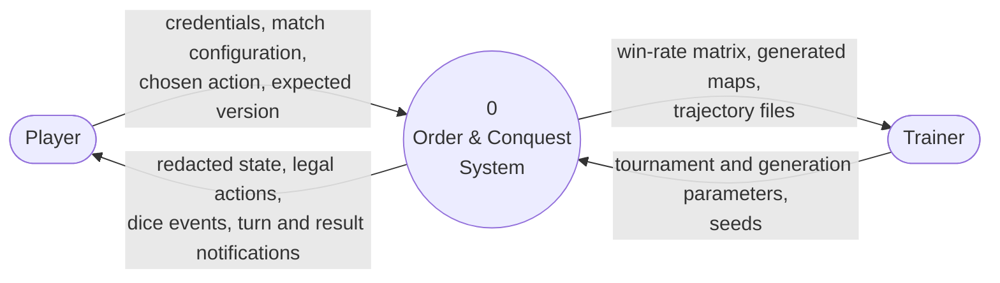

The context diagram has two external entities. **AI agents are not external** — they run inside the
server process, in `OrderAndConquest.Ai`, and appear at level 1.

## 4.7 Data Flow Diagram — Level 1

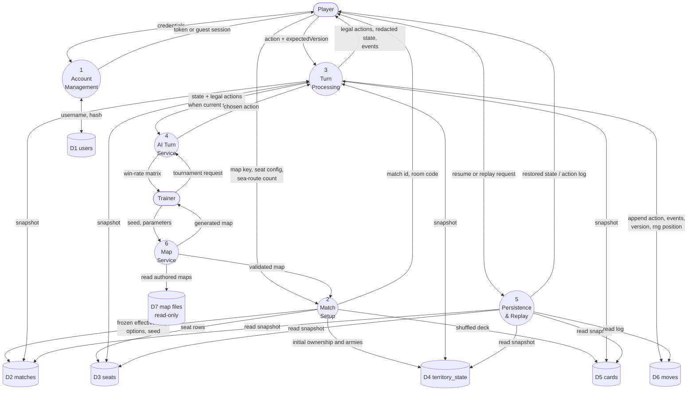

**Store-access rule made visible:** process 3 is the only process with a write arrow into D4 and D5, and
the only process that appends to D6. Process 5 has read arrows only. This is FR-57 and NFR-12 expressed
as a structural property rather than a convention.

## 4.8 Data Flow Diagram — Level 2 (Process 3: Turn Processing)

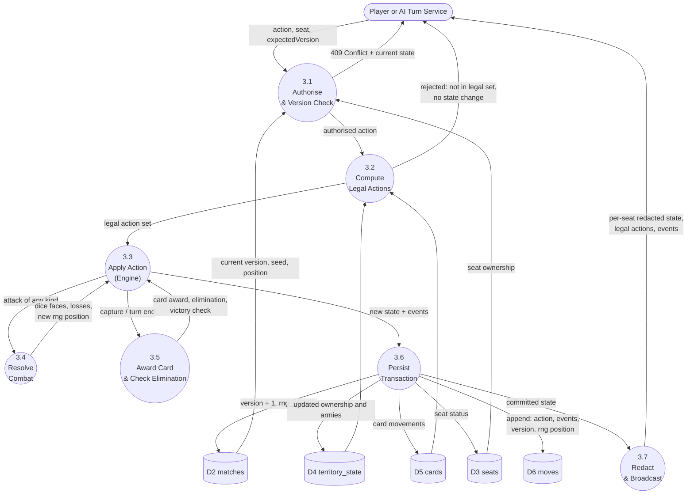

Three properties of this decomposition are deliberate:

1. **3.1 runs before 3.2.** A stale `expectedVersion` is rejected before any rule is evaluated, so a
   conflicting request costs a version read and nothing more (FR-61).
2. **3.4 is the only source of randomness,** and it returns the new random-source position to 3.3, which
   hands it to 3.6 for persistence. Determinism is a data-flow property here, not a coding convention.
3. **3.7 redacts after commit.** The stored state is complete; only the *view* is reduced (FR-62). One
   stored truth, many redacted views.

## 4.9 Sequence Diagrams

### 4.9.1 Human action — the normal path

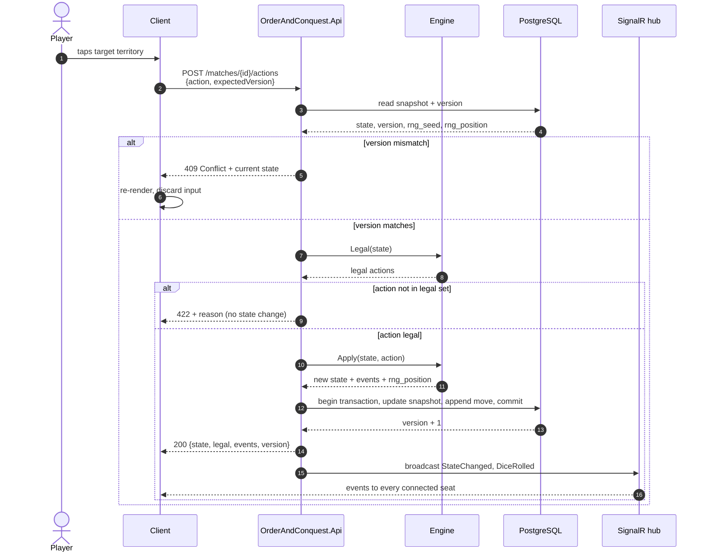

### 4.9.2 AI turn

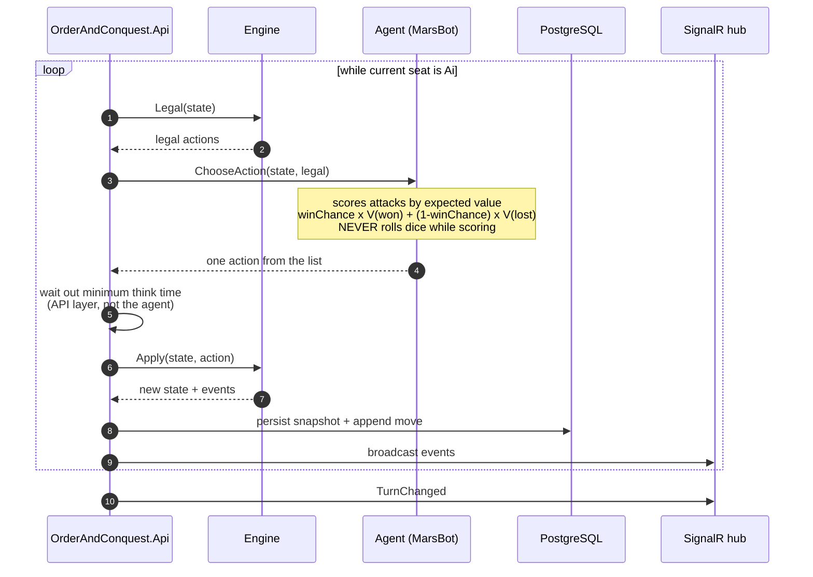

The note on the agent is the single most important line in this diagram. An agent that called `Apply`
speculatively to see what happens would consume the match random source, and the dice the player then
sees would differ from the dice they would have seen. Scoring is by expected value precisely so that
evaluation has no side effect.

### 4.9.3 Pass-and-play hand-over

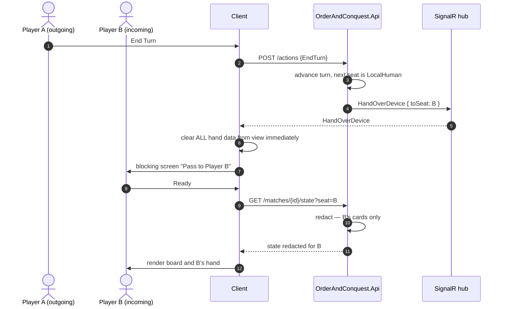

### 4.9.4 Resume

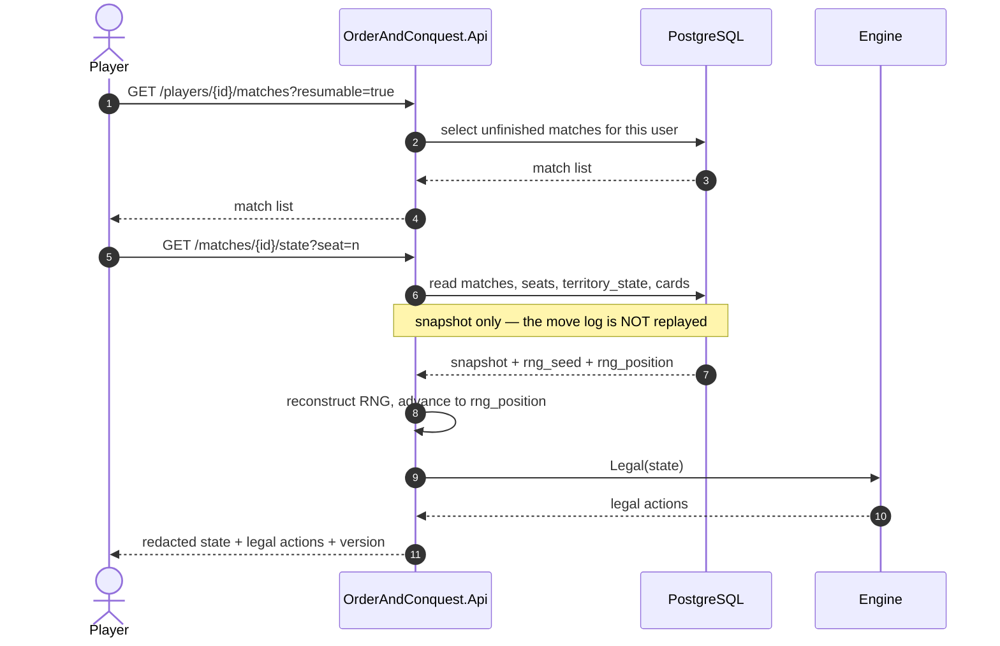

## 4.10 State Diagrams

### 4.10.1 Match lifecycle

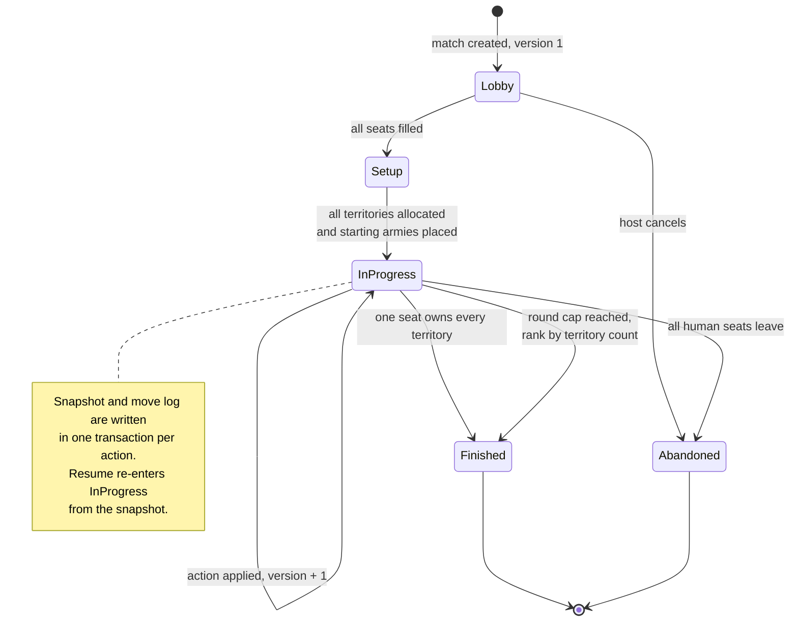

### 4.10.2 Turn phase machine

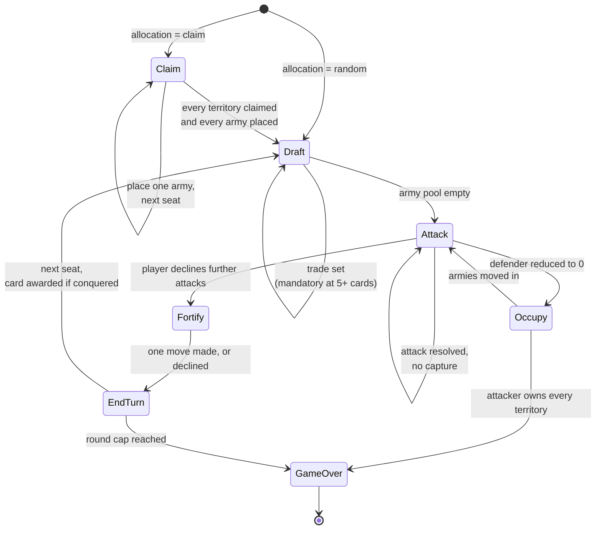

**Air Force and Naval Force add no state.** They are additional transitions out of `Attack` into the same
`Occupy`, which is why this machine is identical to the classic-RISK one. If the extensions had needed a
new phase, that would have been the signal that they were too large — and the diagram is how that would
have been visible.

---

**Previous:** [3 — Requirement Analysis](03-requirements.md) · **Next:** [5 — System Design](05-system-design.md)
