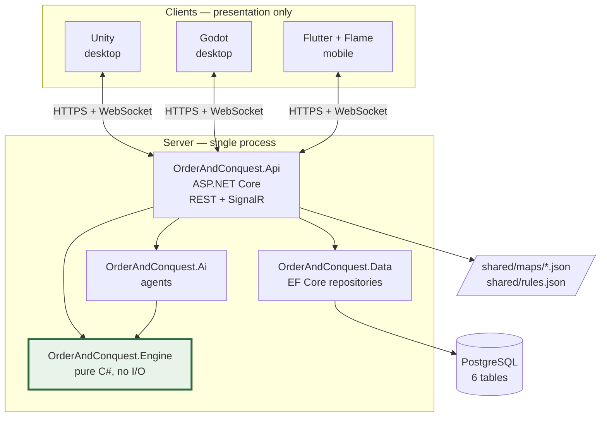
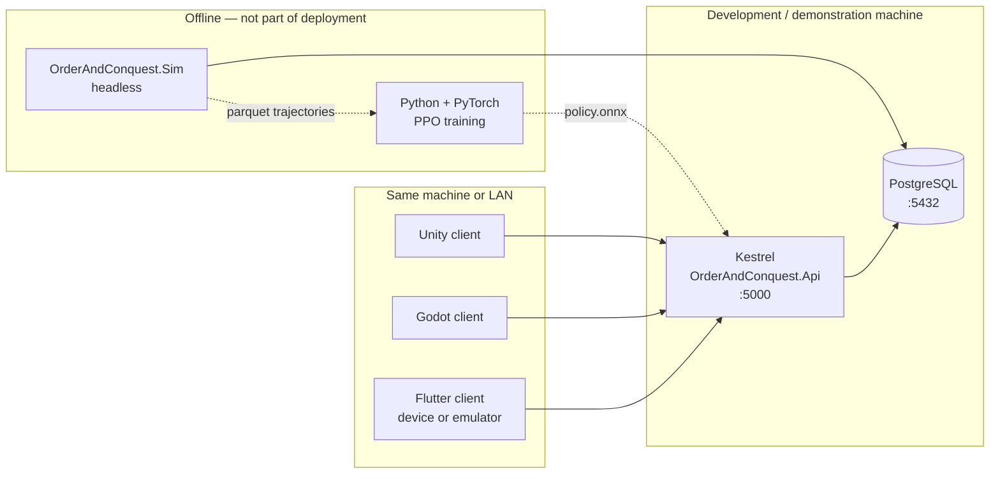
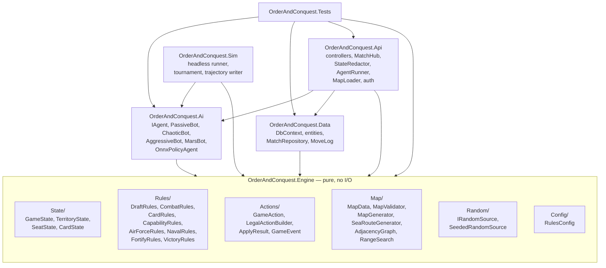
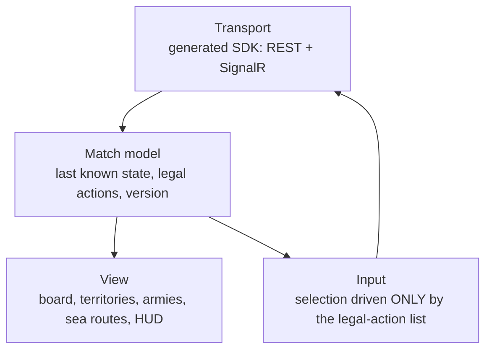
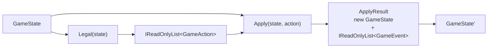
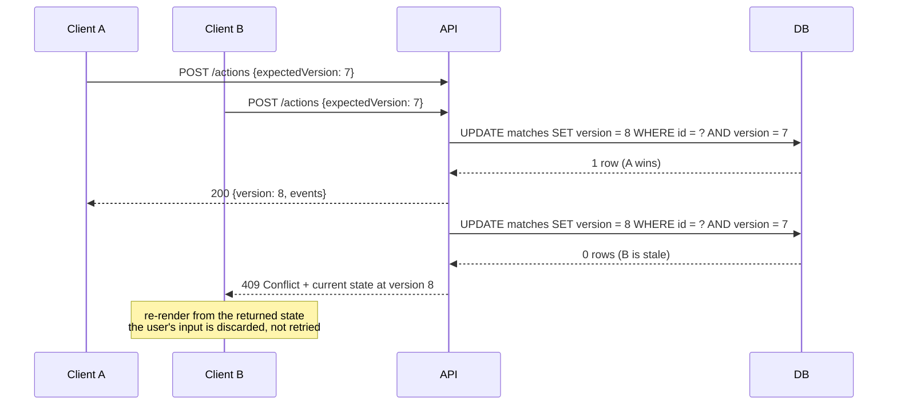
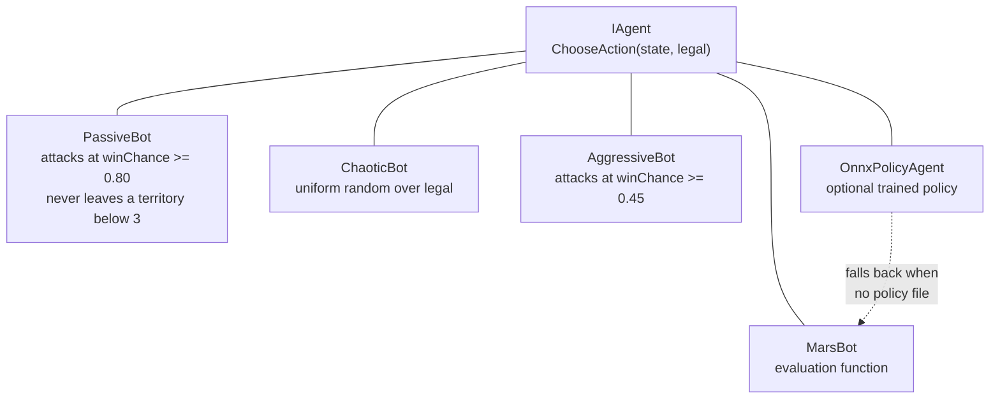
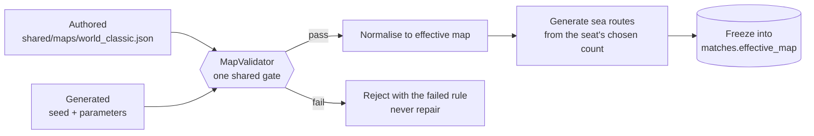
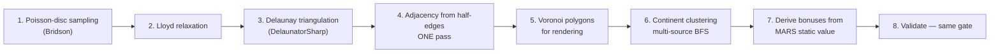
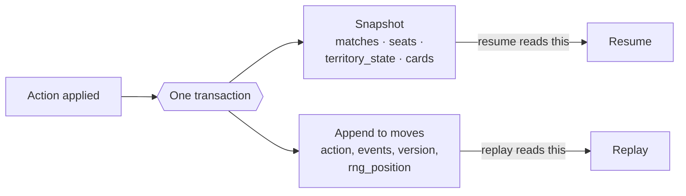

# 5 — System Design

> **Deliverables H, I, J.** Architecture, component design, sequence and deployment views, and the design
> of each subsystem. Diagrams are Mermaid source.

## 5.1 System Architecture

### The architectural decision

One authoritative server holds one rules engine. Three clients render state and submit actions. No client
contains rule logic (FR-67, NFR-17).



The engine box is highlighted because it is the only box in this diagram that other boxes may not
bypass. Everything that changes game state goes through it.

### Layering rules, stated as constraints

| Rule | Enforced by |
|---|---|
| The engine references no web framework, ORM, driver or file API | NFR-01, asserted by an automated dependency test (TC-ARC-01) |
| The engine never performs I/O; randomness is injected | NFR-01, NFR-02 |
| `Apply` returns a new state and never mutates its input | NFR-03, TC-ARC-02 |
| The API layer owns all I/O, authorisation, redaction and timing | §5.5 |
| Agents depend on the engine, never on the API | §5.6 |
| Clients depend only on the published contract | NFR-18 |

### Why this shape rather than the alternatives

| Alternative | Why not |
|---|---|
| Rules in each client | Three implementations of the same rules diverge. This is the problem stated in §1.2 |
| Rules in the client with server validation | The rules exist twice, so they can disagree, and the AI still has no reusable environment |
| Microservices | A turn-based game has one writer at a time. Splitting it adds network hops and distributed-transaction problems to solve a scaling problem the system does not have. Explicitly excluded (Part E) |
| Rules in database procedures | Not testable at speed, not usable as an RL environment, not portable |

### Deployment view



One API process, one database instance (NFR-23). No container orchestration, no cloud service, no message
broker, no cache tier. The training column is dashed because it is offline work that produces a file;
nothing in the deployed system depends on it (FR-78 falls back to MarsBot).

## 5.2 Component Design

Five class libraries and one test project — matching the mandated component list exactly (D-02).



| Component | Responsibility | Must not |
|---|---|---|
| **Engine** | Rules, state transitions, legal actions, map validation and generation, range search | Touch the network, filesystem, clock or database. Create randomness |
| **Ai** | Choose one action from a supplied legal list | Apply actions. Consume the match random source |
| **Data** | Persistence, snapshot, append-only log, optimistic concurrency | Contain rules |
| **Api** | HTTP, WebSocket, auth, redaction, think-time delay, map file loading | Contain rules |
| **Sim** | Headless matches, tournaments, trajectory export | Require a database or a UI |
| **Tests** | Everything in §9 | — |

**Map generation lives in the Engine** because it is pure seeded computation (D-02). Map *loading* —
reading `shared/maps/*.json` from disk — lives in the Api, because that is I/O.

### Key interfaces

```csharp
public interface IGameEngine
{
    GameState Start(MapData map, MatchOptions options, IRandomSource rng);
    IReadOnlyList<GameAction> Legal(GameState state);
    ApplyResult Apply(GameState state, GameAction action);   // -> new state + events
}

public interface IRandomSource
{
    int NextInt(int minInclusive, int maxExclusive);
    long Position { get; }          // persisted as matches.rng_position
}

public interface IAgent
{
    string Name { get; }
    GameAction ChooseAction(GameState state, IReadOnlyList<GameAction> legal);
}
```

`IAgent` takes the legal list as a parameter rather than computing it. That one signature choice is what
makes NFR-20 — an invalid-action rate of exactly zero — a structural property rather than a target.

## 5.3 Client Architecture

### Common design, three renderers

Every client implements the same four-layer structure:



The rule that makes three clients affordable: **the client asks "what can I do?" and is told.** A
territory is interactive if and only if it appears in the current legal-action list (FR-66). No client
computes whether an attack is permitted, what reinforcement is due, whether a card set is valid, or
whether a target is in Air Force range.

| Client | Engine | Role | Notes |
|---|---|---|---|
| Unity | Unity 2022 LTS, C# | Reference client, built first | Shares the C# DTO types directly |
| Godot | Godot 4, GDScript or C# | Second client; proves the API is not Unity-shaped | Built only after Unity is complete |
| Flutter + Flame | Dart | Mobile | Cannot host the server; see O-02 |

### Screen inventory

Baseline from the 2022 report (§2.4), extended with the screens the new capabilities require.

| # | Screen | Purpose | New? |
|---|---|---|---|
| S-01 | Splash | Branding, version, connectivity check | |
| S-02 | Sign in / Register / Continue as guest | FR-01…03 | |
| S-03 | Main menu | New match, resume, replay, settings | |
| S-04 | Match setup | Map choice, seat count, seat kinds, AI difficulty, allocation mode | |
| S-05 | **Sea-route configuration** | Choose the **count** within `[min, max]`; shows the default and the permitted range | **Yes** |
| S-06 | Lobby / waiting room | Room code, seat list, ready state | |
| S-07 | Claim phase | Seat-by-seat territory claiming | |
| S-08 | Main board | Territories, ownership colours, army counts, continent outlines, **sea routes drawn as a distinct edge style** | extended |
| S-09 | Draft / reinforcement | Army pool, placement targets, continent bonus breakdown | |
| S-10 | Card hand and trading | Six symbols; valid sets highlighted; next escalation value shown | extended |
| S-11 | Attack | Origin, target, dice count, odds display | |
| S-12 | **Air Force targeting** | Shows every territory within range 5 **over land edges**, with the distance to each; disabled when the turn's attack is used or capability is absent | **Yes** |
| S-13 | **Naval Force action** | Lists sea routes from owned territories; attack or fortify across one | **Yes** |
| S-14 | Occupy | Choose how many armies move into the captured territory | |
| S-15 | Fortify | Source, destination, army count; naval fortification offered here too | extended |
| S-16 | **Capability panel** | Which capabilities this seat currently holds, and from which territory or card | **Yes** |
| S-17 | Hand-over | Blocking pass-and-play screen (UC-16) | |
| S-18 | Game over | Winner, final standings, match duration, round count | |
| S-19 | Replay viewer | Step through the action log | |
| S-20 | Settings | Audio, animation speed, difficulty defaults | |

S-05, S-12, S-13 and S-16 are the entire UI cost of the extension set — four screens, no new board
metaphor.

### What a client must never do

- Roll a die. Dice faces arrive in the `DiceRolled` event (FR-69).
- Decide whether a move is legal.
- Compute reinforcements, trade values, ranges or victory.
- Hold another seat's card identities — the server never sends them (FR-62).

## 5.4 Game Engine Design

### State

`GameState` is an immutable record holding the frozen effective map reference, per-territory ownership
and army counts, per-seat status and card holdings, the phase, the current seat, the round number, the
card-escalation position, per-turn flags (conquered, fortified, air-attack used) and the random source
position.

### The three methods



`Legal` is a pure query. `Apply` validates that the action is in the legal set, then produces a new state
and the events that describe what changed. An action not in the legal set produces a rejection with **no
state change and no consumption of randomness** (FR-22) — which matters, because a rejected action that
advanced the random source would make the match non-reproducible.

### Rules organisation

| Module | Owns |
|---|---|
| `DraftRules` | Reinforcement calculation, continent bonuses, placement legality |
| `CombatRules` | **The single combat resolution** — dice, comparison, losses, occupation |
| `CardRules` | Deck construction, award eligibility, set validity, escalation, forced trades, territory bonus |
| `CapabilityRules` | CAP-1 profile derivation, CAP-2 seat capability query |
| `AirForceRules` | Range search over the land graph, per-turn limit |
| `NavalRules` | Sea-route traversal for attack and fortification |
| `FortifyRules` | Fortify mode, once-per-turn enforcement |
| `VictoryRules` | Elimination, domination, round cap, ranking |

`AirForceRules` and `NavalRules` contain **target selection only**. Both call `CombatRules`. Neither
contains a die roll, a loss calculation or an occupation step. This is the structural guarantee behind
FR-31 and O3.

### Determinism design

| Mechanism | Purpose |
|---|---|
| `IRandomSource` injected into `Start` | The engine never constructs a generator |
| `Position` advanced on every draw and persisted | Resume continues the same stream (FR-58) |
| Every roll returned as an event | Replay needs no re-rolling |
| Iteration over ordered collections only | No dictionary-order dependence across runs |
| No `DateTime.Now`, no `Guid.NewGuid()`, no ambient culture | Nothing outside the state can influence a transition |

### Air Force range search

Breadth-first search from the origin over the land adjacency graph, bounded at `maxRange`, with sea
routes excluded from the edge set entirely.

```csharp
// Bounded BFS over land edges only. Sea routes are not in this graph.
IReadOnlyList<string> WithinRange(AdjacencyGraph land, string origin, int maxRange)
{
    var seen = new HashSet<string> { origin };
    var frontier = new List<string> { origin };
    var result = new List<string>();

    for (var depth = 1; depth <= maxRange && frontier.Count > 0; depth++)
    {
        var next = new List<string>();
        foreach (var t in frontier)
            foreach (var n in land.Neighbours(t))      // land edges only
                if (seen.Add(n)) { next.Add(n); result.Add(n); }
        frontier = next;
    }
    return result;
}
```

The graph passed in is the land adjacency graph. Sea routes live in a separate structure and are never
added to it — which is how C-08 is enforced by construction rather than by a conditional that could be
edited away.

## 5.5 API Design

REST for commands and queries, SignalR for push. Full contract:
[`appendices/A-api-contract.md`](../appendices/A-api-contract.md).

### Endpoint summary

| Method | Path | Purpose |
|---|---|---|
| `POST` | `/api/auth/register` | FR-01 |
| `POST` | `/api/auth/login` | FR-02 |
| `GET` | `/api/maps` | FR-05 |
| `GET` | `/api/maps/{key}` | FR-06 |
| `POST` | `/api/maps/generate` | FR-07 |
| `POST` | `/api/matches` | FR-12…FR-19 |
| `GET` | `/api/players/{id}/matches` | FR-04 |
| `GET` | `/api/matches/{id}/state?seat=n` | Redacted state + version |
| `GET` | `/api/matches/{id}/legal?seat=n` | FR-21 |
| `POST` | `/api/matches/{id}/actions` | FR-61, the only state-changing endpoint |
| `POST` | `/api/matches/{id}/ai-step` | FR-73 |
| `GET` | `/api/matches/{id}/replay` | FR-59 |
| `POST` | `/api/matches/{id}/join` | FR-13 |

Twelve of the thirteen are the specification's §22 baseline, unchanged. `join` is the one addition, and it
exists because a `RemoteHuman` seat has to be claimable from a second device — without it, multiplayer has
no entry point. No other endpoint was added: §22's instruction is to treat the list as a starting contract,
**not** as a reason to create more.

### Optimistic concurrency

Every action carries `expectedVersion`. The server compares it against `matches.version` inside the same
transaction that applies the action.



A 409 is **not** retried automatically. Re-submitting an action chosen against a stale board would be a
different move than the player intended.

### Per-seat redaction

One stored state, many views. The redactor removes every other seat's card identities while preserving
card *counts*, which are public information in RISK.

| Field | Own seat | Other seats |
|---|---|---|
| Territory ownership and armies | Full | Full |
| Card identities | Full | **Removed** |
| Card count | Full | Full |
| Capability set | Full | Derived and shown — it follows from visible ownership |
| Trade-table position | Full | Full — it is match-wide |

Opponent capability is **not** secret: it is derivable from territories anyone can see (CAP-2), so hiding
it would be theatre rather than redaction.

### Real-time events

| Event | Payload | Consumer |
|---|---|---|
| `StateChanged` | version, redacted state | All seats |
| `DiceRolled` | attacker faces, defender faces, losses | All seats — the client animates these, never generates them |
| `TurnChanged` | seat index, phase | All seats |
| `SeatEliminated` | seat index, eliminated by | All seats |
| `GameOver` | winner, standings | All seats |
| `HandOverDevice` | incoming seat | Pass-and-play client only |

## 5.6 AI Design

### One interface, five agents



Every agent receives the legal list and returns a member of it. None can emit an illegal action
(FR-74, NFR-20).

**ChaoticBot is not filler.** It is the baseline every stronger agent must beat, it reaches code paths
scripted agents never visit, and it is the fastest opponent for a large smoke test.

### MarsBot

Position value, from the MARS paper (§2.5):

```
V = P_sv + P_fn + P_fnu + P_en + P_enu + P_cb + V_bonus × (V_cp + P_oc + P_eoc)
```

Coefficients and knobs live in `shared/rules.json → ai.mars`, so tuning is a data edit.

#### The speculative-apply trap

MarsBot must compare candidate attacks. The obvious implementation — call `Apply` and evaluate the
result — is wrong in a way that does not announce itself:

> Calling `Apply` rolls dice. Rolling dice advances `IRandomSource.Position`. The match's random stream
> would then depend on how many options the bot considered, and the dice the player actually sees would
> not be the dice the seed implies. Determinism (NFR-02) breaks silently and the match becomes
> non-reproducible.

The correct implementation scores by **expected value**, computed from the known combat probabilities
without drawing from the source at all:

```
score(attack) = winChance × V(state if won)
              + (1 − winChance) × V(state if lost)
```

`winChance` comes from the closed-form dice table (§2.3), and the two hypothetical states are constructed
directly rather than by running the engine. FR-76 states this as a requirement, and TC-AI-02 asserts that
`Position` is unchanged across a full MarsBot decision.

### Difficulty

| Setting | Agent | Parameters |
|---|---|---|
| Easy | PassiveBot | — |
| Normal | MarsBot | `W_p` 0.85, `G_l` 0, temperature 1.0 |
| Hard | MarsBot | `W_p` 0.7375, `G_l` 5, temperature 0.5 |
| Brutal | OnnxPolicyAgent | temperature 0.0; falls back to MarsBot |

Difficulty is a parameter set, not a separate code path (D-21). `W_p` — the minimum win probability
required to attack — is the dial: raise it for a cautious opponent, lower it for a reckless one.

### Optional learned policy

Architecture, training loop and curriculum are in
[8 — Implementation Plan](08-implementation-plan.md) §8.9. Design summary: a graph neural network encoder
over the territory graph, factored action heads masked by the engine's legal list, PPO with self-play
against an opponent pool. The C# side does inference only, through ONNX Runtime. Nothing in the engine,
API, database or clients depends on it (FR-78).

## 5.7 Map System Design

### Two sources, one gate



A generated map is validated by the same code as the authored one (FR-08). A map that fails is rejected
with a named rule, never silently repaired — a repaired map is a map nobody specified.

### Validation gate

| Rule | Check |
|---|---|
| V-01 | Adjacency is symmetric |
| V-02 | No self-loops |
| V-03 | No duplicate edges |
| V-04 | Every neighbour key exists |
| V-05 | Every territory's continent key exists |
| V-06 | Continents partition the territories exactly |
| V-07 | The land graph is connected |
| V-08 | `territories ≥ 2 × maxPlayers` |
| V-09 | Every continent has at least one border territory |
| V-10 | Every authored capability profile equals its CAP-1 derivation (TC-MAP-05) |
| V-11 | No Naval card symbol on a landlocked territory |
| V-12 | `crossesWater` pairs are a subset of the adjacency edges |

### Procedural generation



**Adjacency first, geometry later.** Step 4 produces the graph the rules need; steps 5 and 7 produce what
the renderer needs. The engine, agents and tests all run correctly before a single polygon is drawn,
which removes artwork from the critical path (O-01).

Continent bonuses are derived, not guessed: `bonus = clamp(round(target × size × borders), 1, 10)`, where
`target` is the classic board's static-value band (§2.3). Generated continents therefore sit in the same
reinforcement-per-defensive-cost range as the authored board.

### Sea-route generation

Input: a count chosen by the host. Output: that many routes, or a specific failure.

| Constraint | Rule |
|---|---|
| Both endpoints coastal | `endpointsMustBeCoastal` |
| Not already land-adjacent | `forbidExistingLandAdjacency` — a sea route that duplicates a land edge adds nothing |
| No duplicate route | `forbidDuplicate` |
| Different continents preferred | Soft preference; not a hard constraint |
| Bounded attempts | `maxGenerationAttempts` 500, then a specific failure naming how many were placeable |

Routes are generated once, at match creation, from the match seed, and frozen into
`matches.effective_map` (FR-16). They are never regenerated, so a resumed match has the same routes it
started with.

### Submersion masks — optional

The mask design is retained in [`appendices/C-map-specification.md`](../appendices/C-map-specification.md)
and the nullable `matches.mask` column stays in the schema. It is **not** a v1 requirement (D-05): no FR,
no phase, no v1 test case.

## 5.8 Database Design

Six tables, detailed in [6 — Database Design](06-database-design.md) and
[`appendices/B-database-schema.sql`](../appendices/B-database-schema.sql).

### Snapshot plus log



Two representations, two distinct purposes:

- **Resume reads the snapshot**, so it is O(1) in match length (FR-58).
- **Replay reads the log**, so a completed match can be stepped through (FR-59).

Both are written in the same transaction, so they cannot disagree (NFR-13). `moves` is append-only,
enforced by `REVOKE UPDATE, DELETE` rather than by application discipline (NFR-12).

### Why the effective map is frozen JSON

`matches.effective_map` holds the whole normalised map, including the generated sea routes. Editing
`shared/maps/world_classic.json` afterwards cannot alter a match in progress (FR-10). The alternative —
a foreign key to a map table — would mean an in-flight match could change under the players.

## 5.9 Security Design

| Concern | Design |
|---|---|
| Password storage | Argon2id, PHC string format, per-user salt. No plaintext anywhere (NFR-09, D-23) |
| Authentication | Bearer token issued at login; guest sessions are unauthenticated and limited to local play |
| Authorisation | Every action is checked server-side against seat ownership. A client-supplied seat index is never trusted (NFR-10) |
| Information disclosure | Per-seat redaction before serialisation (NFR-11). The client cannot leak what it was never sent |
| Tampering | The client submits an *intent*; the server decides legality and rolls the dice. A modified client can submit illegal actions and be rejected (FR-22), and cannot influence any outcome |
| Audit | Append-only `moves`, enforced by database privileges (NFR-12) |
| Injection | Parameterised queries throughout EF Core; no dynamic SQL |
| Transport | HTTPS in any non-localhost deployment |
| Rate limiting | Per-token action rate limit at the API layer |

### The property that makes cheating uninteresting

Dice are rolled on the server, from the match's seeded source, and every roll is logged. A modified
client can lie about what it *wants* to do and will be told no. It cannot lie about what *happened*,
because it is not where anything happens.

---

**Previous:** [4 — System Analysis and Modelling](04-system-analysis.md) · **Next:** [6 — Database Design](06-database-design.md)
