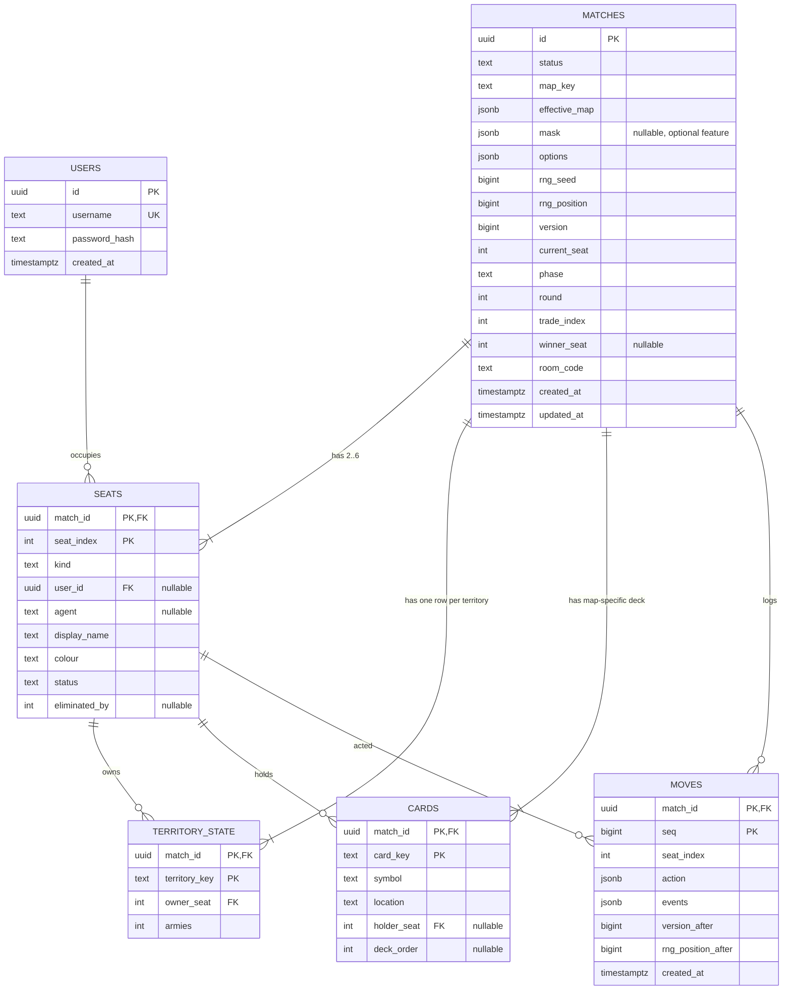

# 6 — Database Design

> **Deliverable K.** Entity-relationship diagram, entity and attribute definitions, relationships,
> constraints and the full data dictionary. Executable DDL:
> [`appendices/B-database-schema.sql`](../appendices/B-database-schema.sql).

## 6.1 Design Principles

Six tables (C-03). The count is a constraint, not an outcome — and it is achievable because of one
decision:

> **The board is stored as data, not as schema.** `matches.effective_map` holds the normalised map —
> territories, adjacency, continents, capability profiles and the generated sea routes — as one frozen
> JSON document. Only the *mutable* part of the board, ownership and army count, gets a row per territory.

Without that decision the schema needs tables for maps, continents, territories, adjacency edges, sea
routes and capability profiles — six more tables representing data that never changes during a match.
That would be the "dozens of tables" the scope rules forbid (Part E), and it would let an in-flight match
change under the players when a map file is edited.

| Principle | Consequence |
|---|---|
| Snapshot **and** append-only log | Resume is O(1) in match length; replay is complete |
| One transaction per applied action | A crash leaves no half-applied action (NFR-13) |
| Immutable data frozen as JSON | Map edits cannot affect a running match (FR-10) |
| Derived data is never stored | Capability is computed from ownership; there is no capability column (FR-41) |
| Vendor-neutral types | `text` with `CHECK` instead of enums; portable to SQLite (NFR-19) |

## 6.2 Entity-Relationship Diagram



## 6.3 Entity Definitions

### USERS

A registered account. Guest play creates **no row** (FR-03) — a guest session exists only in memory, so
single-player never requires registration (D-24).

### MATCHES

One row per match, holding everything that is true of the match as a whole: its frozen map, its options,
its random-source state, its optimistic-concurrency version and its current position in the turn cycle.

Three columns deserve specific comment:

| Column | Why it exists |
|---|---|
| `effective_map` | The **frozen** normalised map including generated sea routes. This is what makes FR-10 true |
| `rng_seed` + `rng_position` | Together they reconstruct the exact random stream. A deterministic game could be replayed from its log; a stochastic one cannot (§2.1) |
| `trade_index` | The match-wide position in the card-escalation table. It advances once per trade and never resets (DR-13) |

### SEATS

One row per seat, 2–6 of them — or 3 when a 2-player match inserts a `Neutral` (FR-14, D-07). A seat is
the unit of agency; "game mode" is not a column anywhere in this schema, because a mode is just a
configuration of seat kinds (§5.1).

| `kind` | `user_id` | `agent` | Acts? |
|---|---|---|---|
| `LocalHuman` | optional | null | Yes, on this device |
| `RemoteHuman` | required | null | Yes, over the network |
| `Ai` | null | **required** | Yes, via `IAgent` |
| `Neutral` | null | null | **No** — defends only (DR-15) |

### TERRITORY_STATE

The mutable board: one row per territory per match, holding the owner and the army count. Everything
immutable about a territory — its name, continent, neighbours, coastal flag, card symbol and capability
profile — lives in `matches.effective_map` and is never duplicated here.

### CARDS

The whole deck for a match, with `location` tracking where each card is. There is no separate hand or
discard table; a hand is `location = 'hand'` with a `holder_seat`.

The `symbol` domain carries **six** values, extended from four (D-03):

```
CHECK (symbol IN ('infantry','cavalry','artillery','airforce','naval','wild'))
```

**The trade set is still three cards.** Six symbols do not imply five-card sets; that is explicitly
excluded (C-05).

### MOVES

The append-only action log. One row per applied action, recording the action, the events it produced, the
resulting version and the resulting random-source position.

Append-only is enforced at the database:

```sql
REVOKE UPDATE, DELETE ON moves FROM app_user;
```

Application-level discipline is not sufficient for NFR-12. A privilege is.

## 6.4 Relationships

| Relationship | Cardinality | Delete behaviour |
|---|---|---|
| USERS → SEATS | 1 : 0..N | `ON DELETE SET NULL` — deleting an account must not destroy other players' match history |
| MATCHES → SEATS | 1 : 2..6 | `ON DELETE CASCADE` |
| MATCHES → TERRITORY_STATE | 1 : N (N = territory count) | `ON DELETE CASCADE` |
| MATCHES → CARDS | 1 : N (N = territories + wilds) | `ON DELETE CASCADE` |
| MATCHES → MOVES | 1 : 0..N | `ON DELETE CASCADE` |
| SEATS → TERRITORY_STATE | 1 : 0..N | Composite FK `(match_id, owner_seat)` |
| SEATS → CARDS | 1 : 0..N | Composite FK `(match_id, holder_seat)`, nullable |

Every child key is composite and includes `match_id`. A territory row cannot reference a seat in a
different match, because the foreign key makes that unrepresentable rather than merely discouraged.

## 6.5 Constraints

### Primary keys

| Table | Key |
|---|---|
| `users` | `id` |
| `matches` | `id` |
| `seats` | `(match_id, seat_index)` |
| `territory_state` | `(match_id, territory_key)` |
| `cards` | `(match_id, card_key)` |
| `moves` | `(match_id, seq)` |

### Check constraints

| ID | Table | Constraint | Enforces |
|---|---|---|---|
| CK-01 | `matches` | `status IN ('lobby','setup','in_progress','finished','abandoned')` | §4.10.1 |
| CK-02 | `matches` | `phase IN ('claim','draft','attack','occupy','fortify','end_turn','game_over')` | §4.10.2 |
| CK-03 | `matches` | `version >= 1` | Optimistic concurrency |
| CK-04 | `matches` | `rng_position >= 0` | Determinism |
| CK-05 | `matches` | `trade_index >= 0` | DR-13 |
| CK-06 | `matches` | `round >= 0` | Round cap |
| CK-07 | `seats` | `seat_index BETWEEN 0 AND 5` | FR-12 |
| CK-08 | `seats` | `kind IN ('LocalHuman','RemoteHuman','Ai','Neutral')` | §5.1 |
| CK-09 | `seats` | `(kind = 'Ai') = (agent IS NOT NULL)` | FR-13 — an AI seat **must** name an agent, and no other kind may |
| CK-10 | `seats` | `status IN ('active','eliminated','left')` | FR-53 |
| CK-11 | `territory_state` | `armies >= 1` | DR-04 — a territory is never empty |
| CK-12 | `cards` | `symbol IN ('infantry','cavalry','artillery','airforce','naval','wild')` | D-03, FR-19 |
| CK-13 | `cards` | `location IN ('deck','hand','discard')` | §6.3 |
| CK-14 | `cards` | `(location = 'hand') = (holder_seat IS NOT NULL)` | A card is held **iff** a seat holds it |
| CK-15 | `moves` | `seq >= 1` | Append order |
| CK-16 | `moves` | `version_after >= 1` | Log/snapshot agreement |

CK-09 and CK-14 are the two worth highlighting. Both are **biconditional** — they forbid the
half-consistent row in either direction, which is the state that produces the bug nobody can reproduce.

### Unique constraints

| Table | Columns |
|---|---|
| `users` | `username` |
| `matches` | `room_code` (partial: where not null) |

### Indexes

| Index | Table | Columns | Purpose |
|---|---|---|---|
| `ix_seats_user` | `seats` | `(user_id)` | FR-04 resumable-match list |
| `ix_territory_owner` | `territory_state` | `(match_id, owner_seat)` | Territory count per seat, every draft phase |
| `ix_cards_holder` | `cards` | `(match_id, holder_seat)` where not null | Hand retrieval |
| `ix_moves_match_seq` | `moves` | `(match_id, seq)` | Replay in order — this is the primary key |
| `ix_matches_status` | `matches` | `(status)` where `status = 'in_progress'` | Resumable listing |

### Referential integrity not expressible in SQL

Four invariants are enforced by the engine because SQL cannot express them cheaply. Each has a test:

| Invariant | Test |
|---|---|
| Territory keys in `territory_state` match exactly the keys in `effective_map` | TC-PER-02 |
| Card keys match exactly the territory keys plus the wilds | TC-PER-03 |
| Exactly one seat has `status = 'active'` and holds every territory when `status = 'finished'` by domination | TC-VIC-01 |
| `rng_position` in `matches` equals `rng_position_after` of the highest `seq` in `moves` | TC-DET-03 |

The last one is the schema-level statement of determinism: if the snapshot and the log disagree about the
random-source position, the match is not reproducible, and that is detectable without playing it.

## 6.6 Data Dictionary

### `users`

| Column | Type | Null | Default | Description |
|---|---|---|---|---|
| `id` | `uuid` | No | `gen_random_uuid()` | Primary key |
| `username` | `text` | No | — | Unique, case-insensitive comparison |
| `password_hash` | `text` | No | — | **Argon2id PHC string.** Never plaintext (NFR-09) |
| `created_at` | `timestamptz` | No | `now()` | Registration time |

### `matches`

| Column | Type | Null | Default | Description |
|---|---|---|---|---|
| `id` | `uuid` | No | `gen_random_uuid()` | Primary key |
| `status` | `text` | No | `'lobby'` | CK-01 |
| `map_key` | `text` | No | — | Source map identifier, for display and audit only |
| `effective_map` | `jsonb` | No | — | **Frozen** normalised map: territories, adjacency, continents, capability profiles, generated sea routes |
| `mask` | `jsonb` | Yes | `null` | Submersion mask. Optional feature (D-05); null in v1 |
| `options` | `jsonb` | No | — | Allocation mode, fortify mode, round cap, difficulty, turn timer, sea-route count |
| `rng_seed` | `bigint` | No | — | Seed for the match random source |
| `rng_position` | `bigint` | No | `0` | Draws consumed so far. With `rng_seed`, reconstructs the exact stream (FR-58) |
| `version` | `bigint` | No | `1` | Optimistic-concurrency token; incremented once per applied action (FR-61) |
| `current_seat` | `int` | No | `0` | Seat whose turn it is |
| `phase` | `text` | No | `'claim'` | CK-02 |
| `round` | `int` | No | `0` | Completed full cycles; compared against the round cap (FR-55) |
| `trade_index` | `int` | No | `0` | Position in the escalation table. Match-wide, monotonic (DR-13) |
| `winner_seat` | `int` | Yes | `null` | Set when `status = 'finished'` by domination |
| `room_code` | `text` | Yes | `null` | Short join code; unique while not null |
| `created_at` | `timestamptz` | No | `now()` | |
| `updated_at` | `timestamptz` | No | `now()` | Touched on every applied action |

### `seats`

| Column | Type | Null | Default | Description |
|---|---|---|---|---|
| `match_id` | `uuid` | No | — | PK part; FK → `matches(id)` cascade |
| `seat_index` | `int` | No | — | PK part; 0–5 |
| `kind` | `text` | No | — | CK-08 |
| `user_id` | `uuid` | Yes | `null` | FK → `users(id)` set-null. Null for guest, AI and neutral seats |
| `agent` | `text` | Yes | `null` | Agent name. Required **iff** `kind = 'Ai'` (CK-09) |
| `display_name` | `text` | No | — | Shown in the UI |
| `colour` | `text` | No | — | Seat colour, hex |
| `status` | `text` | No | `'active'` | CK-10 |
| `eliminated_by` | `int` | Yes | `null` | Seat that eliminated this one; drives card transfer (FR-38) |

### `territory_state`

| Column | Type | Null | Default | Description |
|---|---|---|---|---|
| `match_id` | `uuid` | No | — | PK part; FK → `matches(id)` cascade |
| `territory_key` | `text` | No | — | PK part; must exist in `effective_map` (TC-PER-02) |
| `owner_seat` | `int` | No | — | FK → `seats(match_id, seat_index)` |
| `armies` | `int` | No | `1` | `>= 1` (CK-11) |

### `cards`

| Column | Type | Null | Default | Description |
|---|---|---|---|---|
| `match_id` | `uuid` | No | — | PK part; FK → `matches(id)` cascade |
| `card_key` | `text` | No | — | PK part. A territory key, or `wild_1` / `wild_2` |
| `symbol` | `text` | No | — | One of six (CK-12) |
| `location` | `text` | No | `'deck'` | CK-13 |
| `holder_seat` | `int` | Yes | `null` | FK → `seats(match_id, seat_index)`. Non-null **iff** in a hand (CK-14) |
| `deck_order` | `int` | Yes | `null` | Shuffled position while in the deck. Determined by the match seed, so the shuffle is reproducible |

### `moves`

| Column | Type | Null | Default | Description |
|---|---|---|---|---|
| `match_id` | `uuid` | No | — | PK part; FK → `matches(id)` cascade |
| `seq` | `bigint` | No | — | PK part; 1-based, contiguous, append-only |
| `seat_index` | `int` | No | — | Seat that acted |
| `action` | `jsonb` | No | — | The `GameAction` as submitted |
| `events` | `jsonb` | No | — | Events the engine produced, **including every die face** |
| `version_after` | `bigint` | No | — | `matches.version` after this action |
| `rng_position_after` | `bigint` | No | — | `matches.rng_position` after this action (TC-DET-03) |
| `created_at` | `timestamptz` | No | `now()` | Wall-clock time; audit only, never a rule input |

The `created_at` note is deliberate. A timestamp that influenced a rule would make the match
non-reproducible, so the column is documented as audit-only to prevent it becoming a temptation.

## 6.7 Transaction Design

```sql
BEGIN;

UPDATE matches
   SET version      = version + 1,
       rng_position = @newPosition,
       phase        = @phase,
       current_seat = @currentSeat,
       round        = @round,
       trade_index  = @tradeIndex,
       updated_at   = now()
 WHERE id = @matchId
   AND version = @expectedVersion;        -- 0 rows => 409 Conflict, nothing applied

-- territory_state, cards, seats updated from the new state

INSERT INTO moves (match_id, seq, seat_index, action, events,
                   version_after, rng_position_after)
VALUES (@matchId, @seq, @seat, @action, @events, @newVersion, @newPosition);

COMMIT;
```

The `AND version = @expectedVersion` clause is the whole concurrency design. If it matches no row, the
transaction affects nothing, the client receives `409` with the current state, and no partial write ever
existed (FR-61, NFR-13).

## 6.8 Portability

PostgreSQL is the target. The schema avoids vendor-specific constructs so that a SQLite build — useful
for headless simulation without a server — needs only type substitutions (NFR-19).

| PostgreSQL | SQLite | Note |
|---|---|---|
| `uuid` | `text` | Store the canonical hyphenated form |
| `jsonb` | `text` | Serialise identically; queries are by key, not by JSON path |
| `timestamptz` | `text` (ISO-8601 UTC) | Audit only |
| `bigint` | `INTEGER` | 64-bit in SQLite |
| `gen_random_uuid()` | Application-generated | |
| `REVOKE UPDATE, DELETE` | Trigger raising on update/delete | Same guarantee, different mechanism |

No enum types, no arrays, no domain types and no stored procedures are used anywhere — which is what
makes the substitution table this short.

---

**Previous:** [5 — System Design](05-system-design.md) · **Next:** [7 — Game Design and Rules](07-game-design.md)
