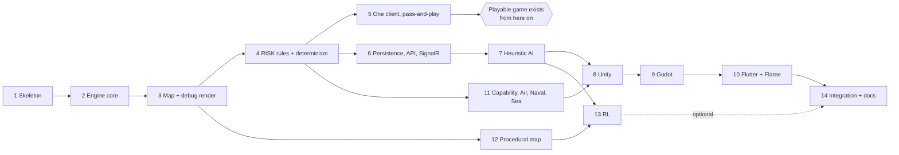

# 8 — Implementation

> **Deliverables J, K, R.** How the system is built: the technology stack, the repository layout, the
> per-project implementation notes, and the staged phase plan.
>
> **This chapter describes planned work.** No part of it reports completed code. Where a library choice
> carries a risk, the risk and its fallback are stated rather than omitted.
>
> **Scope discipline.** This chapter deliberately contains module inventories, interfaces and commands —
> not implementations. The specification is not the codebase, and a document that pre-writes the code
> becomes wrong the first time the code changes.

## 8.1 Technologies

### Stack

| Concern | Technology | Why this one |
|---|---|---|
| Engine and server language | **C#**, .NET LTS | The engine must be shared verbatim between the API, the AI, the simulator and the Unity client. One language for all four is what makes that literal rather than aspirational |
| Web API | **ASP.NET Core** (controllers) | Controllers over minimal APIs: the action endpoint needs model binding, filters for authorisation and a consistent `ProblemDetails` error shape, and those read better grouped in a class |
| Realtime push | **SignalR** | Already in the framework; transport negotiation and reconnection are solved. The alternative, raw WebSockets, means writing reconnection by hand (§2.1) |
| Database | **PostgreSQL** | `jsonb` for the frozen map, real constraints, and privilege-level append-only enforcement (NFR-12) |
| Headless database | **SQLite** | Simulation runs need persistence without a server (§6.8, NFR-19) |
| Data access | **Npgsql + Dapper** | Not an ORM — see below |
| Password hashing | **Argon2id** | NFR-09. Candidate packages: `Konscious.Security.Cryptography.Argon2`, `Isopoh.Cryptography.Argon2`. Pick one, pin it, and record the choice |
| Auth | **JWT bearer** against the local `users` table | Proportional to an FYP (§26). No OAuth ecosystem, no external identity provider |
| Tests | **xUnit** + an assertion library | Data-driven `[Theory]` cases map cleanly onto the test-case IDs in appendix F |
| Delaunay triangulation | **DelaunatorSharp** | A correct, small, dependency-free implementation. Writing one is not a project objective (§8.10) |
| Model inference | **Microsoft.ML.OnnxRuntime** | The C# side of the ONNX boundary (§8.9) |
| Unity client | **Unity LTS**, C# | Reuses the engine assembly directly |
| Godot client | **Godot 4.x**, .NET build, C# | Reuses the contract DTOs directly |
| Flutter client | **Flutter**, Dart, **Flame** | The only client that cannot reuse C# — which is the whole reason NFR-18 exists |
| RL training | **Python**, **PyTorch** | Locked by §24 |
| Model interchange | **ONNX** | Locked by §24. The only artefact crossing the Python/C# boundary |

### Versions are pinned in the repository, not in this document

This chapter names LTS *lines*, not patch versions. A version number written into a specification is
stale within weeks and is then quietly contradicted by the build. The authoritative versions live in
`global.json`, `Directory.Packages.props`, `pubspec.lock`, `ProjectSettings/ProjectVersion.txt` and
`rl/requirements.txt`. The rule that matters is the one this document *can* hold:

> **No package is added without a named reason recorded in the pull request.** The dependency list above
> is short deliberately; every addition is a thing that can break the build of three clients, a server and
> a training pipeline.

### Why Dapper and not Entity Framework Core

The persistence pattern is *write the whole match snapshot and one log row inside one transaction guarded
by a version predicate* (§6.7). An ORM's change tracker is built for the opposite pattern — load entities,
mutate them, let the framework work out the UPDATE statements. Against a snapshot write it adds a layer
that must be understood and then worked around, and the `WHERE version = @expectedVersion` clause that
carries the entire concurrency design becomes something expressed indirectly.

Dapper maps rows to records and otherwise stays out of the way. The cost is hand-written SQL, which for a
six-table schema is a few hundred lines that are easier to review than the equivalent configuration.

This is a judgement, not a locked decision. It is reversible: the repository interfaces in §8.2 are what
the rest of the server depends on, and they do not mention either library.

### Repository structure

Taken from the specification's §27 and made concrete. Only directories the project actually uses appear:

```
OrderAndConquest/
├── docs/                              this documentation package
├── server/
│   ├── OrderAndConquest.Engine/       pure rules. Zero infrastructure dependencies
│   ├── OrderAndConquest.Api/          REST + SignalR host
│   ├── OrderAndConquest.Data/         PostgreSQL persistence, migrations
│   ├── OrderAndConquest.Ai/           heuristic agents + ONNX inference agent
│   ├── OrderAndConquest.Sim/          headless match runner, tournaments, episode export
│   └── OrderAndConquest.Tests/        unit + integration tests
├── clients/
│   ├── unity/
│   ├── godot/
│   └── flutter/
├── shared/
│   ├── maps/                          world_classic.json, generated map fixtures
│   └── contracts/                     JSON Schema for every DTO; DTO generation source
├── rl/
│   ├── environment/                   Python-side episode reader, observation spec tests
│   ├── training/                      PPO implementation, curriculum, opponent pool
│   ├── models/                        network definitions
│   ├── checkpoints/                   training checkpoints (git-ignored)
│   └── export/                        ONNX export and verification scripts
└── assets/                            artwork, map imagery, UI assets
```

> **From the specification, verbatim:** "Do not add projects merely for naming symmetry. If a directory is
> not used, omit it."

Applied honestly, that instruction has consequences worth stating in advance:

| Directory | Status |
|---|---|
| `server/OrderAndConquest.Sim/` | Created in Phase 13, **not Phase 1**. Until there is an agent to simulate, it would be an empty project |
| `rl/` | Created in Phase 13. If RL is not reached, the directory does not exist and the documentation says so |
| `assets/` | Created in Phase 12 when artwork begins. Phases 3–11 run on the debug renderer (§7.11) |
| `shared/contracts/` | Created in Phase 6 with the first API contract |
| A separate `OrderAndConquest.Contracts` project | **Not created.** DTOs live in `Api`; the Godot client references it. A fourth project to hold twenty records is naming symmetry |

There is no `OrderAndConquest.Core`, no `.Common`, no `.Shared` and no `.Abstractions`. Those names appear
when nobody has decided where a thing belongs, and they accumulate.

### Solution-level dependency rule

One test enforces the whole architecture (NFR-01, TC-ARC-01):

```
Engine   → (nothing)
Ai       → Engine
Data     → Engine
Api      → Engine, Ai, Data
Sim      → Engine, Ai
Tests    → all
```

`Engine` referencing anything at all fails the build. That arrow being absent is what makes every other
claim in this document about determinism and testability true.

## 8.2 Backend

`server/OrderAndConquest.Api/`

| Folder | Contents |
|---|---|
| `Controllers/` | `AuthController`, `MapsController`, `MatchesController`, `PlayersController` |
| `Contracts/` | Request and response records. The source of truth for `shared/contracts/` schemas |
| `Hubs/` | `MatchHub` — SignalR; server-to-client events only |
| `Services/` | `MatchService`, `MapService`, `AiTurnService`, `RedactionService` |
| `Auth/` | JWT issuance, the seat-authorisation filter |
| `Startup/` | DI registration, configuration binding, migration runner |

### Middleware order

```
Exception handler (→ ProblemDetails)
  → HTTPS redirection
    → Authentication
      → Authorization
        → Routing
          → Controllers + Hub
```

The exception handler is outermost so that an engine exception becomes a `400` or `409` with a machine-
readable body rather than an HTML error page a Flutter client cannot parse.

### The action endpoint

`POST /api/matches/{id}/actions` is the only endpoint that changes a match, so it is the only one whose
sequence is worth writing out. Every clause below corresponds to a requirement:

```
1  Authenticate                                          → 401
2  Load match snapshot                                   → 404
3  Authorise: caller owns the acting seat                 → 403   (NFR-10)
4  Compare body.expectedVersion with matches.version      → 409 + current state (FR-61)
5  Rehydrate GameState; construct SeededRandom(seed, position)
6  legal = engine.Legal(state)
7  Reject if the submitted action is not in legal          → 400   (FR-62, NFR-10)
8  result = engine.Apply(state, action)
9  BEGIN; write snapshot with the version predicate; INSERT move; COMMIT   (§6.7)
10 Broadcast redacted StateChanged + events per seat       (FR-63, NFR-11)
11 Return the caller's redacted state
```

Step 7 is not redundant with step 8. `Apply` may assume a legal action — that assumption is what keeps it
small — so something must enforce it, and the server is the only place that can. A client is never
trusted to have filtered correctly (§26).

Steps 5 and 9 are where determinism is won or lost: the random source is constructed at the persisted
position, and the position after the action is written in the same transaction as the state it produced
(TC-DET-03).

### Repository interfaces

`Data` exposes intent, not SQL:

```csharp
public interface IMatchRepository
{
    Task<MatchSnapshot?> LoadAsync(Guid matchId, CancellationToken ct);
    Task<bool>           TryApplyAsync(MatchSnapshot next, MoveRecord move,
                                       long expectedVersion, CancellationToken ct);
    Task<IReadOnlyList<MoveRecord>> ReplayAsync(Guid matchId, CancellationToken ct);
}
```

`TryApplyAsync` returns `false` for a version conflict rather than throwing. A conflict is an ordinary,
expected outcome in a multi-client game — two clients pressing "end turn" at once — not an exceptional
condition, and modelling it as a return value keeps the controller's `409` path readable.

### Configuration

`shared/rules.json` is bound to a `RuleSet` record at startup and injected. Nothing reads a tunable number
from a constant (NFR-16). The match options stored in `matches.options` override per-match fields; the
merged result is what the engine receives, and it is written into the match row at creation so a resumed
match cannot silently pick up an edited rules file (FR-10).

### AI turn execution

`POST /api/matches/{id}/ai-step` advances one AI action. It is a pull endpoint rather than a server-side
loop for three reasons: a loop needs its own cancellation and failure story, a stuck loop is invisible,
and the client wants to animate each step anyway. The endpoint runs steps 5–11 above with the agent
supplying the action instead of the caller.

## 8.3 Engine

`server/OrderAndConquest.Engine/` — the project the rest of the system is built to protect.

| Folder | Contents |
|---|---|
| `Models/` | `MapData`, `Territory`, `Continent`, `SeaRoute`, `RuleSet`, `MatchOptions` |
| `State/` | `GameState`, `SeatState`, `TerritoryState`, `CardState` |
| `Actions/` | `GameAction` hierarchy, `GameEvent` hierarchy |
| `Rules/` | `SetupRules`, `DraftRules`, `CombatRules`, `CardRules`, `CapabilityRules`, `AirForceRules`, `NavalRules`, `FortifyRules`, `VictoryRules` |
| `Random/` | `IRandomSource`, `SeededRandom` |
| `Validation/` | `MapValidator` (the V-01…V-12 gate, §5.7) |
| `Generation/` | `MapGenerator`, `SeaRouteGenerator` — seeded and pure, output passed through `MapValidator` (§8.10) |
| `GameEngine.cs` | The `Start` / `Legal` / `Apply` surface |

`Generation/` sits inside `Engine` rather than in a separate project for one reason: a generated map must
satisfy the same V-01…V-12 gate as an authored one, and the gate lives here. A generator in another
assembly would be free to emit a board the engine cannot play.

### Immutability

State types are `record`s with init-only members. `Apply` builds the next state with `with` expressions
and returns it; the input is never touched (NFR-03, TC-ARC-02).

Collections are exposed as `IReadOnlyDictionary` / `IReadOnlyList` over copies. `ImmutableDictionary` was
considered and rejected: on a 42-key dictionary the structural-sharing benefit is smaller than the
allocation and lookup overhead, and the simulator's inner loop is the one place in the system where that
overhead is measurable.

### `Legal` is the contract surface

Every client, every agent and the server's own validation call the same `Legal`. It returns a flat list of
concrete actions, not a permission structure, because the two consumers with the most to gain from that
shape are the ones hardest to debug otherwise: the UI enables exactly what the list contains (FR-66), and
the RL action mask is built from the same list (§8.9).

Two implementation notes on `Legal`, both about cost:

1. **Air Force targets are computed by one bounded BFS per owned origin**, capped at depth 5, with sea
   routes excluded from the edge set (§5.4). Not an all-pairs distance matrix — the map can be
   regenerated, and a cache would need invalidating.
2. **Avoid LINQ chains in the attack enumeration.** It is called once per agent decision and tens of
   millions of times per training run. Plain loops with a pre-sized list are the difference between a
   simulation that finishes overnight and one that does not.

### `Apply` returns events, and events carry the dice

```csharp
public sealed record ApplyResult(GameState State, IReadOnlyList<GameEvent> Events);
```

Every die face appears in a `DiceRolled` event (FR-29). The events are what the clients animate, what the
log stores, and what makes a replay show the same battle rather than a plausible one.

### Determinism mechanics

| Mechanism | Implementation |
|---|---|
| Injected randomness | `IRandomSource` is a constructor parameter. The engine never calls `new Random()`, `DateTime.Now` or `Guid.NewGuid()` |
| Position tracking | `SeededRandom.Position` counts draws; persisted as `matches.rng_position` |
| Stable iteration | Territory iteration follows the map's authored order, never dictionary enumeration order |
| Stable sorting | Dice comparison sorts descending with a total order; no `OrderBy` on equal keys where the result is observable |

The stable-iteration row is the one that gets missed. Enumeration order of a hash-based dictionary is
unspecified, and a rule that iterates territories to break a tie will be reproducible on one machine and
not another — the worst class of determinism bug, because it passes on the developer's laptop.

## 8.4 Unity

`clients/unity/`

| Concern | Approach |
|---|---|
| Engine reuse | References the `Engine` assembly directly, for local pass-and-play with **no server** |
| Board rendering | Sprites plus polygon colliders for hit-testing; debug renderer from label anchors until Phase 12 |
| UI | UI Toolkit for panels; the board stays in the scene |
| Scenes | `Splash`, `Menu`, `MatchSetup`, `Lobby`, `Game`, `Result` — the S-01…S-20 inventory of §5.3 maps onto these six scenes plus in-scene panels |
| Networking | `Microsoft.AspNetCore.SignalR.Client` + `HttpClient` |
| State | One `MatchStore` holding the last received state and legal-action list; every panel reads from it |

### Interaction derives from the legal-action list

A territory is clickable if and only if some action in the current legal list names it (FR-66). The client
computes no adjacency, no range and no capability. This is what §34 asks for, and it has a practical
payoff: the Air Force range rule, the trickiest rule to render, needs no client code at all — the reachable
set is whatever the server listed.

### Known risk: SignalR under IL2CPP

The .NET SignalR client uses reflection-heavy serialisation paths that can misbehave under IL2CPP
stripping on some platforms. **Mitigation:** a `link.xml` preserving the contract assembly, and a
`PollingTransport` fallback that calls `GET /state` on a timer. The fallback is written in Phase 8, not
kept as a theory, because discovering the problem during integration week is the scenario the phase plan
exists to prevent.

Pass-and-play does not touch the network at all, so this risk cannot affect the demonstrable core game.

## 8.5 Godot

`clients/godot/`

| Concern | Approach |
|---|---|
| Language | C# on the .NET build of Godot 4.x |
| Contract reuse | References the API's contract assembly — no hand-written DTOs |
| Engine reuse | Same as Unity: direct reference for offline play |
| Board | `Node2D` with `Polygon2D` per territory, `Line2D` for sea routes |
| UI | `Control` nodes; one scene per screen group |
| Input | `_input_event` on collision shapes, filtered through the same legal-action list |

### Known constraint: no web export

Godot's C# builds do not target the web. The Godot client is therefore **desktop only**, and that is
acceptable because the three clients exist to demonstrate one backend serving different runtimes — not to
cover every platform. The alternative, rewriting the client in GDScript to gain web export, would mean
hand-maintaining a second copy of every DTO, which is the specific failure NFR-18 exists to prevent.

Stated plainly so it is not discovered in Phase 9: **if web delivery becomes a requirement, the Flutter
client is the one that provides it.**

## 8.6 Flutter + Flame

`clients/flutter/`

| Concern | Approach |
|---|---|
| Language | Dart — **the only client that cannot reuse C#** |
| Board | Flame: a `FlameGame` with a component per territory and per sea route |
| UI | Standard Flutter widgets overlaid on the Flame canvas |
| DTOs | **Generated** from `shared/contracts/` JSON Schema via `json_serializable` + `build_runner` (NFR-18) |
| State | `ChangeNotifier` or a small store — no framework needed for one state object |
| Offline play | **Not supported.** This client is server-backed only |

### This client is why the contract is generated

Two of three clients can reference C# types. The third cannot, and a hand-written Dart mirror of twenty
DTOs drifts the first time a field is added — silently, because a missing key deserialises to null. So the
schemas in `shared/contracts/` are generated from the C# contract types in CI, and the Dart classes are
generated from the schemas. A contract change that is not propagated fails the build instead of failing at
runtime in the client nobody was testing.

### Known risk: realtime transport

SignalR has no first-party Dart client. Options, in order of preference:

1. `signalr_netcore` — community package. **Verify maintenance status and protocol version before
   committing to it**, in Phase 10, not in Phase 14.
2. Fall back to REST polling of `GET /state?seat=n` at a low frequency.

Polling is genuinely adequate here. This is a turn-based game where a state change happens at most every
few seconds, and a two-second poll is indistinguishable from push during play. The fallback is a
documented supported mode, not a defeat.

## 8.7 Database

`server/OrderAndConquest.Data/`

| Folder | Contents |
|---|---|
| `Migrations/` | `001_initial.sql`, `002_*.sql` — plain numbered SQL, applied in order |
| `Repositories/` | `MatchRepository`, `UserRepository`, `MapRepository` |
| `Mapping/` | Snapshot ↔ row translation, `jsonb` serialisation |
| `Schema/` | Reference copy of the full schema — also published as `appendices/B-database-schema.sql` |

### Migrations are numbered SQL files

A tiny runner applies unapplied files inside a transaction and records them in a `schema_migrations`
table. No migration framework: the schema is six tables, migrations are forward-only, and a C#-authored
migration DSL would hide the constraint definitions that §6.5 spends a page justifying.

### Two database roles

| Role | Grants |
|---|---|
| `oc_owner` | Owns the schema; used only by the migration runner |
| `oc_app` | `SELECT, INSERT, UPDATE` on all tables; `SELECT, INSERT` **only** on `moves` |

```sql
REVOKE UPDATE, DELETE ON moves FROM oc_app;
```

This is NFR-12. Application discipline can be circumvented by the next developer in a hurry; a revoked
privilege raises an error. The API connects as `oc_app` and therefore *cannot* rewrite history even if a
code path tried to.

### Transactions

Isolation stays at PostgreSQL's default `READ COMMITTED`. The concurrency design needs nothing stronger,
because the `AND version = @expectedVersion` predicate in the snapshot `UPDATE` is what serialises
competing actions (§6.7) — the second writer matches zero rows and receives its `409`. Raising the
isolation level would add retry handling for serialisation failures to solve a problem already solved.

Write order within the transaction is fixed: `matches` first (so the version predicate fails before
anything else is touched), then `territory_state`, `cards`, `seats`, then the `moves` insert last.

### SQLite for simulation

`Sim` uses SQLite through the same repository interfaces, with the type substitutions of §6.8. In practice
most simulation runs persist nothing at all and keep state in memory; the SQLite path exists for
reproducing a specific training episode as a real, resumable match.

## 8.8 AI

`server/OrderAndConquest.Ai/`

| File | Contents |
|---|---|
| `IAgent.cs` | `ChooseAction(state, legal)` — the only interface the server knows |
| `PassiveBot.cs` | Reinforces, never attacks. The termination and round-cap test partner |
| `ChaoticBot.cs` | Uniform random over legal actions. The crash-finder, and an opponent-pool member |
| `AggressiveBot.cs` | Greedy: attacks the weakest reachable defender |
| `MarsBot.cs` | Evaluation-based, per §5.6 |
| `Evaluation/MarsEvaluator.cs` | The `V` function and its coefficient table |
| `OnnxPolicyAgent.cs` | ONNX Runtime inference. **Optional** (FR-78) |
| `AgentRegistry.cs` | Name → agent factory, resolving `seats.agent` |

### The coefficients are data

The MARS weights (`C_sv` 70, `C_fn` 1.2, `C_en` −0.3, `C_fnu` 0.05, `C_enu` −0.03, `C_cb` 0.5, `C_oc` 20,
`C_eoc` 4, `P_db` 3.5, `P_ob` 170, `W_p` 0.7375, `W_p1` 0.25, `G_l` 5) live in `shared/rules.json`, not in
the evaluator. They are tuning parameters taken from a published source, and the first thing anyone will
want to do is change one and measure (§8.9's tournament harness is how).

### The trap this project must not fall into

An evaluation bot wants to know what an attack is worth. The obvious implementation is to call
`Apply` and evaluate the result — and it is wrong, because `Apply` **consumes the match random source**.
A bot that evaluates ten candidate attacks advances the shared random stream ten times, and the match is
no longer reproducible from its seed. Worse, the bug is invisible: the game plays correctly, and only
replay and training reveal the corruption.

The correct form scores the *distribution*:

```
score(attack) = winChance × V(state | captured)
              + (1 − winChance) × V(state | repulsed)
```

`winChance` comes from the closed-form table in §7.5. No dice are rolled.

The guard is structural, not a comment: **agents receive an `IRandomSource` that throws on use.**

```csharp
internal sealed class ThrowingRandomSource : IRandomSource
{
    public int NextInt(int lo, int hi) =>
        throw new InvalidOperationException(
            "An agent must not consume the match random source. Score distributions (§8.8).");
    public long Position => throw new InvalidOperationException();
}
```

Any agent that speculatively applies an action fails immediately and loudly, in the first unit test that
exercises it (FR-76, TC-AI-04). An agent needing randomness for its *own* tie-breaking gets a separate
source seeded independently of the match.

### Difficulty

| Setting | Agent | Notes |
|---|---|---|
| Easy | `PassiveBot` / `ChaoticBot` | |
| Normal | `AggressiveBot` | |
| Hard | `MarsBot` | |
| Experimental | `OnnxPolicyAgent` | Offered only when a checkpoint is present; falls back to `MarsBot` (FR-78) |

Difficulty is a mapping onto agents and their parameters, never a modifier on the rules. No AI receives
extra armies, better dice or hidden information — the same `Legal` list, the same combat resolution, the
same redaction. An AI that cheats is not a harder opponent, it is a different game.

## 8.9 RL

`rl/` and `server/OrderAndConquest.Sim/`

> **Everything in this section is optional (NFR-24) and gated (§10.3).** If it does not finish, the
> shipped opponent is `MarsBot` and the documentation reports the RL component honestly as incomplete.
> Nothing in §8.2–§8.8 depends on anything here.

### The boundary

```
C# Sim  ──episodes──▶  Python training  ──ONNX──▶  C# OnnxPolicyAgent
```

| Direction | Artefact | Format |
|---|---|---|
| C# → Python | Self-play trajectories: observation graphs, action indices, legal-action masks, rewards | Batched files, one per episode set |
| Python → C# | Trained policy | **ONNX** |

**Batch/episode granularity, never per-step IPC** (§24). A per-step bridge would make every environment
step a process round trip, and the training run's throughput would be set by serialisation rather than by
the game.

There is **one rules engine**. The Python side never implements a game rule; it reads trajectories and
produces weights. A second Python engine would drift from the C# one, and a policy trained against
drifted rules is worse than no policy because its failure is not obvious.

### The observation builder lives in C#

`Engine`-adjacent, used by both the exporter and the inference agent. This is not a stylistic preference:
if the training observation and the inference observation are built by two different pieces of code, they
will disagree, and the symptom is a policy that performs well in evaluation and poorly in play. One
builder, one test asserting byte-identical tensors from the same state (TC-AI-05).

### Network and training

| Element | Value |
|---|---|
| Encoder | Graph convolutional network, 3 layers, hidden width 128 |
| Node features | Ownership one-hot, army count (scaled), continent id, coastal flag, capability profile bits, is-current-seat |
| Edge types | Land adjacency; sea route |
| Heads | Factored per action category, with legal-action masking |
| Algorithm | **PPO** (locked) |
| Discount γ | 0.995 |
| Reward | Win +1, loss −1, draw 0, per-step −0.0005 |
| Self-play pool | Current policy 40%, frozen checkpoints 30%, MarsBot 20%, ChaoticBot 10% |

The graph encoder is what makes variable territory counts trainable — a fixed-length vector would bind the
policy to 42 territories and make procedural maps useless for training (§2.6).

Masking is applied to logits before the softmax, sourced from the same `Legal` list the UI uses. This is
what drives the **zero invalid-action rate** target (NFR-20): an illegal action is not penalised, it is
unrepresentable.

### Curriculum

| Stage | Seats | Map | Cards |
|---|---|---|---|
| 1 | 2 | 12-territory generated | Off |
| 2 | 3 | 24-territory generated | On |
| 3 | 4 | Classic 42 | On |
| 4 | 3–6 | Classic + generated (+ submerged variants where supported) | On |

Stage 4's parenthesis is conditional because submersion masks are an optional feature (D-05) and appear in
no v1 requirement. If masks are not implemented, stage 4 runs classic plus generated, and that is the
whole consequence.

### Checkpoint metadata

Every checkpoint records the map kinds, seat counts, rule-set hash and **fortify mode** it trained under.
Loading fails on a fortify-mode mismatch (FR-83). An agent trained under `single_pair` and played under
`connected_path` learned a different game, and it will be weaker in a way no one attributes to the right
cause.

### Evaluation

Per §25: baseline bots and the RL agent, multiple seeds, repeated matches, classic and generated maps,
reporting win rate, average match length, elimination and placement statistics, invalid-action rate
(target zero) and inference latency. The harness is `Sim`'s tournament runner (FR-82), and it is the same
tool used to compare MARS coefficient changes.

**The gate:** the RL agent ships as the default opponent only if it beats `MarsBot` over a pre-registered
number of seeded matches. Otherwise `MarsBot` remains the default and the RL result is reported as an
experimental component with its actual numbers. §10.3 is written to be filled in either way.

## 8.10 Maps

`shared/maps/` + `Engine/Generation/` + `Engine/Validation/` + `Engine/Models/`

### Loading and validation

Every map — authored or generated — passes the **same** V-01…V-12 gate before a match can use it
(FR-08, §5.7). The validator is in `Engine`, so the API, the simulator and the offline clients cannot
each apply a different standard.

The two checks worth naming again: **symmetric adjacency** (V-04) and **capability profiles re-derived
and asserted equal to the stored ones** (V-10). The second means the authored `capabilities` array in the
map file is a redundant copy that can never silently disagree with rule CAP-1.

### Generation pipeline

| Step | Implementation |
|---|---|
| 1. Point sampling | Poisson-disc (Bridson), seeded |
| 2. Relaxation | Lloyd, fixed iteration count |
| 3. Triangulation | DelaunatorSharp |
| 4. Adjacency | One pass over half-edges — not a distance test |
| 5. Polygons | Voronoi cells from the triangulation |
| 6. Continents | Multi-source BFS from spread seed points |
| 7. Bonuses | Derived from the classic static-value band (§7.3) |
| 8. Coastal flags | Cells touching the hull, plus the continent-boundary rule |
| 9. Validate | The same V-01…V-12 gate. **Failure discards and reseeds** |

Step 4 matters more than it looks. Adjacency from a proximity threshold produces *almost* the right graph
— and an almost-right adjacency graph is an unplayable board with a plausible-looking picture. The
triangulation already knows exactly which cells share an edge.

Step 9's discard-and-reseed, bounded by an attempt count, is what lets the earlier steps stay simple:
generation may fail, and the cheapest correct response is to try another seed rather than to repair a bad
graph.

### Sea-route generation

Runs once at match creation, from the match seed, under the constraints in §7.10, and the result is
**frozen into `matches.effective_map`** (FR-16, FR-10). The generator is `Engine/Generation/SeaRouteGenerator`,
beside the map validator, and its output is validated too — a route with a landlocked endpoint fails the gate
rather than entering a match.

### Debug rendering

Phases 3–11 render from label anchors: a labelled circle per territory, a line per adjacency, a dashed
line per sea route. No artwork, no polygons.

This is the cheapest important decision in the plan. It means the rules, the AI, the API, the tests and
pass-and-play are all fully exercisable before anyone draws a map — so a slipping art task cannot block a
playable game (§7.11, O-01).

## 8.11 Implementation Phases

> Deliverable R. The phase list below is the specification's §35 recommended order, **verbatim**. One
> documented deviation to the execution sequence follows, which §35 explicitly permits.

### The critical rule

> **From the specification, verbatim:** "make the core playable before advanced RL or procedural features
> can block progress."

Every decision in this chapter serves that sentence: the debug renderer, the optional-by-construction RL
path, the pull-based AI endpoint, and the fact that pass-and-play needs no server and no database.

### The fourteen phases

| # | Phase | Done when | Must **not** include |
|---|---|---|---|
| **1** | Repository and backend skeleton | Solution builds; the dependency test of §8.1 passes; CI runs | Any game rule |
| **2** | Pure game engine models/state/actions | `GameState`, actions and events exist; `Apply` returns a new state; purity test passes (TC-ARC-02) | Combat, cards, capabilities |
| **3** | Classic map adjacency and debug rendering | `world_classic.json` loads and passes V-01…V-12; the debug board draws 42 territories and 83 edges (TC-MAP-01…04) | Artwork, polygons, generation |
| **4** | Core RISK rules and deterministic tests | A full match plays engine-only from setup to domination; dice probabilities assert; TC-DET-01…04 pass | Air Force, Naval, sea routes, capability |
| **5** | Basic client board in one client for gameplay validation | Two humans complete a match pass-and-play, **no server, no database** | The other two clients |
| **6** | Persistence/API/SignalR | Match creates, acts, saves and resumes over HTTP; `409` on a stale version; redaction holds (TC-PER-*, TC-SEC-*) | AI, extensions |
| **7** | Heuristic AI | All four bots play legal complete matches; the throwing random source is in place (TC-AI-01…04) | Any RL |
| **8** | Complete Unity client | Every S-01…S-20 screen present and driven by legal actions | Rules in the client |
| **9** | Complete Godot client | Same, against the same backend | A second DTO set |
| **10** | Complete Flutter + Flame client | Same; DTOs generated from `shared/contracts/` | Hand-written Dart DTOs |
| **11** | Capability cards, Air Force, Naval Force and sea routes | CAP-1/CAP-2, range-5 land-only BFS, sea-route generation and freezing, naval attack and fortify (TC-AIR-*, TC-NAV-*, TC-SEA-*) | New unit types, a second combat system |
| **12** | Procedural map | Generated maps pass the same gate and play through the same engine (TC-MAP-06…10) | A separate engine path |
| **13** | RL simulation/training/inference | Episodes export; PPO trains; ONNX loads in C#; tournament reports (FR-79…83) | Anything the core depends on |
| **14** | Integration, testing, polish and documentation | The §9 suite green; the §13 traceability matrix complete; §10 filled with measured numbers | New features |

### Dependencies



Phase 5 is the milestone that matters. From there a demonstrable game exists, and every later phase
improves something rather than enabling anything.

### One documented deviation: run Phase 11 before Phases 8–10

§35 permits adjusting the order where the dependency structure argues for it. It does here, and the reason
is concrete.

Phase 11 adds four screens to the client inventory — sea-route configuration (S-05), Air Force targeting
(S-12), Naval Force action (S-13) and the capability panel (S-16) — plus new entries in the attack UI.
Completing three clients in Phases 8–10 and *then* adding those actions means **three clients are revisited**,
in three different toolchains, by whoever is available in week fourteen.

| | Specification order | Recommended execution |
|---|---|---|
| Sequence | 1–7, 8, 9, 10, 11, 12, 13, 14 | 1–7, **11**, 8, 9, 10, 12, 13, 14 |
| Client passes | Two per client | One per client |
| Risk | Extension UI lands during integration | Extension UI is part of each client's only build |

Phase numbering is **not** renumbered — the phase IDs are referenced by the traceability matrix and by
this document's cross-references, and stable identifiers are worth more than a tidy sequence. Phase 11 is
scheduled earlier; it keeps its number.

This does not weaken the critical rule. Phases 1–7 still come first, and a playable game still exists at
Phase 5 before any extension work begins.

### What can be cut, and in what order

If time runs out, this is the order in which scope is surrendered. Deciding it now prevents deciding it
badly under pressure:

| Order | Cut | Consequence |
|---|---|---|
| 1st | Phase 13 (RL) | `MarsBot` is the shipped opponent. §10.3 reports RL as incomplete. Nothing else changes |
| 2nd | Phase 12 (procedural maps) | Classic board only. Training variety is reduced; no v1 requirement fails except FR-07 |
| 3rd | Map artwork | Debug renderer ships. Every rule still works |
| 4th | Phase 10 (Flutter) | **A scope reduction the supervisor and committee must approve** — C-04 states *"Three clients must all ship: Unity, Godot, Flutter + Flame. None may be dropped"* and is **Locked**, so this is an amendment to a locked constraint, not a discretionary cut. The case for it, with measurements, is [`../PLATFORM-SCOPE-PROPOSAL.md`](../PLATFORM-SCOPE-PROPOSAL.md) |
| Never | Phases 1–7, 11 | These are the game |

The order is not arbitrary: each of the first three is a component nothing else depends on, which is
exactly the property §8.9 was built to have.

---

**Previous:** [7 — Game Design and Rules](07-game-design.md) · **Next:** [9 — Testing](09-testing.md)
